# 北梨论坛 系统需求文档

**版本**: 1.0  
**日期**: 2026-06-19  
**团队**: 北梨小组（5人）

---

## 一、需求分析与可行性

### 一.1 领域边界

#### 一.1.1 问题领域定义

北梨论坛所涉问题领域为**高校校园信息交流与社区互动**，具体涵盖以下子领域：

- **校园信息发布与获取**：学生和教职工之间发布通知、分享资讯、交流观点，替代传统公告栏和分散的社交群组。
- **学术讨论与协作**：课程学习交流、学术问题答疑、科研经验分享，构建校内学术氛围。
- **校内社交与人际连接**：跨年级、跨专业的交友互动，缓解高校学生社交圈层固化问题。
- **校园生活服务**：失物招领、二手交易、拼车拼单、活动组织等生活场景支持。
- **内容管理与治理**：敏感词过滤、帖子审核、公告置顶，保障校园网络环境健康有序。

#### 一.1.2 系统范围边界

**系统在范围内（做）：**

| 范围 | 说明 |
|------|------|
| 用户认证与角色管理 | JWT 无状态认证，支持游客、注册用户、管理员三级角色体系 |
| 论坛帖子 CRUD | 基于 Quill Delta 富文本编辑器，支持日常闲聊、真诚交友、问题反馈、恋爱官宣四种分类 |
| 评论与回复 | 多级嵌套评论，支持贴主精选评论 |
| 互动机制 | 点赞、收藏（Redis 缓冲批写入库）、浏览量统计 |
| 全文搜索 | Elasticsearch 搜索引擎，支持高亮显示和分类筛选 |
| AI 聊天助手 | DeepSeek 大模型驱动，支持论坛搜索 RAG、网络搜索（Tavily）、图像识别/生成（SiliconFlow）三种工具调用 |
| 公告管理 | 管理员发布公告、置顶/取消置顶 |
| 邮件通知 | RabbitMQ 异步队列发送系统通知和互动提醒 |
| 文件存储 | MinIO 对象存储，支持图片和文件上传 |
| 管理后台 | 用户管理、帖子管理、邮件记录、敏感词管理 |
| 请求限流 | Redis 计数器实现全局限流和功能级限流（发帖、评论、登录等） |
| 可观测性 | 链路追踪（Tempo）、日志聚合（Loki）、指标监控（Prometheus）、可视化面板（Grafana） |

**系统不在范围内（不做）：**

| 范围 | 原因 |
|------|------|
| 即时通讯（IM） | 论坛为异步交流模式，实时聊天超出社区论坛定位；校内即时通讯已有微信/QQ 等成熟方案 |
| 在线课堂/直播 | 属于教务系统和在线教育平台范畴，与论坛社区定位不同 |
| 校内支付/商城 | 二手交易仅提供信息发布，不介入资金流转，避免金融合规风险 |
| 课表/成绩查询 | 属于教务管理系统功能域，涉及敏感数据隔离要求 |
| 第三方登录（微信/QQ） | 当前阶段聚焦校园邮箱/学号注册，减少外部依赖和隐私合规复杂度 |
| 移动端原生 App | 采用响应式 Web + PWA 方案覆盖移动端，避免双端开发和审核成本 |

#### 一.1.3 为什么需要专门的校园论坛

通用社交平台（微信群、QQ 群、贴吧）在校园场景中存在以下结构性缺陷，论证了专门校园论坛的必要性：

1. **信息结构化缺失**：微信群/QQ 群的聊天记录无法按话题、分类、时间线有效组织和检索，重要信息被淹没在碎片化对话中。北梨论坛的帖子分类、全文搜索和标签体系提供结构化的知识管理。
2. **受众覆盖盲区**：微信群成员上限 500 人，跨专业、跨年级的信息流通受阻。论坛对所有在校生开放，打破圈层壁垒。
3. **内容治理缺位**：通用平台缺乏针对校园场景的内容审核机制，敏感信息和不当言论难以有效管控。论坛内置敏感词库和管理员三级审核体系。
4. **AI 能力缺失**：现有校园社交工具均无 AI 助手集成。北梨论坛的 DeepSeek AI 助手可基于论坛内容进行 RAG 问答，成为校内知识库的智能入口。
5. **可观测性与运营支撑**：通用平台不向校园运营方提供系统级可观测数据。论坛的全景可观测性栈（Loki + Tempo + Prometheus + Grafana）支撑运维和运营决策。

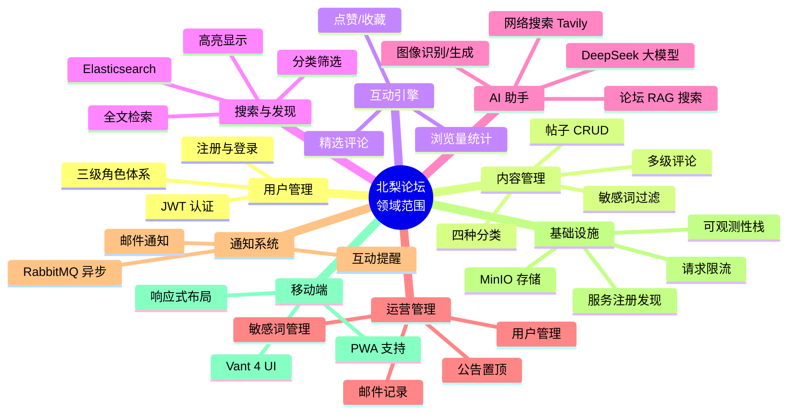
```mermaid
mindmap
  root((北梨论坛<br/>领域范围))
    用户管理
      JWT 认证
      三级角色体系
      注册与登录
    内容管理
      帖子 CRUD
      四种分类
      多级评论
      敏感词过滤
    互动引擎
      点赞/收藏
      浏览量统计
      精选评论
    搜索与发现
      Elasticsearch
      全文检索
      高亮显示
      分类筛选
    AI 助手
      DeepSeek 大模型
      论坛 RAG 搜索
      网络搜索 Tavily
      图像识别/生成
    运营管理
      公告置顶
      用户管理
      邮件记录
      敏感词管理
    通知系统
      RabbitMQ 异步
      邮件通知
      互动提醒
    基础设施
      MinIO 存储
      请求限流
      可观测性栈
      服务注册发现
    移动端
      响应式布局
      Vant 4 UI
      PWA 支持
```

---

### 一.2 目标用户分析

#### 一.2.1 角色定义

系统定义三个核心用户角色：**普通游客**、**注册用户（学生/教职工）**、**管理员**。三级权限体系覆盖从浏览到系统治理的完整链路。

#### 一.2.2 用户画像

| 维度 | 普通游客 | 注册用户（学生/教职工） | 管理员 |
|------|---------|----------------------|--------|
| **典型身份** | 未登录浏览者、校外访客、首次接触论坛的新生 | 在校大学生（主）、教职工（辅），已完成学号/邮箱注册 | 校方运营人员、学生干部、系统运维者 |
| **核心目标** | 了解论坛内容质量和活跃度，决定是否注册参与 | 参与校园讨论、获取信息、社交互动、使用 AI 助手解决问题 | 维护论坛秩序、管理用户和内容、监控系统健康度、发布官方公告 |
| **主要痛点** | 看不到完整内容（受限）；不确定论坛是否值得注册；担心隐私和安全 | 信息过载，无法快速找到感兴趣话题；优质内容被淹没；跨专业交流渠道有限；课业问题无处高效提问 | 手动审核内容效率低；难以发现违规模式和趋势；缺乏系统级运营数据支撑决策；批量操作不便 |
| **系统解决方案** | 提供受限的公开内容预览（帖子列表和部分摘要）；注册流程简洁（学号/邮箱 + 密码）；隐私政策透明展示 | 四种分类筛选 + ES 全文搜索高亮；点赞/收藏构建个人兴趣图谱；AI 助手支持 RAG 检索论坛内容回答问题；跨分类浏览打破圈层 | 管理后台提供用户/帖子/邮件/敏感词一体化管理；请求限流和敏感词自动过滤减少人工审核量；Grafana 可观测性面板提供实时运营数据；批量操作功能 |
| **功能权限** | 浏览公开帖子列表；查看帖子摘要 | 游客权限 + 发帖/评论/回复；点赞/收藏；使用 AI 助手；上传图片/文件；个人中心管理 | 注册用户权限 + 用户封禁/解封；帖子删除/置顶；公告发布/取消置顶；邮件记录查询；敏感词管理；ES 全量同步触发 |
| **使用场景** | 通过社交媒体/口碑了解到论坛，初次访问评估内容质量 | 日常浏览校园话题；发布交友/吐槽/求助帖子；回复同学评论；通过 AI 搜索课程资料；收藏有用帖子 | 每天登录后台检查举报和违规内容；发布学校官方通知；查看 Grafana 面板监控系统负载和异常；管理敏感词库 |
| **接触频率** | 偶发，单次访问通常不超过 5 分钟 | 高频，日均 3-10 次访问，每次 10-30 分钟 | 高频，工作日定时登录，日均 2-5 次 |
| **技术素养** | 参差不齐，从技术新手到熟练用户 | 中等偏高，大学生群体对 Web 应用和新技术的接受度较高 | 中高，需要掌握后台操作和基础的数据解读能力 |

#### 一.2.3 用户场景示例

**场景一：新生入学融入（注册用户）**

大一新生李某入学第一周，想了解校园生活但社交圈有限。通过搜索引擎找到北梨论坛，浏览"日常闲聊"分类后决定注册。他在"真诚交友"分类发布交友帖，收到来自不同专业同学的回复。他还在"问题反馈"分类提问选课建议，得到多位高年级学长学姐的详细回答。李某通过论坛快速建立了校园社交网络。

**场景二：学术求助（注册用户）**

计算机专业研究生王某在做课程项目时遇到技术难题，在论坛发帖详细描述问题，随后使用 AI 聊天助手输入相同问题。AI 助手通过论坛搜索 RAG 召回相关讨论帖，结合自身知识给出解决思路，同时附上了 Tavily 搜索到的最新技术文档。王某在 AI 回复的引导下成功定位了 Bug。

**场景三：运营管理与应急处理（管理员）**

管理员张某发现论坛首页出现多条异常帖子，登录管理后台查看用户举报列表，确认为同一恶意账号批量发帖。张某通过用户管理功能将该账号封禁，在敏感词管理中添加新增的违规关键词，并在公告板块发布处理通报。整个过程在 5 分钟内完成，避免了不良内容的进一步扩散。

---

### 一.3 竞品分析

#### 一.3.1 竞品概览

当前校园论坛和通用社区领域的竞品可以归为四类：通用论坛软件、校内自建平台、通用社交媒体、开源社区框架。以下选取四个代表性产品进行对比分析。

#### 一.3.2 竞品详情

**1. Discuz! Q / Discuz! X**

中国最广泛使用的论坛软件之一，拥有超过二十年的发展历史。提供完整的论坛功能：版块管理、用户组权限、插件生态、模板系统。Q 版本采用前后端分离架构（Vue + Laravel）。大量高校论坛基于 Discuz! 搭建。

**2. Flarum**

轻量级开源论坛软件，注重用户体验和交互设计。PHP + JavaScript（Mithril.js）架构，扁平化界面风格。对移动端有较好的支持，但功能较为基础，插件生态不如 Discuz! 丰富。

**3. 微信校园圈子/企业微信**

腾讯生态内的校园社交方案。基于微信庞大的用户基础，零安装成本。集成通知触达、群聊和小程序能力。但功能高度依赖微信平台，数据归平台所有，学校无自主可控权，不支持 AI 集成和深度搜索。

**4. 校内定制小程序**

各高校自行开发的校园微信小程序（如"XX 大学校园通"类），通常集成课表查询、校园卡、通知公告等功能。但论坛/社区仅作为附属模块，功能单薄，用户体验参差不齐，缺乏统一的交互标准。

#### 一.3.3 对比分析

| 对比维度 | 北梨论坛 | Discuz! Q | Flarum | 微信校园圈子 | 校内定制小程序 |
|---------|---------|-----------|--------|------------|--------------|
| **架构** | 微服务（Spring Cloud Alibaba，9 服务） | 单体/前后端分离（Laravel + Vue） | 轻量单体（PHP + Mithril.js） | 平台托管（腾讯生态） | 通常单体/无明确架构 |
| **AI 集成** | **DeepSeek LLM + RAG + Tavily + SiliconFlow 三工具** | 无原生 AI 集成 | 无原生 AI 集成 | 无 AI 集成 | 极少数有简单客服机器人 |
| **移动端支持** | **响应式 Web + Vant 4 + PWA** | 模板级移动适配 | 具备移动端支持 | 原生微信小程序 | 微信小程序 |
| **校园场景适配** | **专属分类（四种）、学号注册、公告系统、敏感词管理** | 通用论坛，需自行配置版块 | 通用论坛，需自行配置 | 通用圈子，无校园专用功能 | 校园专用但功能单一 |
| **搜索能力** | **Elasticsearch 全文搜索 + 高亮** | 数据库模糊搜索或 ES（需插件） | 数据库搜索 | 基础搜索 | 通常仅有数据库检索 |
| **可观测性** | **Loki + Tempo + Prometheus + Grafana + Alloy 全景** | 无内置可观测性 | 无内置可观测性 | 平台提供基础数据 | 无 |
| **技术自主可控** | **完全自主**（开源自建） | 需授权/自建 | 开源自建 | 平台锁定 | 部分自主 |
| **部署复杂度** | 高（需 Docker Compose 基础设施） | 中 | 低 | 无（平台托管） | 低（微信生态） |
| **优势** | AI 驱动、微服务高可用、全景可观测、多端统一、校园垂直适配 | 生态成熟、插件丰富、用户基数大、中文社区支持好 | 轻量、界面美观、加载快速、用户体验好 | 零部署成本、微信用户全覆盖、通知触达强 | 轻量便捷、贴合本校需求定制 |
| **劣势** | 部署门槛较高、运维复杂度大、生态建设初期 | 架构老旧迭代慢、无 AI 能力、移动端体验一般 | 功能基础、插件生态弱、大负载性能存疑 | 平台锁定严重、论坛功能弱、数据不自主、无 AI 能力 | 功能单薄、开发维护成本高、可复用性差 |

#### 一.3.4 本系统差异化优势总结

1. **AI 原生集成**：将 DeepSeek LLM 深度嵌入论坛场景，通过 RAG 将论坛内容转化为可问答的知识库，结合 Tavily 网络搜索和 SiliconFlow 图像能力，是唯一具备多工具 AI 助手的校园论坛。

2. **企业级架构下放校园场景**：Spring Cloud 微服务架构 + Nacos 注册发现 + Gateway 统一入口 + 全景可观测性栈，这些通常用于企业级生产系统的技术栈，首次完整应用于高校论坛领域，保障了系统的可扩展性、可维护性和可观测性。

3. **同一代码库双端体验**：768px 断点响应式设计，桌面端 Element Plus 和后端管理能力，移动端 Vant 4 + PWA，无需维护两套前端项目。

4. **可观测性驱动运营**：不只是一个论坛系统，更是一套完整的运营决策支持平台。Grafana 面板实时反映用户行为、系统负载、接口延迟等关键指标，支撑校园运营团队数据驱动决策。

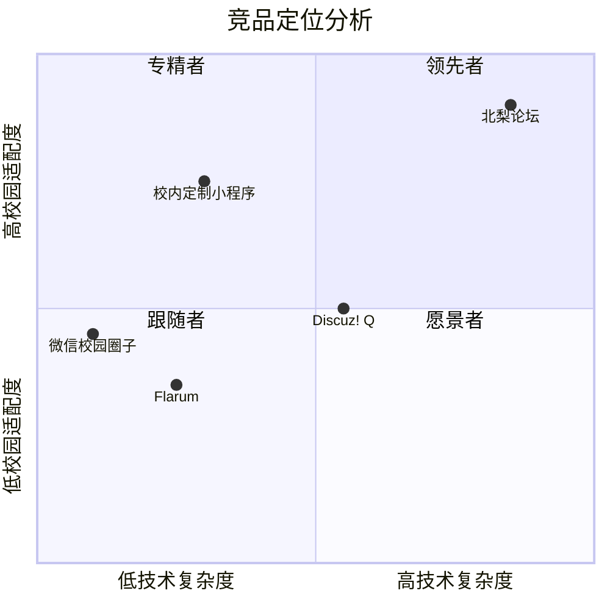
```mermaid
quadrantChart
    title 竞品定位分析
    x-axis "低技术复杂度" --> "高技术复杂度"
    y-axis "低校园适配度" --> "高校园适配度"
    quadrant-1 "领先者"
    quadrant-2 "专精者"
    quadrant-3 "跟随者"
    quadrant-4 "愿景者"
    "北梨论坛": [0.85, 0.90]
    "Discuz! Q": [0.55, 0.50]
    "Flarum": [0.25, 0.35]
    "微信校园圈子": [0.10, 0.45]
    "校内定制小程序": [0.30, 0.75]
```

> **定位解读**：北梨论坛位于第一象限（右上角），在技术复杂度（微服务 + AI + 可观测性）和校园场景适配度（专属分类 + 内容治理 + 多端适配）两个维度均处于领先位置。校内定制小程序校园适配度高但技术能力有限，Discuz! Q 和 Flarum 技术能力中等但缺乏校园垂直场景深耕，微信校园圈子则完全受限于平台生态。

---

## 二、系统功能分析

---

### 二.1 功能分解树

北梨论坛的功能体系可分解为十大核心模块。各模块之间通过 Spring Cloud 微服务网关统一路由，共享基础设施层（Nacos、Redis、MySQL、Elasticsearch、RabbitMQ、MinIO），形成高内聚低耦合的微服务架构。

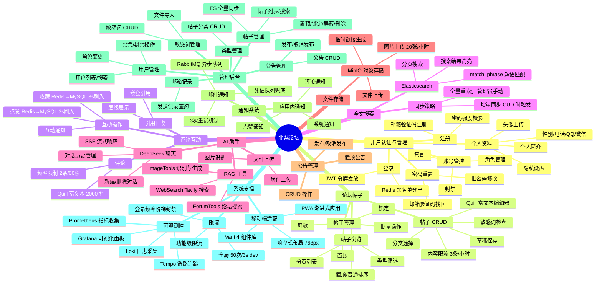
```mermaid
mindmap
  root((北梨论坛))
    用户认证与管理
      注册
        邮箱验证码注册
        密码强度校验
      登录
        JWT 令牌发放
        Redis 黑名单登出
      密码重置
        邮箱验证码找回
        旧密码修改
      个人资料
        头像上传
        性别/电话/QQ/微信
        个人简介
        隐私设置
      账号管控
        禁言
        封禁
        角色管理
    论坛帖子
      帖子 CRUD
        Quill 富文本编辑器
        分类选择
        内容限流 3条/小时
        敏感词检查
        草稿保存
      帖子浏览
        分页列表
        类型筛选
        置顶/普通排序
      帖子管理
        置顶
        锁定
        屏蔽
        批量操作
    评论互动
      评论
        Quill 富文本 2000字
        频率限制 2条/60秒
      引用回复
        嵌套引用
        层级展示
      互动操作
        点赞 Redis→MySQL 3s刷入
        收藏 Redis→MySQL 3s刷入
        互动通知
    全文搜索
      Elasticsearch
        match_phrase 短语匹配
        搜索结果高亮
        分页搜索
      同步策略
        增量同步 CUD 时触发
        全量重索引 管理员手动
    AI 助手
      DeepSeek 聊天
        SSE 流式响应
        对话历史管理
        新建/删除对话
      RAG 工具
        ForumTools 论坛搜索
        WebSearch Tavily 搜索
        ImageTools 识别与生成
      文件上传
        图片识别
        附件上传
    文件存储
      MinIO 对象存储
        图片上传 20张/小时
        文件上传
        临时链接生成
    公告管理
      CRUD 操作
      发布/取消发布
      置顶公告
    通知系统
      应用内通知
        评论通知
        点赞通知
        系统通知
      邮件通知
        RabbitMQ 异步队列
        3次重试机制
        死信队列兜底
    管理后台
      用户管理
        用户列表/搜索
        角色变更
        禁言/封禁操作
      帖子管理
        帖子列表/搜索
        置顶/锁定/屏蔽/删除
        ES 全量同步
      类型管理
        帖子分类 CRUD
      敏感词管理
        敏感词 CRUD
        文件导入
      邮箱记录
        发送记录查询
      公告管理
        公告 CRUD
        发布/取消发布
    系统支撑
      限流
        全局 50次/3s dev
        功能级限流
        登录频率阶梯封禁
      可观测性
        Loki 日志采集
        Tempo 链路追踪
        Prometheus 指标收集
        Grafana 可视化面板
      移动端适配
        响应式布局 768px
        Vant 4 组件库
        PWA 渐进式应用
```

### 功能清单与优先级

| 编号 | 功能名称 | 所属模块 | 优先级 | 依赖关系 | 描述 |
|------|----------|----------|--------|----------|------|
| F-01 | 邮箱注册 | 用户认证与管理 | P1 | 无 | 通过邮箱验证码完成新用户注册，密码加密存储 |
| F-02 | 密码登录 | 用户认证与管理 | P1 | 无 | 用户名/邮箱 + 密码，签发 JWT 令牌，72h 过期 |
| F-03 | JWT 登出 | 用户认证与管理 | P1 | F-02 | 将 JWT UUID 加入 Redis 黑名单，使令牌立即失效 |
| F-04 | 邮箱验证码 | 用户认证与管理 | P1 | 无 | 发送验证码到用户邮箱，用于注册与密码重置 |
| F-05 | 密码重置 | 用户认证与管理 | P2 | F-04 | 通过邮箱验证码重置密码 |
| F-06 | 个人资料管理 | 用户认证与管理 | P2 | F-01 | 修改头像、性别、电话、QQ、微信、简介及隐私设置 |
| F-07 | 用户禁言/封禁 | 用户认证与管理 | P1 | F-01 | 管理员对用户执行禁言或封禁操作 |
| F-08 | 创建帖子 | 论坛帖子 | P1 | F-01, F-16 | 使用 Quill 富文本编辑器撰写帖子，限 20000 字，含敏感词检查 |
| F-09 | 编辑帖子 | 论坛帖子 | P1 | F-08 | 作者或管理员编辑已有帖子 |
| F-10 | 删除帖子 | 论坛帖子 | P1 | F-08 | 作者或管理员删除帖子 |
| F-11 | 帖子分类 | 论坛帖子 | P1 | F-08 | 按类型筛选帖子列表 |
| F-12 | 帖子列表 | 论坛帖子 | P1 | 无 | 分页展示帖子，支持分类筛选和排序 |
| F-13 | 帖子详情 | 论坛帖子 | P1 | F-08 | 展示帖子完整内容及关联信息 |
| F-14 | 帖子置顶 | 论坛帖子 | P2 | F-08 | 管理员将帖子置顶 |
| F-15 | 帖子锁定/屏蔽 | 论坛帖子 | P2 | F-08 | 管理员锁定（禁止评论）或屏蔽（隐藏）帖子 |
| F-16 | 草稿保存 | 论坛帖子 | P3 | F-08 | 将未发布的帖子保存为草稿 |
| F-17 | 敏感词检查 | 论坛帖子 | P1 | 无 | 对帖子内容进行敏感词过滤，支持 Delta JSON 和纯文本 |
| F-18 | 发表评论 | 评论互动 | P1 | F-01, F-12 | 对帖子发表 Quill 富文本评论，限 2000 字 |
| F-19 | 引用回复 | 评论互动 | P2 | F-18 | 引用已有评论进行回复 |
| F-20 | 点赞 | 评论互动 | P1 | F-01, F-12 | 对帖子/评论点赞，Redis 缓冲后异步入库 |
| F-21 | 收藏 | 评论互动 | P1 | F-01, F-12 | 收藏帖子，Redis 缓冲后异步入库 |
| F-22 | ES 全文搜索 | 全文搜索 | P1 | F-08, ES 可用 | 使用 Elasticsearch 对帖子进行全文检索 |
| F-23 | ES 增量同步 | 全文搜索 | P1 | F-22 | 帖子发生 CUD 操作时自动增量同步到 ES |
| F-24 | ES 全量同步 | 全文搜索 | P2 | F-22 | 管理员手动触发全量重索引 |
| F-25 | AI 流式聊天 | AI 助手 | P1 | F-01, DeepSeek 可用 | 使用 DeepSeek 模型进行 SSE 流式对话 |
| F-26 | 对话管理 | AI 助手 | P2 | F-25 | 创建新对话、切换对话、删除对话 |
| F-27 | ForumTools RAG | AI 助手 | P2 | F-25, F-22 | AI 通过工具调用搜索论坛数据增强回答 |
| F-28 | WebSearch | AI 助手 | P3 | F-25, Tavily 可用 | AI 调用 Tavily 搜索引擎获取实时信息 |
| F-29 | ImageTools | AI 助手 | P3 | F-25 | AI 进行图片识别与 DALL·E 生成 |
| F-30 | 图片上传 | 文件存储 | P1 | 无 | 上传图片到 MinIO，限 20 张/小时 |
| F-31 | 文件上传 | 文件存储 | P2 | 无 | 上传通用文件到 MinIO |
| F-32 | 公告 CRUD | 公告管理 | P1 | F-01 | 管理员创建、查看、编辑、删除公告 |
| F-33 | 公告发布/取消 | 公告管理 | P2 | F-32 | 控制公告的发布状态 |
| F-34 | 公告置顶 | 公告管理 | P2 | F-32 | 将重要公告置顶显示 |
| F-35 | 应用内通知 | 通知系统 | P2 | F-20, F-21, F-32 | 系统内通知中心，展示评论/点赞/系统通知 |
| F-36 | 邮件异步发送 | 通知系统 | P1 | RabbitMQ 可用 | 通过 RabbitMQ 异步队列发送邮件，支持 3 次重试和死信队列 |
| F-37 | 用户管理后台 | 管理后台 | P1 | F-07 | 管理员查看和管理所有用户 |
| F-38 | 帖子管理后台 | 管理后台 | P1 | F-14, F-15 | 管理员批量管理帖子 |
| F-39 | 类型管理 | 管理后台 | P2 | F-11 | 管理帖子分类 |
| F-40 | 敏感词管理 | 管理后台 | P2 | F-17 | 管理敏感词库并支持文件导入 |
| F-41 | 邮箱记录查询 | 管理后台 | P3 | F-36 | 管理员查询邮件发送历史 |
| F-42 | 全局限流 | 系统支撑 | P1 | 无 | 基于 Redis 的全局请求频率限制 |
| F-43 | 日志采集 | 系统支撑 | P2 | 无 | Loki 采集结构化日志 |
| F-44 | 链路追踪 | 系统支撑 | P3 | 无 | Tempo 采集 OpenTelemetry 链路 |
| F-45 | 指标监控 | 系统支撑 | P3 | 无 | Prometheus + Grafana 可视化指标 |
| F-46 | 响应式布局 | 系统支撑 | P2 | 无 | 768px 断点切换桌面/移动端布局 |
| F-47 | 移动端 Vant 组件 | 系统支撑 | P2 | F-46 | 移动端使用 Vant 4 组件库重构界面 |
| F-48 | PWA 支持 | 系统支撑 | P3 | 无 | Vite PWA 插件构建渐进式应用 |

---

### 二.2 UML 用例图

系统按访问权限分为三类角色：**游客**（未登录用户）、**注册用户**（已登录）、**管理员**。

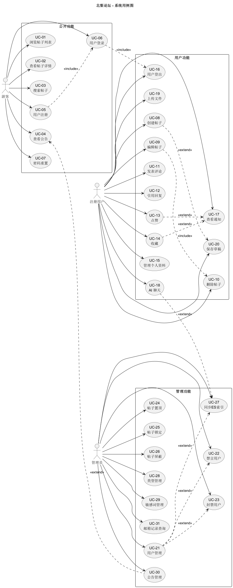

*（上图由 PlantUML 生成，源码见 `diagrams/usecase.puml`）*

### 用例说明

| 编号 | 用例名称 | 角色 | 前置条件 | 后置条件 | 简要描述 |
|------|----------|------|----------|----------|----------|
| UC-01 | 浏览帖子列表 | 游客/用户/管理员 | 无 | 无 | 分页浏览帖子，支持按分类筛选和排序 |
| UC-02 | 查看帖子详情 | 游客/用户/管理员 | 无 | 无 | 查看帖子完整内容及评论列表 |
| UC-03 | 搜索帖子 | 游客/用户/管理员 | ES 可用 | 无 | 使用 ES 进行全文搜索并高亮展示结果 |
| UC-04 | 查看公告 | 游客/用户/管理员 | 无 | 无 | 浏览已发布的公告列表和详情 |
| UC-05 | 用户注册 | 游客 | 邮箱可用 | 用户已创建 | 通过邮箱验证码注册新账号 |
| UC-06 | 用户登录 | 游客 | 账号已注册 | 获得 JWT | 用户名/邮箱 + 密码登录，签发 JWT |
| UC-07 | 密码重置 | 游客 | 邮箱可接收验证码 | 密码已更新 | 通过邮箱验证码重置账号密码 |
| UC-08 | 创建帖子 | 注册用户 | 已登录，未达限流阈值 | 帖子已发布或保存为草稿 | 使用 Quill 编辑器创建帖子，含敏感词检查 |
| UC-09 | 编辑帖子 | 注册用户 | 本人或管理员 | 帖子内容已更新 | 编辑已有帖子的标题、内容、分类 |
| UC-10 | 删除帖子 | 注册用户 | 本人或管理员 | 帖子已删除 | 删除指定帖子及其关联数据 |
| UC-11 | 发表评论 | 注册用户 | 已登录，未达限流阈值 | 评论已发表 | 对帖子发表含格式的评论内容 |
| UC-12 | 引用回复 | 注册用户 | 已登录 | 回复已发表 | 引用指定评论进行回复 |
| UC-13 | 点赞 | 注册用户 | 已登录 | Redis 缓存已更新 | 对帖子或评论进行点赞/取消操作 |
| UC-14 | 收藏 | 注册用户 | 已登录 | Redis 缓存已更新 | 收藏/取消收藏帖子 |
| UC-15 | 管理个人资料 | 注册用户 | 已登录 | 资料已更新 | 修改头像、联系方式、简介、隐私设置 |
| UC-16 | 用户登出 | 注册用户 | 已登录 | JWT 已加入黑名单 | 销毁当前会话 |
| UC-17 | 查看通知 | 注册用户 | 已登录 | 无 | 查看评论/点赞/系统通知列表 |
| UC-18 | AI 聊天 | 注册用户 | 已登录 | 无 | 与 DeepSeek AI 进行流式对话 |
| UC-19 | 上传文件 | 注册用户 | 已登录，未达限流阈值 | 文件已存储 | 上传图片或文件到 MinIO |
| UC-20 | 保存草稿 | 注册用户 | 已登录 | 草稿已保存 | 将未完成的帖子保存为草稿 |
| UC-21 | 用户管理 | 管理员 | 已登录，角色为 ADMIN | 无 | 浏览、搜索所有用户 |
| UC-22 | 禁言用户 | 管理员 | 已登录，角色为 ADMIN | 用户被禁言 | 对指定用户执行禁言，设定禁言时长 |
| UC-23 | 封禁用户 | 管理员 | 已登录，角色为 ADMIN | 用户被封禁 | 永久封禁违规用户 |
| UC-24 | 帖子置顶 | 管理员 | 已登录，角色为 ADMIN，帖子存在 | 帖子置顶状态已更新 | 将帖子置顶或取消置顶 |
| UC-25 | 帖子锁定 | 管理员 | 已登录，角色为 ADMIN | 帖子已锁定 | 锁定帖子，禁止新增评论 |
| UC-26 | 帖子屏蔽 | 管理员 | 已登录，角色为 ADMIN | 帖子已隐藏 | 屏蔽帖子，使其对普通用户不可见 |
| UC-27 | 同步 ES 索引 | 管理员 | ES 可用 | ES 索引已更新 | 手动触发全量 ES 重索引 |
| UC-28 | 类型管理 | 管理员 | 已登录，角色为 ADMIN | 分类已更新 | 增删改帖子分类 |
| UC-29 | 敏感词管理 | 管理员 | 已登录，角色为 ADMIN | 敏感词库已更新 | 管理敏感词，支持文件导入 |
| UC-30 | 公告管理 | 管理员 | 已登录，角色为 ADMIN | 公告已更新 | 增删改公告，控制发布状态 |
| UC-31 | 邮箱记录查询 | 管理员 | 已登录，角色为 ADMIN | 无 | 查询邮件发送历史记录 |

### 权限矩阵

| 功能 | 游客 | 注册用户 | 管理员 |
|------|:----:|:--------:|:------:|
| 浏览帖子列表 | O | O | O |
| 查看帖子详情 | O | O | O |
| 全文搜索 | O | O | O |
| 查看公告 | O | O | O |
| 用户注册 | O | X | X |
| 用户登录 | O | X | X |
| 密码重置 | O | X | X |
| 创建帖子 | X | O (限流) | O (限流) |
| 编辑本人帖子 | X | O | O |
| 删除本人帖子 | X | O | O |
| 编辑/删除任意帖子 | X | X | O |
| 发表评论 | X | O (限流) | O (限流) |
| 点赞/收藏 | X | O | O |
| 管理个人资料 | X | O | O |
| 用户登出 | X | O | O |
| 查看通知 | X | O | O |
| AI 聊天 | X | O | O |
| 上传文件 | X | O (限流) | O (限流) |
| 用户管理 | X | X | O |
| 禁言/封禁用户 | X | X | O |
| 帖子置顶/锁定/屏蔽 | X | X | O |
| ES 全量同步 | X | X | O |
| 类型管理 | X | X | O |
| 敏感词管理 | X | X | O |
| 公告 CRUD | X | X | O |
| 邮箱记录查询 | X | X | O |

> **注：** O 表示允许操作，X 表示不允许操作。"

---

### 二.3 前后端功能划分

系统采用前后端分离架构。前端为 Vue 3 单页应用（SPA），通过 HTTP 请求与后端微服务通信。后端各微服务独立部署，通过 Nacos 注册发现，经 Spring Cloud Gateway 统一路由。

| 功能 | 前端实现 | 后端微服务 | 通信方式 |
|------|----------|-----------|----------|
| 登录页 | 用户名/密码表单，JWT 前端存储 localStorage | `user-service` `/api/auth/login` | HTTP POST |
| 注册页 | 邮箱+密码+验证码表单 | `user-service` `/api/auth/register` | HTTP POST |
| 邮箱验证码 | 倒计时按钮，发送请求 | `user-service` `/api/auth/email-code` | HTTP POST |
| 密码重置 | 分步表单（邮箱→验证码→新密码） | `user-service` `/api/auth/reset-password` | HTTP POST |
| 帖子列表 | 分页滚动加载，分类 Tab 切换 | `forum-service` `/api/topic/page` | HTTP GET |
| 帖子详情 | 富文本渲染，评论嵌套展示 | `forum-service` `/api/topic/{id}` | HTTP GET |
| 创建帖子 | Quill 编辑器组件，草稿本地缓存 | `forum-service` `/api/topic/create` | HTTP POST |
| 编辑帖子 | Quill 编辑器回填草稿数据 | `forum-service` `/api/topic/update` | HTTP PUT |
| 删除帖子 | 二次确认弹窗 | `forum-service` `/api/topic/delete/{id}` | HTTP DELETE |
| 评论发表 | Quill 编辑器（2000 字限），快捷表情 | `forum-service` `/api/comment/create` | HTTP POST |
| 引用回复 | 评论区域 "回复" 按钮唤起编辑器 | `forum-service` `/api/comment/reply` | HTTP POST |
| 点赞/收藏 | 图标按钮，即时 UI 反馈 | `forum-service` `/api/interact/like` / `.../favorite` | HTTP POST |
| 全文搜索 | 搜索输入框，下拉实时建议 + 结果页 | `forum-service` `/api/search` | HTTP GET |
| AI 聊天 | 对话气泡组件，SSE 流式渲染 | `ai-service` `/api/ai/chat` | SSE (EventSource) |
| 对话管理 | 对话列表侧栏，切换/删除 | `ai-service` `/api/ai/conversation/**` | HTTP REST |
| 图片上传 | 拖拽/点击上传组件，预览裁剪 | `oss-service` `/api/image/upload` | HTTP POST (multipart) |
| 文件上传 | 通用上传组件，进度条 | `oss-service` `/api/file/upload` | HTTP POST (multipart) |
| 个人资料 | 表单 + 头像裁剪上传 | `user-service` `/api/user/profile` | HTTP PUT |
| 应用内通知 | 通知图标 + 下拉面板 | `notification-service` `/api/notification/**` | HTTP GET/POST |
| 公告管理 | 公告列表 + 编辑表单 | `announcement-service` `/api/admin/announcement/**` | HTTP REST |
| 管理后台 | Element Plus 表格 + 对话框 | 各服务 `/api/admin/**` | HTTP REST |
| 用户管理 | 分页表格，角色/状态操作按钮 | `user-service` `/api/admin/user/**` | HTTP REST |
| 帖子管理 | 分页表格，置顶/锁定/屏蔽/删除 | `forum-service` `/api/admin/forum/**` | HTTP REST |
| 类型管理 | 分类 CRUD 表单 | `forum-service` `/api/admin/forum/type` | HTTP REST |
| 敏感词管理 | 文本列表 + 文件导入 | `forum-service` (prohibited.json) | HTTP REST |
| 注册页面 | 背景图/渐变色布局，验证码倒计时 | `user-service` `/api/auth/**` | HTTP POST |
| 首页 | SPA 路由分发，Element Plus/Vant 布局 | N/A（纯前端） | — |
| 移动端布局 | Vant TabBar + NavBar 组件 | N/A（纯前端） | — |
| PWA 离线缓存 | Service Worker 注册 | N/A（纯前端） | — |

---

### 二.4 系统界面截图

### 二.4a 登录页面

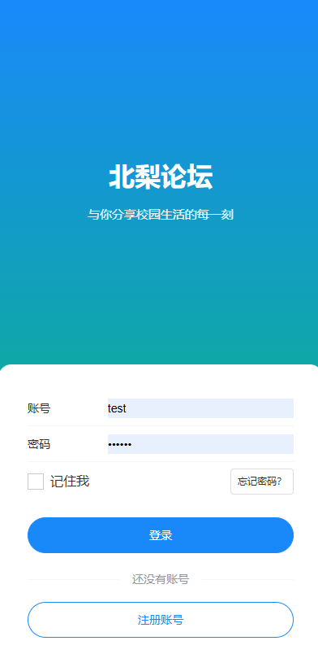

### 二.4b 帖子列表

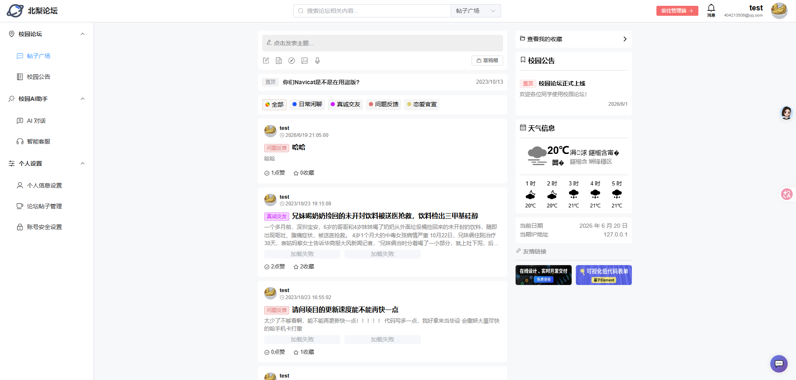
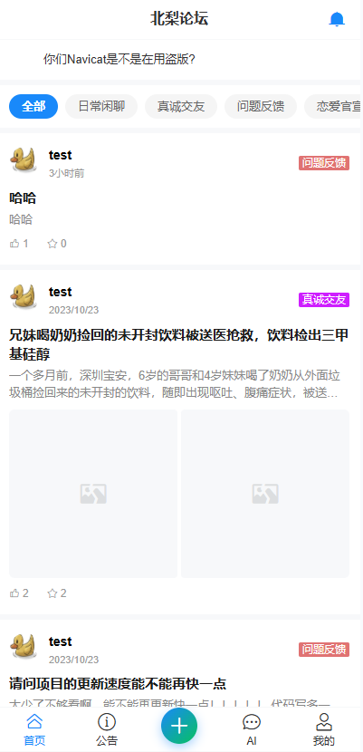

### 二.4c 帖子详情与评论

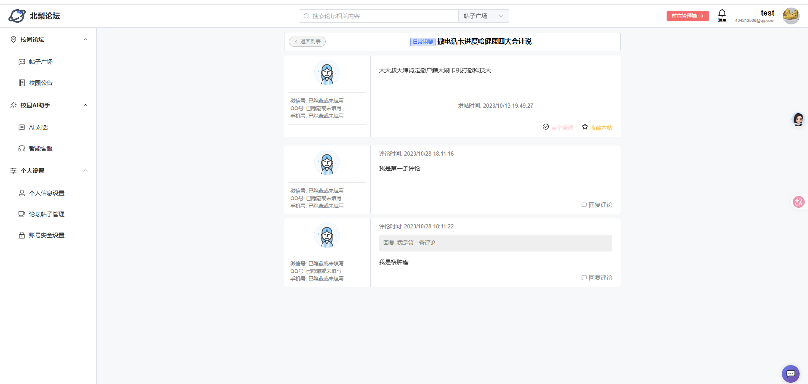
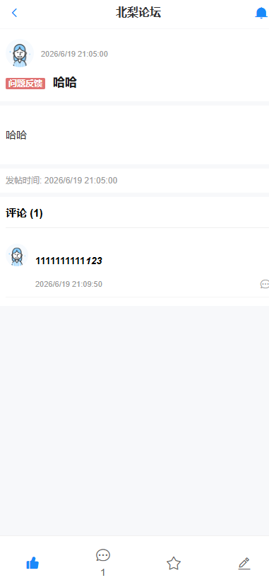

### 二.4d AI 聊天助手

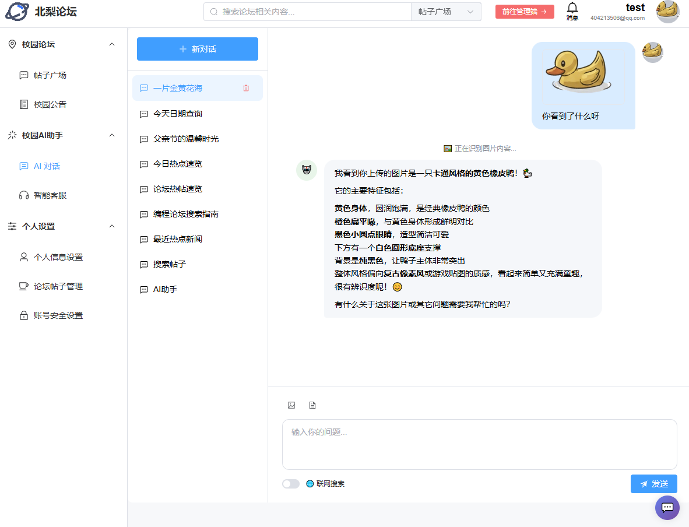
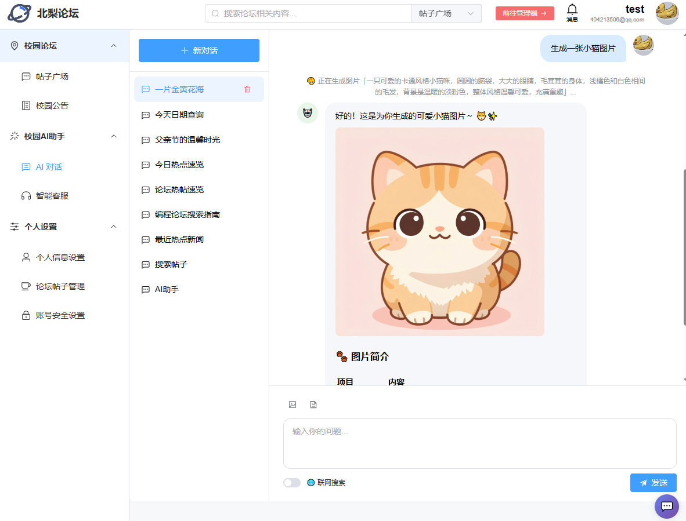
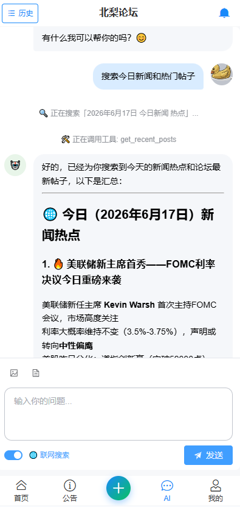

### 二.4e 管理后台
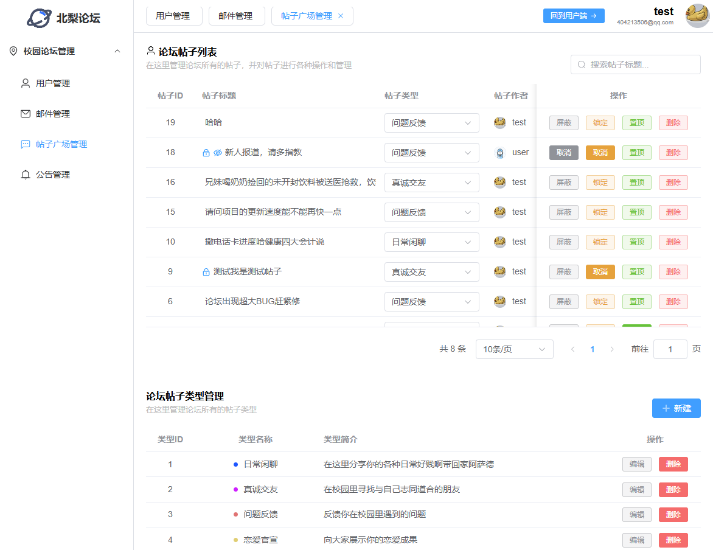

*管理后台采用左侧导航菜单 + 右侧内容区的经典布局。导航菜单包含用户管理、帖子管理、类型管理、敏感词管理、邮箱记录、公告管理等入口。内容区以 Element Plus 表格组件展示数据，表格支持关键词搜索、分页、批量操作。管理操作通过对话框（Dialog）形式展开，包含确认弹窗二次确认以防止误操作。*

### 二.4f 个人中心
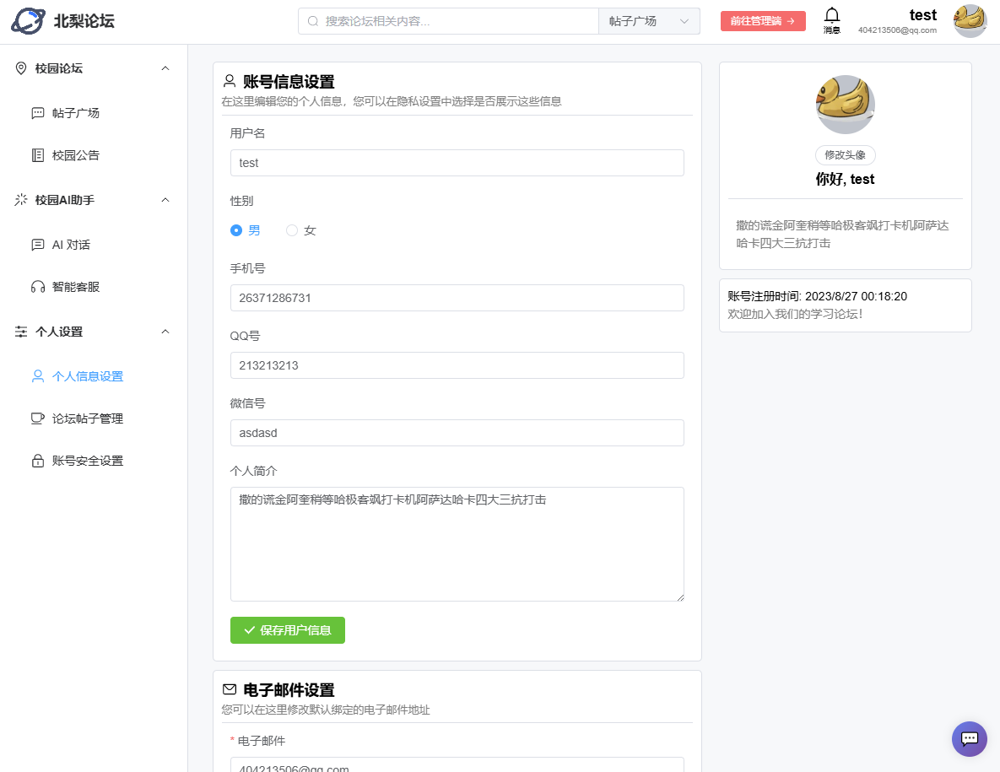
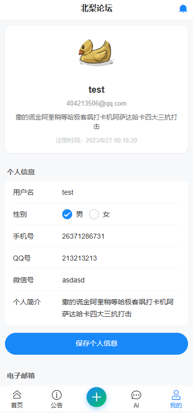

---

### 二.5 开发计划

项目按 5 人团队 5 周迭代开发。团队组成：**吴海峰**（组长/全栈架构）、**黄朋悦**（AI 开发/移动端）、**欧阳希朋**（AI 开发/前端开发）、**李昊**（后端开发/文档）、**赵欣航**（后端开发/搜索）。

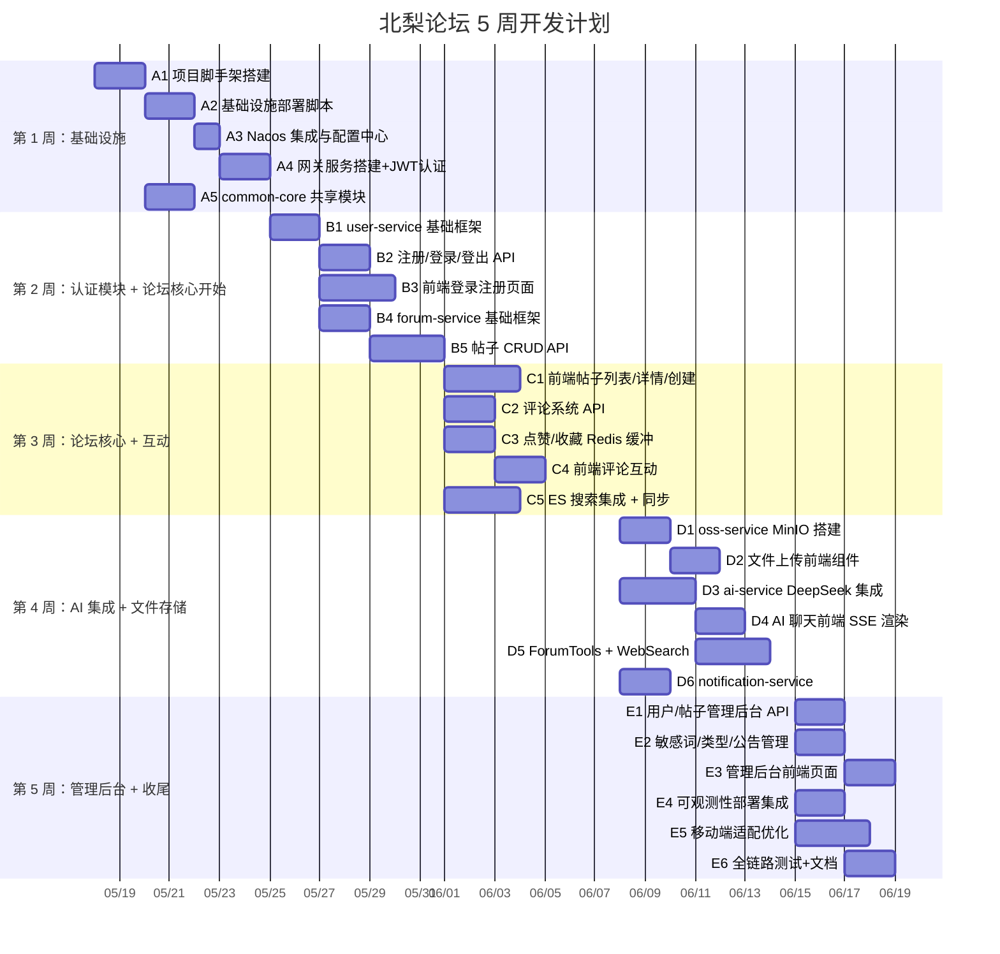
```mermaid
gantt
  title 北梨论坛 5 周开发计划
  dateFormat  YYYY-MM-DD
  axisFormat  %m/%d

  section 第 1 周：基础设施
  A1 项目脚手架搭建       :a1, 2026-05-18, 2d
  A2 基础设施部署脚本      :a2, after a1, 2d
  A3 Nacos 集成与配置中心  :a3, after a2, 1d
  A4 网关服务搭建+JWT认证  :a4, after a3, 2d
  A5 common-core 共享模块  :a5, after a1, 2d

  section 第 2 周：认证模块 + 论坛核心开始
  B1 user-service 基础框架  :b1, 2026-05-25, 2d
  B2 注册/登录/登出 API     :b2, after b1, 2d
  B3 前端登录注册页面       :b3, after b1, 3d
  B4 forum-service 基础框架  :b4, 2026-05-27, 2d
  B5 帖子 CRUD API          :b5, after b4, 3d

  section 第 3 周：论坛核心 + 互动
  C1 前端帖子列表/详情/创建  :c1, 2026-06-01, 3d
  C2 评论系统 API            :c2, after b5, 2d
  C3 点赞/收藏 Redis 缓冲    :c3, after b5, 2d
  C4 前端评论互动            :c4, after c2, 2d
  C5 ES 搜索集成 + 同步      :c5, after b5, 3d

  section 第 4 周：AI 集成 + 文件存储
  D1 oss-service MinIO 搭建  :d1, 2026-06-08, 2d
  D2 文件上传前端组件         :d2, after d1, 2d
  D3 ai-service DeepSeek 集成 :d3, 2026-06-08, 3d
  D4 AI 聊天前端 SSE 渲染    :d4, after d3, 2d
  D5 ForumTools + WebSearch  :d5, after d3, 3d
  D6 notification-service     :d6, 2026-06-08, 2d

  section 第 5 周：管理后台 + 收尾
  E1 用户/帖子管理后台 API    :e1, 2026-06-15, 2d
  E2 敏感词/类型/公告管理      :e2, 2026-06-15, 2d
  E3 管理后台前端页面          :e3, after e1, 2d
  E4 可观测性部署集成          :e4, 2026-06-15, 2d
  E5 移动端适配优化            :e5, 2026-06-15, 3d
  E6 全链路测试+文档          :e6, after e4, 2d
```

### 任务依赖明细

| 任务编号 | 任务名称 | 预估工时 | 依赖 | 负责人 |
|----------|----------|----------|------|--------|
| A1 | 项目脚手架搭建 | 2人天 | 无 | 吴海峰 |
| A2 | 基础设施部署脚本 | 2人天 | A1 | 吴海峰 |
| A3 | Nacos 集成与配置中心 | 1人天 | A2 | 吴海峰 |
| A4 | 网关服务搭建 + JWT 认证 | 2人天 | A3 | 吴海峰 |
| A5 | common-core 共享模块 | 2人天 | A1 | 李昊 |
| B1 | user-service 基础框架 | 2人天 | A3, A5 | 吴海峰 |
| B2 | 注册/登录/登出 API | 2人天 | B1 | 吴海峰 |
| B3 | 前端登录注册页面 | 3人天 | A1 | 黄朋悦 |
| B4 | forum-service 基础框架 | 2人天 | A3, A5 | 李昊 |
| B5 | 帖子 CRUD API | 3人天 | B4 | 李昊 |
| C1 | 前端帖子列表/详情/创建 | 3人天 | B5 | 欧阳希朋 |
| C2 | 评论系统 API | 2人天 | B5 | 李昊 |
| C3 | 点赞/收藏 Redis 缓冲 | 2人天 | B5 | 吴海峰 |
| C4 | 前端评论互动 | 2人天 | C2, C3 | 欧阳希朋 |
| C5 | ES 搜索集成 + 同步 | 3人天 | B5 | 赵欣航 |
| D1 | oss-service MinIO 搭建 | 2人天 | A4 | 吴海峰 |
| D2 | 文件上传前端组件 | 2人天 | D1 | 黄朋悦 |
| D3 | ai-service DeepSeek 集成 | 3人天 | A4 | 黄朋悦 |
| D4 | AI 聊天前端 SSE 渲染 | 2人天 | D3 | 欧阳希朋 |
| D5 | ForumTools + WebSearch | 3人天 | D3, C5 | 黄朋悦 |
| D6 | notification-service | 2人天 | A4 | 吴海峰 |
| E1 | 用户/帖子管理后台 API | 2人天 | B1, B5 | 赵欣航 |
| E2 | 敏感词/类型/公告管理 | 2人天 | B5 | 赵欣航 |
| E3 | 管理后台前端页面 | 2人天 | E1, E2 | 欧阳希朋 |
| E4 | 可观测性部署集成 | 2人天 | A2 | 吴海峰 |
| E5 | 移动端适配优化 | 3人天 | C1, C4 | 黄朋悦 |
| E6 | 全链路测试 + 文档 | 2人天 | 全部 | 吴海峰 |

### 里程碑节点

| 里程碑 | 时间 | 交付物 | 验收标准 |
|--------|------|--------|----------|
| M1 基础设施就绪 | 第 1 周末 | Nacos + MySQL + Redis + ES + RabbitMQ + MinIO 成功运行，网关可路由请求 | `docker compose ps` 全部健康，网关 200 响应 |
| M2 认证链路打通 | 第 2 周末 | 用户可注册、登录、登出，JWT 认证生效 | 注册→登录→访问受保护 API 全链路验证通过 |
| M3 论坛 MVP | 第 3 周末 | 帖子 CRUD + 评论 + 点赞/收藏 + ES 搜索可用 | 用户可完整走完发帖→搜索→评论→点赞流程 |
| M4 AI 集成完成 | 第 4 周末 | AI 流式聊天 + RAG 搜索 + 文件上传可用 | SSE 连接稳定，AI 可准确搜索并引用论坛内容 |
| M5 系统交付 | 第 5 周末 | 管理后台、可观测性、移动端适配全部完成 | 功能验收测试通过，Grafana 面板就绪 |

---

## 三、领域模型

### 三.1 领域类图

下图展示了"北梨论坛"全部核心领域实体及其静态关系，按微服务边界分组。类图中包含属性（Java 类型）、关联多重性以及组合/聚合语义。

```mermaid
classDiagram
    %% ==================== 用户域 ====================
    namespace UserService {
        class Account {
            +Long id
            +String username
            +String password
            +String email
            +String role
            +String avatar
            +LocalDateTime registerTime
            +Boolean mute
            +Boolean banned
            +register()
            +login()
            +logout()
            +updateProfile()
        }

        class AccountDetails {
            +Long id
            +String gender
            +String phone
            +String qq
            +String wx
            +String desc
        }

        class AccountPrivacy {
            +Long id
            +Boolean phoneHidden
            +Boolean emailHidden
            +Boolean wxHidden
            +Boolean qqHidden
            +Boolean genderHidden
        }

        class EmailRecord {
            +Long id
            +String email
            +String title
            +String content
            +LocalDateTime time
            +Integer status
            +send()
        }
    }

    %% ==================== 论坛域 ====================
    namespace ForumService {
        class Topic {
            +Long id
            +String title
            +String intro
            +String content
            +Long type
            +Long uid
            +LocalDateTime time
            +Boolean top
            +Boolean locked
            +Boolean invisible
            +create()
            +update()
            +delete()
            +syncToES()
        }

        class TopicType {
            +Long id
            +String name
            +String desc
            +String color
        }

        class TopicComment {
            +Long id
            +Long uid
            +Long tid
            +String content
            +LocalDateTime time
            +Long quote
            +create()
            +delete()
        }

        class TopicDraft {
            +Long id
            +Long userId
            +Long type
            +String title
            +String content
            +LocalDateTime createTime
            +LocalDateTime updateTime
            +save()
            +delete()
        }

        class Interact {
            <<ValueObject>>
            +Long tid
            +Long uid
            +LocalDateTime time
            +String type
        }

        class TopicDocument {
            <<ES Index>>
            +String id
            +String title
            +String content
            +String intro
            +Long uid
            +Long type
            +LocalDateTime time
            +Boolean top
            +Boolean locked
            +Boolean invisible
        }
    }

    %% ==================== 公告域 ====================
    namespace AnnouncementService {
        class Announcement {
            +Long id
            +Long uid
            +String title
            +String summary
            +String content
            +Boolean published
            +Boolean top
            +LocalDateTime createTime
            +LocalDateTime updateTime
            +LocalDateTime publishTime
            +publish()
            +unpublish()
        }
    }

    %% ==================== 通知域 ====================
    namespace NotificationService {
        class Notification {
            +Long id
            +Long uid
            +String title
            +String content
            +String type
            +String url
            +LocalDateTime time
            +send()
        }
    }

    %% ==================== AI域 ====================
    namespace AIService {
        class AiConversation {
            +Long id
            +Long userId
            +String title
            +LocalDateTime createdTime
            +LocalDateTime updatedTime
            +create()
            +delete()
        }

        class AiConversationMessage {
            +Long id
            +Long conversationId
            +String role
            +String content
            +String messageType
            +LocalDateTime createdTime
        }
    }

    %% ==================== 存储域 ====================
    namespace OSSService {
        class StoreImage {
            +Long uid
            +String name
            +LocalDateTime time
            +upload()
            +delete()
        }
    }

    %% ==================== 关系 ====================

    %% Account 1→* Topic
    Account "1" --> "*" Topic : 发帖人
    Account "1" --> "*" TopicComment : 评论人
    Account "1" --> "*" Announcement : 发布者
    Account "1" --> "*" Notification : 接收者
    Account "1" --> "*" AiConversation : 对话发起者

    %% Account 1→1 AccountDetails / AccountPrivacy
    Account "1" --> "1" AccountDetails : 扩展信息
    Account "1" --> "1" AccountPrivacy : 隐私设置

    %% Topic 1→* TopicComment
    Topic "1" --> "*" TopicComment : 包含
    TopicComment "*" --> "0..1" TopicComment : 引用(quote)

    %% Topic 1→* Interact (like / collect)
    Topic "1" --> "*" Interact : 互动记录
    Interact "*" --> "1" Account : 互动用户

    %% Topic 1→1 TopicDocument (ES)
    Topic "1" --> "1" TopicDocument : 同步索引

    %% TopicType 1→* Topic
    TopicType "1" --> "*" Topic : 分类

    %% AiConversation 1→* AiConversationMessage
    AiConversation "1" --> "*" AiConversationMessage : 包含消息

    %% Topic 1→* TopicDraft
    Account "1" --> "*" TopicDraft : 草稿
```

#### 三.1.1 实体说明

| 实体 | 所属服务 | 持久化存储 | 说明 |
|------|---------|-----------|------|
| Account | user-service | MySQL (db_account) | 核心用户账户，BCrypt 加密密码 |
| AccountDetails | user-service | MySQL (db_account_details) | 用户扩展资料，与 Account 一对一 |
| AccountPrivacy | user-service | MySQL (db_account_privacy) | 隐私可见性标记，与 Account 一对一 |
| EmailRecord | user-service | MySQL (db_email_record) | 邮件发送记录，含状态追踪 |
| Topic | forum-service | MySQL (db_topic) | 帖子主体，内容为 Quill Delta JSON |
| TopicType | forum-service | MySQL (db_topic_type) | 帖子分类，带颜色标记 |
| TopicComment | forum-service | MySQL (db_topic_comment) | 评论，支持引用父评论形成树形结构 |
| TopicDraft | forum-service | MySQL (db_topic_draft) | 草稿箱，用户维度的临时存储 |
| Interact | forum-service | MySQL (动态表) | 值对象，存储在点赞/收藏动态表中 |
| TopicDocument | forum-service | Elasticsearch | ES 索引，与 Topic 一对一映射 |
| Announcement | announcement-service | MySQL (db_announcement) | 公告，支持发布/下架状态 |
| Notification | notification-service | MySQL (db_notification) | 用户通知，含类型和跳转链接 |
| AiConversation | ai-service | MySQL (ai_conversation) | AI 对话会话 |
| AiConversationMessage | ai-service | MySQL (ai_conversation_message) | 对话消息，支持多种消息类型 |
| StoreImage | oss-service | MySQL (db_image_store) + MinIO | 图片存储记录，MinIO 管理二进制 |

---

### 三.2 包图

下图展示各微服务之间的编译期与运行期依赖关系。

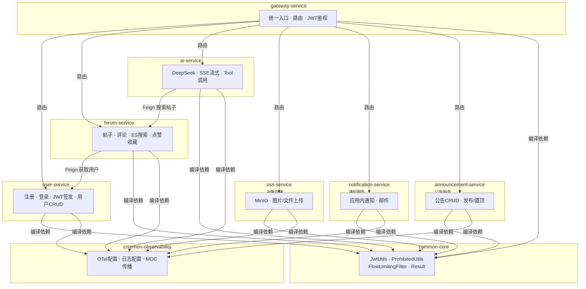
```mermaid
flowchart TD
    subgraph gateway-service["gateway-service<br/><small>Spring Cloud Gateway</small>"]
        gw[统一入口 · 路由 · JWT鉴权]
    end

    subgraph user-service["user-service<br/><small>用户认证与管理</small>"]
        us[注册 · 登录 · JWT签发 · 用户CRUD]
    end

    subgraph forum-service["forum-service<br/><small>帖子与搜索</small>"]
        fs[帖子 · 评论 · ES搜索 · 点赞收藏]
    end

    subgraph ai-service["ai-service<br/><small>AI 聊天</small>"]
        as[DeepSeek · SSE流式 · Tool调用]
    end

    subgraph oss-service["oss-service<br/><small>对象存储</small>"]
        oss[MinIO · 图片/文件上传]
    end

    subgraph notification-service["notification-service<br/><small>通知服务</small>"]
        ns[应用内通知 · 邮件]
    end

    subgraph announcement-service["announcement-service<br/><small>公告服务</small>"]
        ann[公告CRUD · 发布/置顶]
    end

    subgraph common-core["common-core<br/><small>共享基础</small>"]
        core[JwtUtils · ProhibitedUtils<br/>FlowLimitingFilter · Result]
    end

    subgraph common-observability["common-observability<br/><small>共享可观测性</small>"]
        obs[OTel配置 · 日志配置 · MDC传播]
    end

    gw -->|路由| us
    gw -->|路由| fs
    gw -->|路由| as
    gw -->|路由| oss
    gw -->|路由| ns
    gw -->|路由| ann
    gw -->|编译依赖| core

    fs -->|Feign 获取用户| us
    fs -->|编译依赖| core
    fs -->|编译依赖| obs

    us -->|编译依赖| core
    us -->|编译依赖| obs

    as -->|Feign 搜索帖子| fs
    as -->|编译依赖| core
    as -->|编译依赖| obs

    oss -->|编译依赖| core
    oss -->|编译依赖| obs

    ns -->|编译依赖| core
    ns -->|编译依赖| obs

    ann -->|编译依赖| core
    ann -->|编译依赖| obs
```

#### 三.2.1 包依赖说明

| 源包 | 目标包 | 依赖方式 | 用途 |
|------|--------|---------|------|
| gateway-service | 所有服务 | HTTP 路由 + 负载均衡 | 统一入口，按路径前缀分发请求 |
| gateway-service | common-core | 编译依赖 | JWT 过滤器校验令牌 |
| forum-service | user-service | FeignClient | 获取用户昵称、头像等公开信息 |
| ai-service | forum-service | FeignClient | ForumTools 工具调用，搜索帖子数据实现 RAG |
| 所有服务 | common-core | 编译依赖 | 共享 DTO、Result 封装、工具类 |
| 所有服务 | common-observability | 编译依赖 | Micrometer + OTLP 配置上报 |

**基础设施层**（非 Java 包，但为运行期依赖）：

- **Nacos** — 所有微服务启动时注册，网关通过 Nacos 发现服务实例
- **MySQL** — user/forum/ai/oss/notification/announcement 服务的数据持久化
- **Redis** — 缓存、JWT 黑名单、点赞/收藏缓冲、限流计数器
- **Elasticsearch** — forum-service 的全文搜索索引
- **RabbitMQ** — notification-service 消费邮件发送队列
- **MinIO** — oss-service 管理图片/文件对象存储

---

### 三.3 顺序图

#### 三.3.1 发帖流程

用户通过前端创建帖子，请求经网关路由到 forum-service，完成 MySQL 持久化以及 ES 索引同步后返回。

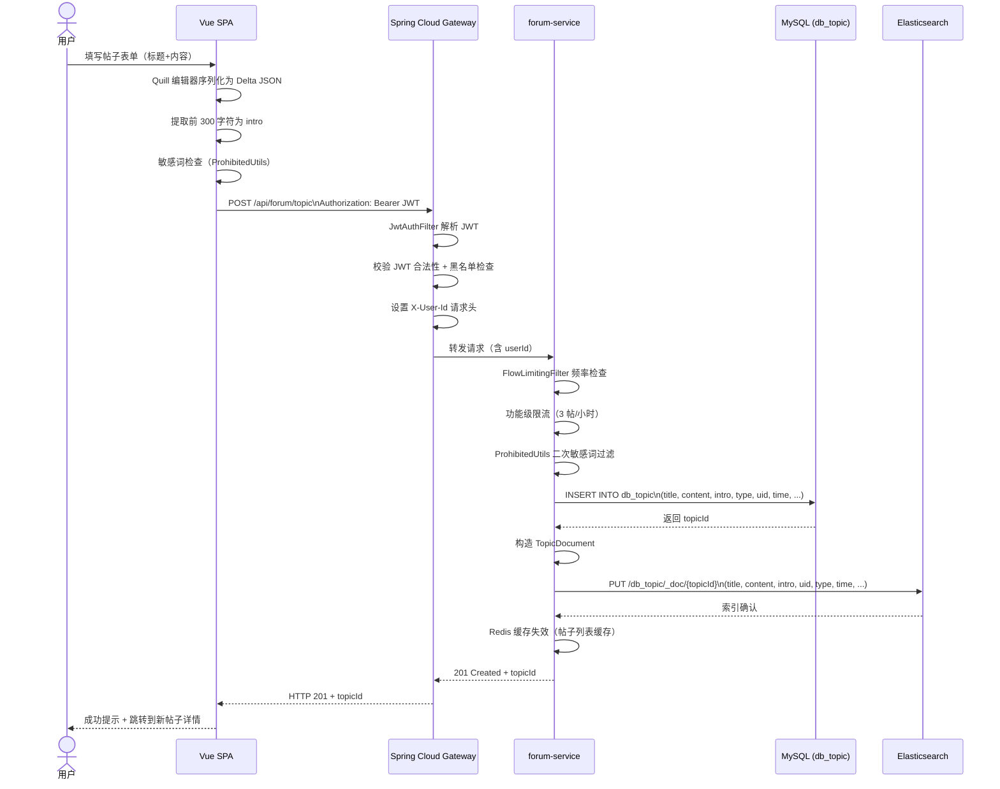
```mermaid
sequenceDiagram
    actor 用户
    participant 前端 as Vue SPA
    participant 网关 as Spring Cloud Gateway
    participant 论坛服务 as forum-service
    participant MySQL as MySQL (db_topic)
    participant ES as Elasticsearch

    用户 ->> 前端: 填写帖子表单（标题+内容）
    前端 ->> 前端: Quill 编辑器序列化为 Delta JSON
    前端 ->> 前端: 提取前 300 字符为 intro
    前端 ->> 前端: 敏感词检查（ProhibitedUtils）
    前端 ->> 网关: POST /api/forum/topic\nAuthorization: Bearer JWT

    网关 ->> 网关: JwtAuthFilter 解析 JWT
    网关 ->> 网关: 校验 JWT 合法性 + 黑名单检查
    网关 ->> 网关: 设置 X-User-Id 请求头
    网关 ->> 论坛服务: 转发请求（含 userId）

    论坛服务 ->> 论坛服务: FlowLimitingFilter 频率检查
    论坛服务 ->> 论坛服务: 功能级限流（3 帖/小时）
    论坛服务 ->> 论坛服务: ProhibitedUtils 二次敏感词过滤
    论坛服务 ->> MySQL: INSERT INTO db_topic\n(title, content, intro, type, uid, time, ...)

    MySQL -->> 论坛服务: 返回 topicId

    论坛服务 ->> 论坛服务: 构造 TopicDocument
    论坛服务 ->> ES: PUT /db_topic/_doc/{topicId}\n(title, content, intro, uid, type, time, ...)
    ES -->> 论坛服务: 索引确认

    论坛服务 ->> 论坛服务: Redis 缓存失效（帖子列表缓存）

    论坛服务 -->> 网关: 201 Created + topicId
    网关 -->> 前端: HTTP 201 + topicId
    前端 -->> 用户: 成功提示 + 跳转到新帖子详情
```

**关键时序点：**

1. 前端序列化 Quill Delta JSON，提取纯文本 intro（前 300 字符）
2. 网关 JwtAuthFilter 验证 JWT，无状态不查数据库
3. forum-service 双重限流（全局 + 功能级）
4. 先写 MySQL 再同步 ES，写操作以 MySQL 为准
5. ES 同步失败不阻断主流程（仅在日志记录错误）
6. 可选：管理员可通过 `/api/admin/forum/sync-to-es` 触发全量同步

#### 三.3.2 AI 聊天带 Tool 调用流程

用户发送消息，ai-service 调用 DeepSeek API，模型主动触发 ForumTools 工具搜索论坛数据，实现 RAG 增强回答。

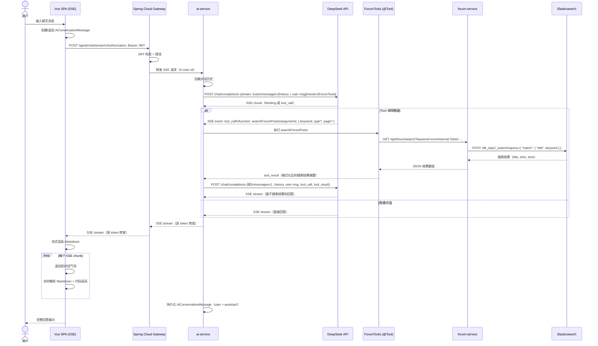
```mermaid
sequenceDiagram
    actor 用户
    participant 前端 as Vue SPA (SSE)
    participant 网关 as Spring Cloud Gateway
    participant AI服务 as ai-service
    participant DeepSeek as DeepSeek API
    participant ForumTools as ForumTools (@Tool)
    participant 论坛服务 as forum-service
    participant ES as Elasticsearch

    用户 ->> 前端: 输入聊天消息
    前端 ->> 前端: 创建/追加 AiConversationMessage
    前端 ->> 网关: POST /api/ai/chat/stream\nAuthorization: Bearer JWT

    网关 ->> 网关: JWT 校验 + 限流
    网关 ->> AI服务: 转发 SSE 请求（X-User-Id）

    AI服务 ->> AI服务: 加载对话历史
    AI服务 ->> DeepSeek: POST /chat/completions (stream: true)\nmessages=[history + user msg]\ntools=[ForumTools]

    DeepSeek -->> AI服务: SSE chunk（thinking 或 tool_call）

    alt Tool 调用触发
        DeepSeek -->> AI服务: SSE event: tool_call\nfunction: searchForumPosts\narguments: { keyword, type?, page? }

        AI服务 ->> ForumTools: 执行 searchForumPosts

        ForumTools ->> 论坛服务: GET /api/forum/search?keyword=xxx\nInternal-Token: ...

        论坛服务 ->> ES: POST /db_topic/_search\nquery={ "match": { "title": keyword } }
        ES -->> 论坛服务: 搜索结果（title, intro, time）
        论坛服务 -->> ForumTools: JSON 结果数组

        ForumTools -->> AI服务: tool_result（格式化后的搜索结果摘要）

        AI服务 ->> DeepSeek: POST /chat/completions (续)\nmessages=[...history, user msg, tool_call, tool_result]

        DeepSeek -->> AI服务: SSE stream（基于搜索结果的回答）
    else 普通对话
        DeepSeek -->> AI服务: SSE stream（直接回答）
    end

    AI服务 -->> 网关: SSE stream（逐 token 转发）
    网关 -->> 前端: SSE stream（逐 token 转发）
    前端 ->> 前端: 流式渲染 Markdown

    loop 每个 SSE chunk
        前端 ->> 前端: 追加到对话气泡
        前端 ->> 前端: 实时解析 Markdown + 代码高亮
    end

    AI服务 ->> AI服务: 持久化 AiConversationMessage（user + assistant）
    前端 -->> 用户: 完整回答展示
```

**Tool 调用机制说明：**

| 步骤 | 参与者 | 说明 |
|------|--------|------|
| 1 | 前端 | 通过 POST SSE 端点发送用户消息 |
| 2 | ai-service | 构建包含 `tools` 参数的 DeepSeek API 请求 |
| 3 | DeepSeek | 判断是否需要 Tool 调用，返回 `tool_call` 事件 |
| 4 | ai-service | 反射执行 `@Tool` 注解方法（ForumTools） |
| 5 | ForumTools | 通过 FeignClient 调用 forum-service 搜索接口 |
| 6 | forum-service | 查询 ES 返回匹配帖子 |
| 7 | ai-service | 将 tool_result 追加到对话上下文，继续请求 DeepSeek |
| 8 | DeepSeek | 基于搜索结果生成自然语言回答 |
| 9 | 网关 | `response-timeout: -1` 支持长时间 SSE 流 |

当前 ForumTools 提供以下工具：

- `searchForumPosts(keyword, type?, page?)` — 搜索论坛帖子

---

### 三.4 JWT 认证生命周期活动图

下图展示 JWT 从签发到过期（或主动登出）的完整状态流转。

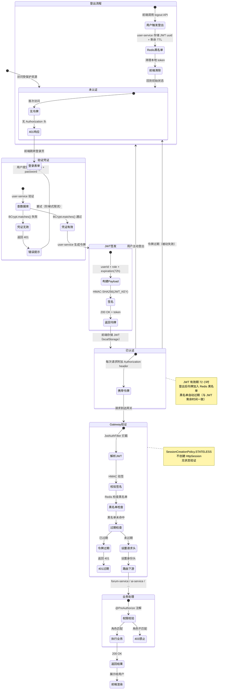
```mermaid
stateDiagram-v2
    [*] --> 未认证: 访问受保护资源

    state 未认证 {
        [*] --> 无令牌: 首次访问
        无令牌 --> 401响应: 无 Authorization 头
    }

    401响应 --> 登录表单: 前端跳转登录页
    登录表单 --> 验证凭证: 用户提交 username + password

    state 验证凭证 {
        [*] --> 查数据库: user-service 验证
        查数据库 --> 凭证有效: BCrypt.matches() 通过
        查数据库 --> 凭证无效: BCrypt.matches() 失败
        凭证无效 --> 错误提示: 返回 401
        错误提示 --> 登录表单: 重试（阶梯式限流）
    }

    凭证有效 --> JWT签发: user-service 生成令牌

    state JWT签发 {
        [*] --> 构建Payload: userId + role + expiration(72h)
        构建Payload --> 签名: HMAC-SHA256(JWT_KEY)
        签名 --> 返回令牌: 200 OK + token
    }

    返回令牌 --> 已认证: 前端存储 JWT（localStorage）

    state 已认证 {
        [*] --> 携带令牌: 每次请求附加 Authorization header
    }

    携带令牌 --> Gateway验证: 请求到达网关

    state Gateway验证 {
        [*] --> 解析JWT: JwtAuthFilter 拦截
        解析JWT --> 校验签名: HMAC 验签
        校验签名 --> 黑名单检查: Redis 检查黑名单
        黑名单检查 --> 过期检查: 黑名单未命中
        过期检查 --> 设置请求头: 未过期
        过期检查 --> 令牌过期: 已过期
        令牌过期 --> 401过期: 返回 401
        设置请求头 --> 路由下游: 设置身份头
    }

    路由下游 --> 业务处理: forum-service / ai-service / ...

    state 业务处理 {
        [*] --> 权限校验: @PreAuthorize 注解
        权限校验 --> 执行业务: 角色匹配
        权限校验 --> 403禁止: 角色不匹配
    }

    执行业务 --> 返回结果: 200 OK
    返回结果 --> 前端渲染: 展示给用户

    state 登出流程 {
        [*] --> 用户触发登出: 前端调用 logout API
        用户触发登出 --> Redis黑名单: user-service 存储 JWT uuid + 剩余 TTL
        Redis黑名单 --> 前端清除: 清理本地 token
        前端清除 --> 未认证: 回到初始状态
    }

    已认证 --> 登出流程: 用户主动登出
    已认证 --> 未认证: 令牌过期（被动失效）

    note right of 已认证
        JWT 有效期 72 小时
        登出后令牌加入 Redis 黑名单
        黑名单自动过期（与 JWT 剩余时间一致）
    end note

    note right of Gateway验证
        SessionCreationPolicy.STATELESS
        不创建 HttpSession
        无状态验证
    end note
```

#### 三.4.1 JWT 认证关键决策点

| 决策点 | 分支条件 | 结果 |
|--------|---------|------|
| 黑名单检查 | UUID 存在于 Redis `jwt:blacklist:*` | 返回 401，令牌已注销 |
| 签名校验 | HMAC 签名不匹配 | 返回 401，令牌被篡改 |
| 过期检查 | `exp` 小于当前时间 | 返回 401，令牌过期 |
| 权限校验 | `ROLE_ADMIN` 访问管理端点 | 通过或返回 403 |
| 阶梯式限流 | 登录失败次数递增 | 逐级增加等待时间 |
| 功能级限流 | 发帖/评论频率超限 | 返回 429 Too Many Requests |

#### 三.4.2 认证数据流总览

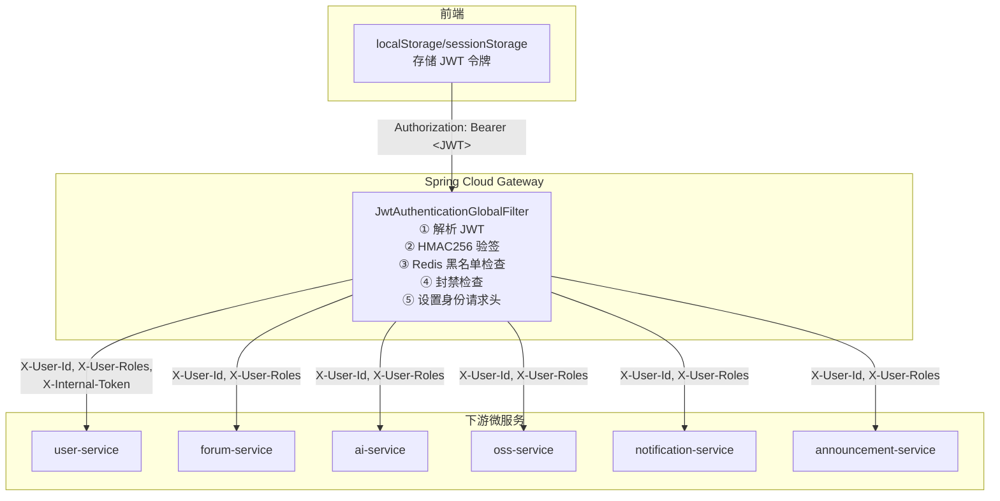
```mermaid
flowchart TD
    subgraph 前端["前端"]
        LS["localStorage/sessionStorage<br/>存储 JWT 令牌"]
    end

    subgraph Gateway["Spring Cloud Gateway"]
        JWT["JwtAuthenticationGlobalFilter<br/>① 解析 JWT<br/>② HMAC256 验签<br/>③ Redis 黑名单检查<br/>④ 封禁检查<br/>⑤ 设置身份请求头"]
    end

    subgraph Microservices["下游微服务"]
        S1["user-service"]
        S2["forum-service"]
        S3["ai-service"]
        S4["oss-service"]
        S5["notification-service"]
        S6["announcement-service"]
    end

    LS -->|"Authorization: Bearer &lt;JWT&gt;"| JWT
    JWT -->|"X-User-Id, X-User-Roles,<br/>X-Internal-Token"| S1
    JWT -->|"X-User-Id, X-User-Roles"| S2
    JWT -->|"X-User-Id, X-User-Roles"| S3
    JWT -->|"X-User-Id, X-User-Roles"| S4
    JWT -->|"X-User-Id, X-User-Roles"| S5
    JWT -->|"X-User-Id, X-User-Roles"| S6
```

---

### 三.5 实体关系矩阵

下表从数据库表的角度汇总实体间的主外键关系。

| 源表 | 外键字段 | 目标表 | 关系类型 |
|------|---------|--------|---------|
| db_account_details | id | db_account (id) | 1:1（共享主键） |
| db_account_privacy | id | db_account (id) | 1:1（共享主键） |
| db_topic | uid | db_account (id) | N:1 |
| db_topic | type | db_topic_type (id) | N:1 |
| db_topic_comment | uid | db_account (id) | N:1 |
| db_topic_comment | tid | db_topic (id) | N:1 |
| db_topic_comment | quote | db_topic_comment (id) | N:0..1（自引用） |
| db_topic_draft | userId | db_account (id) | N:1 |
| db_announcement | uid | db_account (id) | N:1 |
| db_notification | uid | db_account (id) | N:1 |
| ai_conversation | userId | db_account (id) | N:1 |
| ai_conversation_message | conversationId | ai_conversation (id) | N:1 |
| db_image_store | uid | db_account (id) | N:1 |
