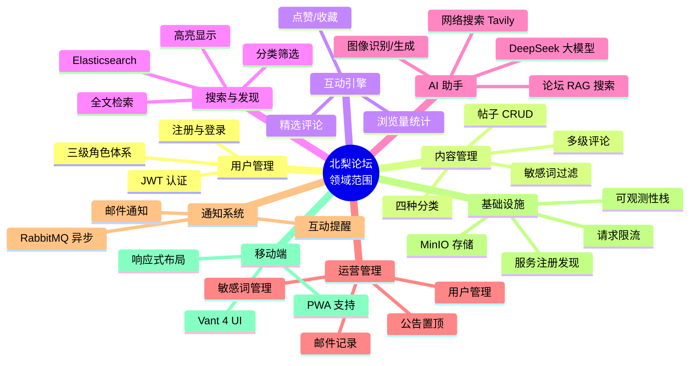

## A.1 领域边界

### A.1.1 问题领域定义

北梨论坛所涉问题领域为**高校校园信息交流与社区互动**，具体涵盖以下子领域：

- **校园信息发布与获取**：学生和教职工之间发布通知、分享资讯、交流观点，替代传统公告栏和分散的社交群组。
- **学术讨论与协作**：课程学习交流、学术问题答疑、科研经验分享，构建校内学术氛围。
- **校内社交与人际连接**：跨年级、跨专业的交友互动，缓解高校学生社交圈层固化问题。
- **校园生活服务**：失物招领、二手交易、拼车拼单、活动组织等生活场景支持。
- **内容管理与治理**：敏感词过滤、帖子审核、公告置顶，保障校园网络环境健康有序。

### A.1.2 系统范围边界

**系统在范围内（做）：**

| 范围 | 说明 |
|------|------|
| 用户认证与角色管理 | JWT 无状态认证，支持游客、注册用户、管理员三级角色体系 |
| 论坛帖子 CRUD | 基于 Quill Delta 富文本编辑器，支持日常闲聊、真诚交友、问题反馈、恋爱官宣四种分类 |
| 评论与回复 | 多级嵌套评论，支持贴主精选评论 |
| 互动机制 | 点赞、收藏（Redis 缓冲批写入库）、浏览量统计 |
| 全文搜索 | Elasticsearch 搜索引擎，支持高亮显示和分类筛选 |
| AI 聊天助手 | DeepSeek 大模型驱动，支持论坛搜索 RAG、网络搜索（Tavily）、图像识别/生成（SiliconFlow）三种工具调用 |
| 公告管理 | 管理员发布公告、置顶/取消置顶 |
| 邮件通知 | RabbitMQ 异步队列发送系统通知和互动提醒 |
| 文件存储 | MinIO 对象存储，支持图片和文件上传 |
| 管理后台 | 用户管理、帖子管理、邮件记录、敏感词管理 |
| 请求限流 | Redis 计数器实现全局限流和功能级限流（发帖、评论、登录等） |
| 可观测性 | 链路追踪（Tempo）、日志聚合（Loki）、指标监控（Prometheus）、可视化面板（Grafana） |

**系统不在范围内（不做）：**

| 范围 | 原因 |
|------|------|
| 即时通讯（IM） | 论坛为异步交流模式，实时聊天超出社区论坛定位；校内即时通讯已有微信/QQ 等成熟方案 |
| 在线课堂/直播 | 属于教务系统和在线教育平台范畴，与论坛社区定位不同 |
| 校内支付/商城 | 二手交易仅提供信息发布，不介入资金流转，避免金融合规风险 |
| 课表/成绩查询 | 属于教务管理系统功能域，涉及敏感数据隔离要求 |
| 第三方登录（微信/QQ） | 当前阶段聚焦校园邮箱/学号注册，减少外部依赖和隐私合规复杂度 |
| 移动端原生 App | 采用响应式 Web + PWA 方案覆盖移动端，避免双端开发和审核成本 |

### A.1.3 为什么需要专门的校园论坛

通用社交平台（微信群、QQ 群、贴吧）在校园场景中存在以下结构性缺陷，论证了专门校园论坛的必要性：

1. **信息结构化缺失**：微信群/QQ 群的聊天记录无法按话题、分类、时间线有效组织和检索，重要信息被淹没在碎片化对话中。北梨论坛的帖子分类、全文搜索和标签体系提供结构化的知识管理。
2. **受众覆盖盲区**：微信群成员上限 500 人，跨专业、跨年级的信息流通受阻。论坛对所有在校生开放，打破圈层壁垒。
3. **内容治理缺位**：通用平台缺乏针对校园场景的内容审核机制，敏感信息和不当言论难以有效管控。论坛内置敏感词库和管理员三级审核体系。
4. **AI 能力缺失**：现有校园社交工具均无 AI 助手集成。北梨论坛的 DeepSeek AI 助手可基于论坛内容进行 RAG 问答，成为校内知识库的智能入口。
5. **可观测性与运营支撑**：通用平台不向校园运营方提供系统级可观测数据。论坛的全景可观测性栈（Loki + Tempo + Prometheus + Grafana）支撑运维和运营决策。



---

## A.2 目标用户分析

### A.2.1 角色定义

系统定义三个核心用户角色：**普通游客**、**注册用户（学生/教职工）**、**管理员**。三级权限体系覆盖从浏览到系统治理的完整链路。

### A.2.2 用户画像

| 维度 | 普通游客 | 注册用户（学生/教职工） | 管理员 |
|------|---------|----------------------|--------|
| **典型身份** | 未登录浏览者、校外访客、首次接触论坛的新生 | 在校大学生（主）、教职工（辅），已完成学号/邮箱注册 | 校方运营人员、学生干部、系统运维者 |
| **核心目标** | 了解论坛内容质量和活跃度，决定是否注册参与 | 参与校园讨论、获取信息、社交互动、使用 AI 助手解决问题 | 维护论坛秩序、管理用户和内容、监控系统健康度、发布官方公告 |
| **主要痛点** | 看不到完整内容（受限）；不确定论坛是否值得注册；担心隐私和安全 | 信息过载，无法快速找到感兴趣话题；优质内容被淹没；跨专业交流渠道有限；课业问题无处高效提问 | 手动审核内容效率低；难以发现违规模式和趋势；缺乏系统级运营数据支撑决策；批量操作不便 |
| **系统解决方案** | 提供受限的公开内容预览（帖子列表和部分摘要）；注册流程简洁（学号/邮箱 + 密码）；隐私政策透明展示 | 四种分类筛选 + ES 全文搜索高亮；点赞/收藏构建个人兴趣图谱；AI 助手支持 RAG 检索论坛内容回答问题；跨分类浏览打破圈层 | 管理后台提供用户/帖子/邮件/敏感词一体化管理；请求限流和敏感词自动过滤减少人工审核量；Grafana 可观测性面板提供实时运营数据；批量操作功能 |
| **功能权限** | 浏览公开帖子列表；查看帖子摘要 | 游客权限 + 发帖/评论/回复；点赞/收藏；使用 AI 助手；上传图片/文件；个人中心管理 | 注册用户权限 + 用户封禁/解封；帖子删除/置顶；公告发布/取消置顶；邮件记录查询；敏感词管理；ES 全量同步触发 |
| **使用场景** | 通过社交媒体/口碑了解到论坛，初次访问评估内容质量 | 日常浏览校园话题；发布交友/吐槽/求助帖子；回复同学评论；通过 AI 搜索课程资料；收藏有用帖子 | 每天登录后台检查举报和违规内容；发布学校官方通知；查看 Grafana 面板监控系统负载和异常；管理敏感词库 |
| **接触频率** | 偶发，单次访问通常不超过 5 分钟 | 高频，日均 3-10 次访问，每次 10-30 分钟 | 高频，工作日定时登录，日均 2-5 次 |
| **技术素养** | 参差不齐，从技术新手到熟练用户 | 中等偏高，大学生群体对 Web 应用和新技术的接受度较高 | 中高，需要掌握后台操作和基础的数据解读能力 |

### A.2.3 用户场景示例

**场景一：新生入学融入（注册用户）**

大一新生李某入学第一周，想了解校园生活但社交圈有限。通过搜索引擎找到北梨论坛，浏览"日常闲聊"分类后决定注册。他在"真诚交友"分类发布交友帖，收到来自不同专业同学的回复。他还在"问题反馈"分类提问选课建议，得到多位高年级学长学姐的详细回答。李某通过论坛快速建立了校园社交网络。

**场景二：学术求助（注册用户）**

计算机专业研究生王某在做课程项目时遇到技术难题，在论坛发帖详细描述问题，随后使用 AI 聊天助手输入相同问题。AI 助手通过论坛搜索 RAG 召回相关讨论帖，结合自身知识给出解决思路，同时附上了 Tavily 搜索到的最新技术文档。王某在 AI 回复的引导下成功定位了 Bug。

**场景三：运营管理与应急处理（管理员）**

管理员张某发现论坛首页出现多条异常帖子，登录管理后台查看用户举报列表，确认为同一恶意账号批量发帖。张某通过用户管理功能将该账号封禁，在敏感词管理中添加新增的违规关键词，并在公告板块发布处理通报。整个过程在 5 分钟内完成，避免了不良内容的进一步扩散。

---

## A.3 竞品分析

### A.3.1 竞品概览

当前校园论坛和通用社区领域的竞品可以归为四类：通用论坛软件、校内自建平台、通用社交媒体、开源社区框架。以下选取四个代表性产品进行对比分析。

### A.3.2 竞品详情

**1. Discuz! Q / Discuz! X**

中国最广泛使用的论坛软件之一，拥有超过二十年的发展历史。提供完整的论坛功能：版块管理、用户组权限、插件生态、模板系统。Q 版本采用前后端分离架构（Vue + Laravel）。大量高校论坛基于 Discuz! 搭建。

**2. Flarum**

轻量级开源论坛软件，注重用户体验和交互设计。PHP + JavaScript（Mithril.js）架构，扁平化界面风格。对移动端有较好的支持，但功能较为基础，插件生态不如 Discuz! 丰富。

**3. 微信校园圈子/企业微信**

腾讯生态内的校园社交方案。基于微信庞大的用户基础，零安装成本。集成通知触达、群聊和小程序能力。但功能高度依赖微信平台，数据归平台所有，学校无自主可控权，不支持 AI 集成和深度搜索。

**4. 校内定制小程序**

各高校自行开发的校园微信小程序（如"XX 大学校园通"类），通常集成课表查询、校园卡、通知公告等功能。但论坛/社区仅作为附属模块，功能单薄，用户体验参差不齐，缺乏统一的交互标准。

### A.3.3 对比分析

| 对比维度 | 北梨论坛 | Discuz! Q | Flarum | 微信校园圈子 | 校内定制小程序 |
|---------|---------|-----------|--------|------------|--------------|
| **架构** | 微服务（Spring Cloud Alibaba，9 服务） | 单体/前后端分离（Laravel + Vue） | 轻量单体（PHP + Mithril.js） | 平台托管（腾讯生态） | 通常单体/无明确架构 |
| **AI 集成** | **DeepSeek LLM + RAG + Tavily + SiliconFlow 三工具** | 无原生 AI 集成 | 无原生 AI 集成 | 无 AI 集成 | 极少数有简单客服机器人 |
| **移动端支持** | **响应式 Web + Vant 4 + PWA** | 模板级移动适配 | 具备移动端支持 | 原生微信小程序 | 微信小程序 |
| **校园场景适配** | **专属分类（四种）、学号注册、公告系统、敏感词管理** | 通用论坛，需自行配置版块 | 通用论坛，需自行配置 | 通用圈子，无校园专用功能 | 校园专用但功能单一 |
| **搜索能力** | **Elasticsearch 全文搜索 + 高亮** | 数据库模糊搜索或 ES（需插件） | 数据库搜索 | 基础搜索 | 通常仅有数据库检索 |
| **可观测性** | **Loki + Tempo + Prometheus + Grafana + Alloy 全景** | 无内置可观测性 | 无内置可观测性 | 平台提供基础数据 | 无 |
| **技术自主可控** | **完全自主**（开源自建） | 需授权/自建 | 开源自建 | 平台锁定 | 部分自主 |
| **部署复杂度** | 高（需 Docker Compose 基础设施） | 中 | 低 | 无（平台托管） | 低（微信生态） |
| **优势** | AI 驱动、微服务高可用、全景可观测、多端统一、校园垂直适配 | 生态成熟、插件丰富、用户基数大、中文社区支持好 | 轻量、界面美观、加载快速、用户体验好 | 零部署成本、微信用户全覆盖、通知触达强 | 轻量便捷、贴合本校需求定制 |
| **劣势** | 部署门槛较高、运维复杂度大、生态建设初期 | 架构老旧迭代慢、无 AI 能力、移动端体验一般 | 功能基础、插件生态弱、大负载性能存疑 | 平台锁定严重、论坛功能弱、数据不自主、无 AI 能力 | 功能单薄、开发维护成本高、可复用性差 |

### A.3.4 本系统差异化优势总结

1. **AI 原生集成**：将 DeepSeek LLM 深度嵌入论坛场景，通过 RAG 将论坛内容转化为可问答的知识库，结合 Tavily 网络搜索和 SiliconFlow 图像能力，是唯一具备多工具 AI 助手的校园论坛。

2. **企业级架构下放校园场景**：Spring Cloud 微服务架构 + Nacos 注册发现 + Gateway 统一入口 + 全景可观测性栈，这些通常用于企业级生产系统的技术栈，首次完整应用于高校论坛领域，保障了系统的可扩展性、可维护性和可观测性。

3. **同一代码库双端体验**：768px 断点响应式设计，桌面端 Element Plus 和后端管理能力，移动端 Vant 4 + PWA，无需维护两套前端项目。

4. **可观测性驱动运营**：不只是一个论坛系统，更是一套完整的运营决策支持平台。Grafana 面板实时反映用户行为、系统负载、接口延迟等关键指标，支撑校园运营团队数据驱动决策。

```mermaid
quadrantChart
    title 竞品定位分析
    x-axis 低技术复杂度 --> 高技术复杂度
    y-axis 低校园适配度 --> 高校园适配度
    quadrant-1 领先者 (Leaders)
    quadrant-2 专精者 (Niche Players)
    quadrant-3 跟随者 (Challengers)
    quadrant-4 愿景者 (Visionaries)
    "北梨论坛": [0.85, 0.90]
    "Discuz! Q": [0.55, 0.50]
    "Flarum": [0.25, 0.35]
    "微信校园圈子": [0.10, 0.45]
    "校内定制小程序": [0.30, 0.75]
```

> **定位解读**：北梨论坛位于第一象限（右上角），在技术复杂度（微服务 + AI + 可观测性）和校园场景适配度（专属分类 + 内容治理 + 多端适配）两个维度均处于领先位置。校内定制小程序校园适配度高但技术能力有限，Discuz! Q 和 Flarum 技术能力中等但缺乏校园垂直场景深耕，微信校园圈子则完全受限于平台生态。

---

