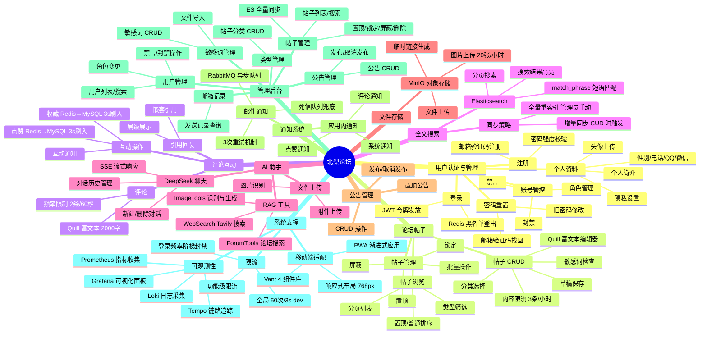
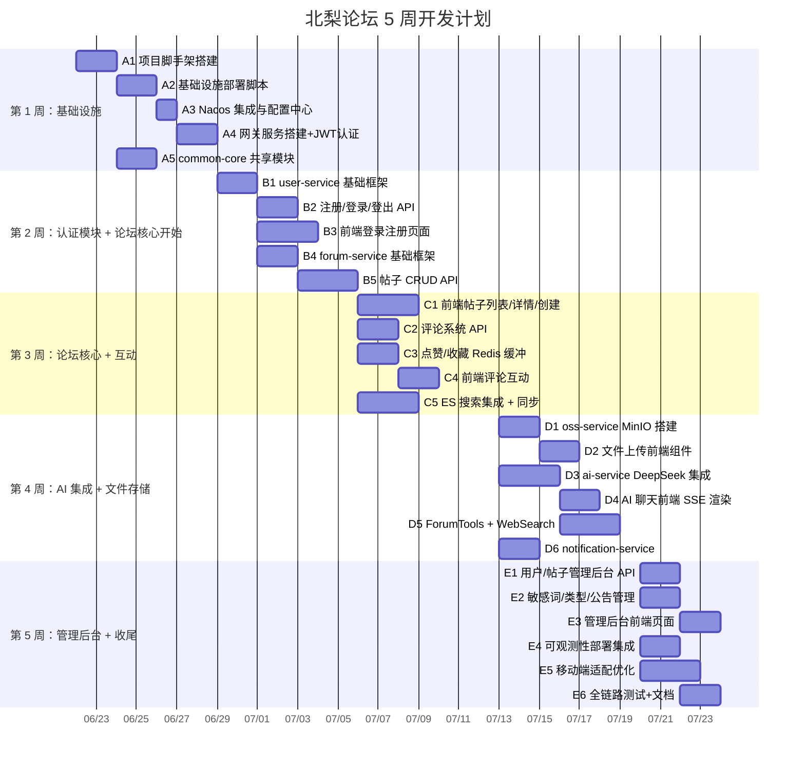

# B 系统功能分析

---

## B.1 功能分解树

北梨论坛的功能体系可分解为十大核心模块。各模块之间通过 Spring Cloud 微服务网关统一路由，共享基础设施层（Nacos、Redis、MySQL、Elasticsearch、RabbitMQ、MinIO），形成高内聚低耦合的微服务架构。



### 功能清单与优先级

| 编号 | 功能名称 | 所属模块 | 优先级 | 依赖关系 | 描述 |
|------|----------|----------|--------|----------|------|
| F-01 | 邮箱注册 | 用户认证与管理 | P1 | 无 | 通过邮箱验证码完成新用户注册，密码加密存储 |
| F-02 | 密码登录 | 用户认证与管理 | P1 | 无 | 用户名/邮箱 + 密码，签发 JWT 令牌，72h 过期 |
| F-03 | JWT 登出 | 用户认证与管理 | P1 | F-02 | 将 JWT UUID 加入 Redis 黑名单，使令牌立即失效 |
| F-04 | 邮箱验证码 | 用户认证与管理 | P1 | 无 | 发送验证码到用户邮箱，用于注册与密码重置 |
| F-05 | 密码重置 | 用户认证与管理 | P2 | F-04 | 通过邮箱验证码重置密码 |
| F-06 | 个人资料管理 | 用户认证与管理 | P2 | F-01 | 修改头像、性别、电话、QQ、微信、简介及隐私设置 |
| F-07 | 用户禁言/封禁 | 用户认证与管理 | P1 | F-01 | 管理员对用户执行禁言或封禁操作 |
| F-08 | 创建帖子 | 论坛帖子 | P1 | F-01, F-16 | 使用 Quill 富文本编辑器撰写帖子，限 20000 字，含敏感词检查 |
| F-09 | 编辑帖子 | 论坛帖子 | P1 | F-08 | 作者或管理员编辑已有帖子 |
| F-10 | 删除帖子 | 论坛帖子 | P1 | F-08 | 作者或管理员删除帖子 |
| F-11 | 帖子分类 | 论坛帖子 | P1 | F-08 | 按类型筛选帖子列表 |
| F-12 | 帖子列表 | 论坛帖子 | P1 | 无 | 分页展示帖子，支持分类筛选和排序 |
| F-13 | 帖子详情 | 论坛帖子 | P1 | F-08 | 展示帖子完整内容及关联信息 |
| F-14 | 帖子置顶 | 论坛帖子 | P2 | F-08 | 管理员将帖子置顶 |
| F-15 | 帖子锁定/屏蔽 | 论坛帖子 | P2 | F-08 | 管理员锁定（禁止评论）或屏蔽（隐藏）帖子 |
| F-16 | 草稿保存 | 论坛帖子 | P3 | F-08 | 将未发布的帖子保存为草稿 |
| F-17 | 敏感词检查 | 论坛帖子 | P1 | 无 | 对帖子内容进行敏感词过滤，支持 Delta JSON 和纯文本 |
| F-18 | 发表评论 | 评论互动 | P1 | F-01, F-12 | 对帖子发表 Quill 富文本评论，限 2000 字 |
| F-19 | 引用回复 | 评论互动 | P2 | F-18 | 引用已有评论进行回复 |
| F-20 | 点赞 | 评论互动 | P1 | F-01, F-12 | 对帖子/评论点赞，Redis 缓冲后异步入库 |
| F-21 | 收藏 | 评论互动 | P1 | F-01, F-12 | 收藏帖子，Redis 缓冲后异步入库 |
| F-22 | ES 全文搜索 | 全文搜索 | P1 | F-08, ES 可用 | 使用 Elasticsearch 对帖子进行全文检索 |
| F-23 | ES 增量同步 | 全文搜索 | P1 | F-22 | 帖子发生 CUD 操作时自动增量同步到 ES |
| F-24 | ES 全量同步 | 全文搜索 | P2 | F-22 | 管理员手动触发全量重索引 |
| F-25 | AI 流式聊天 | AI 助手 | P1 | F-01, DeepSeek 可用 | 使用 DeepSeek 模型进行 SSE 流式对话 |
| F-26 | 对话管理 | AI 助手 | P2 | F-25 | 创建新对话、切换对话、删除对话 |
| F-27 | ForumTools RAG | AI 助手 | P2 | F-25, F-22 | AI 通过工具调用搜索论坛数据增强回答 |
| F-28 | WebSearch | AI 助手 | P3 | F-25, Tavily 可用 | AI 调用 Tavily 搜索引擎获取实时信息 |
| F-29 | ImageTools | AI 助手 | P3 | F-25 | AI 进行图片识别与 DALL·E 生成 |
| F-30 | 图片上传 | 文件存储 | P1 | 无 | 上传图片到 MinIO，限 20 张/小时 |
| F-31 | 文件上传 | 文件存储 | P2 | 无 | 上传通用文件到 MinIO |
| F-32 | 公告 CRUD | 公告管理 | P1 | F-01 | 管理员创建、查看、编辑、删除公告 |
| F-33 | 公告发布/取消 | 公告管理 | P2 | F-32 | 控制公告的发布状态 |
| F-34 | 公告置顶 | 公告管理 | P2 | F-32 | 将重要公告置顶显示 |
| F-35 | 应用内通知 | 通知系统 | P2 | F-20, F-21, F-32 | 系统内通知中心，展示评论/点赞/系统通知 |
| F-36 | 邮件异步发送 | 通知系统 | P1 | RabbitMQ 可用 | 通过 RabbitMQ 异步队列发送邮件，支持 3 次重试和死信队列 |
| F-37 | 用户管理后台 | 管理后台 | P1 | F-07 | 管理员查看和管理所有用户 |
| F-38 | 帖子管理后台 | 管理后台 | P1 | F-14, F-15 | 管理员批量管理帖子 |
| F-39 | 类型管理 | 管理后台 | P2 | F-11 | 管理帖子分类 |
| F-40 | 敏感词管理 | 管理后台 | P2 | F-17 | 管理敏感词库并支持文件导入 |
| F-41 | 邮箱记录查询 | 管理后台 | P3 | F-36 | 管理员查询邮件发送历史 |
| F-42 | 全局限流 | 系统支撑 | P1 | 无 | 基于 Redis 的全局请求频率限制 |
| F-43 | 日志采集 | 系统支撑 | P2 | 无 | Loki 采集结构化日志 |
| F-44 | 链路追踪 | 系统支撑 | P3 | 无 | Tempo 采集 OpenTelemetry 链路 |
| F-45 | 指标监控 | 系统支撑 | P3 | 无 | Prometheus + Grafana 可视化指标 |
| F-46 | 响应式布局 | 系统支撑 | P2 | 无 | 768px 断点切换桌面/移动端布局 |
| F-47 | 移动端 Vant 组件 | 系统支撑 | P2 | F-46 | 移动端使用 Vant 4 组件库重构界面 |
| F-48 | PWA 支持 | 系统支撑 | P3 | 无 | Vite PWA 插件构建渐进式应用 |

---

## B.2 UML 用例图

系统按访问权限分为三类角色：**游客**（未登录用户）、**注册用户**（已登录）、**管理员**。

```mermaid
usecaseDiagram
  actor 游客 as Guest
  actor 注册用户 as User
  actor 管理员 as Admin

  rectangle 北梨论坛 {
    === 公开功能 ===
    usecase "UC-01 浏览帖子列表" as UC1
    usecase "UC-02 查看帖子详情" as UC2
    usecase "UC-03 搜索帖子" as UC3
    usecase "UC-04 查看公告" as UC4
    usecase "UC-05 用户注册" as UC5
    usecase "UC-06 用户登录" as UC6
    usecase "UC-07 密码重置" as UC7

    === 用户功能 ===
    usecase "UC-08 创建帖子" as UC8
    usecase "UC-09 编辑帖子" as UC9
    usecase "UC-10 删除帖子" as UC10
    usecase "UC-11 发表评论" as UC11
    usecase "UC-12 引用回复" as UC12
    usecase "UC-13 点赞" as UC13
    usecase "UC-14 收藏" as UC14
    usecase "UC-15 管理个人资料" as UC15
    usecase "UC-16 用户登出" as UC16
    usecase "UC-17 查看通知" as UC17
    usecase "UC-18 AI 聊天" as UC18
    usecase "UC-19 上传文件" as UC19
    usecase "UC-20 保存草稿" as UC20

    === 管理功能 ===
    usecase "UC-21 用户管理" as UC21
    usecase "UC-22 禁言用户" as UC22
    usecase "UC-23 封禁用户" as UC23
    usecase "UC-24 帖子置顶" as UC24
    usecase "UC-25 帖子锁定" as UC25
    usecase "UC-26 帖子屏蔽" as UC26
    usecase "UC-27 同步 ES 索引" as UC27
    usecase "UC-28 类型管理" as UC28
    usecase "UC-29 敏感词管理" as UC29
    usecase "UC-30 公告管理" as UC30
    usecase "UC-31 邮箱记录查询" as UC31
  end

  %% 角色与用例关系
  Guest --> UC1
  Guest --> UC2
  Guest --> UC3
  Guest --> UC4
  Guest --> UC5
  Guest --> UC6
  Guest --> UC7

  User --> UC8
  User --> UC9
  User --> UC10
  User --> UC11
  User --> UC12
  User --> UC13
  User --> UC14
  User --> UC15
  User --> UC16
  User --> UC17
  User --> UC18
  User --> UC19
  User --> UC20

  Admin --> UC21
  Admin --> UC22
  Admin --> UC23
  Admin --> UC24
  Admin --> UC25
  Admin --> UC26
  Admin --> UC27
  Admin --> UC28
  Admin --> UC29
  Admin --> UC30
  Admin --> UC31

  %% include / extend 关系
  UC4 <|-- UC30 : <<extend>>
  UC5 <.. UC6 : <<include>>
  UC6 <.. UC16 : <<include>>
  UC8 <.. UC20 : <<extend>>
  UC9 <.. UC10 : <<include>>
  UC18 <.. UC27 : <<extend>>
  UC13 <.. UC17 : <<extend>>
  UC14 <.. UC17 : <<extend>>
  UC21 <.. UC22 : <<extend>>
  UC21 <.. UC23 : <<extend>>
  UC21 <.. UC27 : <<extend>>
  UC29 <.. F17 : <<include>>
```

### 用例说明

| 编号 | 用例名称 | 角色 | 前置条件 | 后置条件 | 简要描述 |
|------|----------|------|----------|----------|----------|
| UC-01 | 浏览帖子列表 | 游客/用户/管理员 | 无 | 无 | 分页浏览帖子，支持按分类筛选和排序 |
| UC-02 | 查看帖子详情 | 游客/用户/管理员 | 无 | 无 | 查看帖子完整内容及评论列表 |
| UC-03 | 搜索帖子 | 游客/用户/管理员 | ES 可用 | 无 | 使用 ES 进行全文搜索并高亮展示结果 |
| UC-04 | 查看公告 | 游客/用户/管理员 | 无 | 无 | 浏览已发布的公告列表和详情 |
| UC-05 | 用户注册 | 游客 | 邮箱可用 | 用户已创建 | 通过邮箱验证码注册新账号 |
| UC-06 | 用户登录 | 游客 | 账号已注册 | 获得 JWT | 用户名/邮箱 + 密码登录，签发 JWT |
| UC-07 | 密码重置 | 游客 | 邮箱可接收验证码 | 密码已更新 | 通过邮箱验证码重置账号密码 |
| UC-08 | 创建帖子 | 注册用户 | 已登录，未达限流阈值 | 帖子已发布或保存为草稿 | 使用 Quill 编辑器创建帖子，含敏感词检查 |
| UC-09 | 编辑帖子 | 注册用户 | 本人或管理员 | 帖子内容已更新 | 编辑已有帖子的标题、内容、分类 |
| UC-10 | 删除帖子 | 注册用户 | 本人或管理员 | 帖子已删除 | 删除指定帖子及其关联数据 |
| UC-11 | 发表评论 | 注册用户 | 已登录，未达限流阈值 | 评论已发表 | 对帖子发表含格式的评论内容 |
| UC-12 | 引用回复 | 注册用户 | 已登录 | 回复已发表 | 引用指定评论进行回复 |
| UC-13 | 点赞 | 注册用户 | 已登录 | Redis 缓存已更新 | 对帖子或评论进行点赞/取消操作 |
| UC-14 | 收藏 | 注册用户 | 已登录 | Redis 缓存已更新 | 收藏/取消收藏帖子 |
| UC-15 | 管理个人资料 | 注册用户 | 已登录 | 资料已更新 | 修改头像、联系方式、简介、隐私设置 |
| UC-16 | 用户登出 | 注册用户 | 已登录 | JWT 已加入黑名单 | 销毁当前会话 |
| UC-17 | 查看通知 | 注册用户 | 已登录 | 无 | 查看评论/点赞/系统通知列表 |
| UC-18 | AI 聊天 | 注册用户 | 已登录 | 无 | 与 DeepSeek AI 进行流式对话 |
| UC-19 | 上传文件 | 注册用户 | 已登录，未达限流阈值 | 文件已存储 | 上传图片或文件到 MinIO |
| UC-20 | 保存草稿 | 注册用户 | 已登录 | 草稿已保存 | 将未完成的帖子保存为草稿 |
| UC-21 | 用户管理 | 管理员 | 已登录，角色为 ADMIN | 无 | 浏览、搜索所有用户 |
| UC-22 | 禁言用户 | 管理员 | 已登录，角色为 ADMIN | 用户被禁言 | 对指定用户执行禁言，设定禁言时长 |
| UC-23 | 封禁用户 | 管理员 | 已登录，角色为 ADMIN | 用户被封禁 | 永久封禁违规用户 |
| UC-24 | 帖子置顶 | 管理员 | 已登录，角色为 ADMIN，帖子存在 | 帖子置顶状态已更新 | 将帖子置顶或取消置顶 |
| UC-25 | 帖子锁定 | 管理员 | 已登录，角色为 ADMIN | 帖子已锁定 | 锁定帖子，禁止新增评论 |
| UC-26 | 帖子屏蔽 | 管理员 | 已登录，角色为 ADMIN | 帖子已隐藏 | 屏蔽帖子，使其对普通用户不可见 |
| UC-27 | 同步 ES 索引 | 管理员 | ES 可用 | ES 索引已更新 | 手动触发全量 ES 重索引 |
| UC-28 | 类型管理 | 管理员 | 已登录，角色为 ADMIN | 分类已更新 | 增删改帖子分类 |
| UC-29 | 敏感词管理 | 管理员 | 已登录，角色为 ADMIN | 敏感词库已更新 | 管理敏感词，支持文件导入 |
| UC-30 | 公告管理 | 管理员 | 已登录，角色为 ADMIN | 公告已更新 | 增删改公告，控制发布状态 |
| UC-31 | 邮箱记录查询 | 管理员 | 已登录，角色为 ADMIN | 无 | 查询邮件发送历史记录 |

### 权限矩阵

| 功能 | 游客 | 注册用户 | 管理员 |
|------|:----:|:--------:|:------:|
| 浏览帖子列表 | O | O | O |
| 查看帖子详情 | O | O | O |
| 全文搜索 | O | O | O |
| 查看公告 | O | O | O |
| 用户注册 | O | X | X |
| 用户登录 | O | X | X |
| 密码重置 | O | X | X |
| 创建帖子 | X | O (限流) | O (限流) |
| 编辑本人帖子 | X | O | O |
| 删除本人帖子 | X | O | O |
| 编辑/删除任意帖子 | X | X | O |
| 发表评论 | X | O (限流) | O (限流) |
| 点赞/收藏 | X | O | O |
| 管理个人资料 | X | O | O |
| 用户登出 | X | O | O |
| 查看通知 | X | O | O |
| AI 聊天 | X | O | O |
| 上传文件 | X | O (限流) | O (限流) |
| 用户管理 | X | X | O |
| 禁言/封禁用户 | X | X | O |
| 帖子置顶/锁定/屏蔽 | X | X | O |
| ES 全量同步 | X | X | O |
| 类型管理 | X | X | O |
| 敏感词管理 | X | X | O |
| 公告 CRUD | X | X | O |
| 邮箱记录查询 | X | X | O |

> **注：** O 表示允许操作，X 表示不允许操作。"

---

## B.3 前后端功能划分

系统采用前后端分离架构。前端为 Vue 3 单页应用（SPA），通过 HTTP 请求与后端微服务通信。后端各微服务独立部署，通过 Nacos 注册发现，经 Spring Cloud Gateway 统一路由。

| 功能 | 前端实现 | 后端微服务 | 通信方式 |
|------|----------|-----------|----------|
| 登录页 | 用户名/密码表单，JWT 前端存储 localStorage | `user-service` `/api/auth/login` | HTTP POST |
| 注册页 | 邮箱+密码+验证码表单 | `user-service` `/api/auth/register` | HTTP POST |
| 邮箱验证码 | 倒计时按钮，发送请求 | `user-service` `/api/auth/email-code` | HTTP POST |
| 密码重置 | 分步表单（邮箱→验证码→新密码） | `user-service` `/api/auth/reset-password` | HTTP POST |
| 帖子列表 | 分页滚动加载，分类 Tab 切换 | `forum-service` `/api/topic/page` | HTTP GET |
| 帖子详情 | 富文本渲染，评论嵌套展示 | `forum-service` `/api/topic/{id}` | HTTP GET |
| 创建帖子 | Quill 编辑器组件，草稿本地缓存 | `forum-service` `/api/topic/create` | HTTP POST |
| 编辑帖子 | Quill 编辑器回填草稿数据 | `forum-service` `/api/topic/update` | HTTP PUT |
| 删除帖子 | 二次确认弹窗 | `forum-service` `/api/topic/delete/{id}` | HTTP DELETE |
| 评论发表 | Quill 编辑器（2000 字限），快捷表情 | `forum-service` `/api/comment/create` | HTTP POST |
| 引用回复 | 评论区域 "回复" 按钮唤起编辑器 | `forum-service` `/api/comment/reply` | HTTP POST |
| 点赞/收藏 | 图标按钮，即时 UI 反馈 | `forum-service` `/api/interact/like` / `.../favorite` | HTTP POST |
| 全文搜索 | 搜索输入框，下拉实时建议 + 结果页 | `forum-service` `/api/search` | HTTP GET |
| AI 聊天 | 对话气泡组件，SSE 流式渲染 | `ai-service` `/api/ai/chat` | SSE (EventSource) |
| 对话管理 | 对话列表侧栏，切换/删除 | `ai-service` `/api/ai/conversation/**` | HTTP REST |
| 图片上传 | 拖拽/点击上传组件，预览裁剪 | `oss-service` `/api/image/upload` | HTTP POST (multipart) |
| 文件上传 | 通用上传组件，进度条 | `oss-service` `/api/file/upload` | HTTP POST (multipart) |
| 个人资料 | 表单 + 头像裁剪上传 | `user-service` `/api/user/profile` | HTTP PUT |
| 应用内通知 | 通知图标 + 下拉面板 | `notification-service` `/api/notification/**` | HTTP GET/POST |
| 公告管理 | 公告列表 + 编辑表单 | `announcement-service` `/api/admin/announcement/**` | HTTP REST |
| 管理后台 | Element Plus 表格 + 对话框 | 各服务 `/api/admin/**` | HTTP REST |
| 用户管理 | 分页表格，角色/状态操作按钮 | `user-service` `/api/admin/user/**` | HTTP REST |
| 帖子管理 | 分页表格，置顶/锁定/屏蔽/删除 | `forum-service` `/api/admin/forum/**` | HTTP REST |
| 类型管理 | 分类 CRUD 表单 | `forum-service` `/api/admin/forum/type` | HTTP REST |
| 敏感词管理 | 文本列表 + 文件导入 | `forum-service` (prohibited.json) | HTTP REST |
| 注册页面 | 背景图/渐变色布局，验证码倒计时 | `user-service` `/api/auth/**` | HTTP POST |
| 首页 | SPA 路由分发，Element Plus/Vant 布局 | N/A（纯前端） | — |
| 移动端布局 | Vant TabBar + NavBar 组件 | N/A（纯前端） | — |
| PWA 离线缓存 | Service Worker 注册 | N/A（纯前端） | — |

---

## B.4 系统界面截图

### B.4a 登录页面


*登录页面采用左右双栏布局。左侧为品牌展示区，呈现论坛名称"北梨论坛"与校园主题背景图；右侧为登录表单卡片，包含用户名/邮箱输入框、密码输入框、验证码校验、登录按钮，以及"忘记密码"和"注册账号"链接。页面支持回车键快速提交，错误信息以行内提示方式展示。*

### B.4b 帖子列表


*帖子列表页采用侧边栏 + 主内容区布局。顶部为搜索栏和分类 Tab 切换栏，支持按全部、技术交流、校园生活等分类快速筛选。主区域为卡片式帖子列表，每张卡片展示标题、摘要预览（前 300 字符）、作者头像与昵称、发布时间、评论数、点赞数。置顶帖子以特殊标记前置显示，支持无限滚动分页加载。*

### B.4c 帖子详情与评论


*帖子详情页分上下两部分：上部渲染帖子全文，展示 Quill 编辑器保存的富文本内容（含图片、代码块、引用等格式）；下部为评论区，以时间倒序展示评论列表，每条评论显示作者信息、发表时间、内容，并附带"回复"按钮。评论支持嵌套引用，引用的原文以缩进块样式展示。页面底部固定评论输入框，支持快捷发表。*

### B.4d AI 聊天助手


*AI 聊天助手页面左侧为对话历史列表，支持新建、切换、删除对话；右侧为主聊天区域，用户消息以右对齐气泡显示，AI 回复以左对齐气泡实时流式输出。对话框底部为输入区域，包含文本输入框、发送按钮以及文件上传按钮。AI 回复中可包含论坛帖子链接、搜索结果摘要、图片生成结果等富媒体内容。*

### B.4e 管理后台


*管理后台采用左侧导航菜单 + 右侧内容区的经典布局。导航菜单包含用户管理、帖子管理、类型管理、敏感词管理、邮箱记录、公告管理等入口。内容区以 Element Plus 表格组件展示数据，表格支持关键词搜索、分页、批量操作。管理操作通过对话框（Dialog）形式展开，包含确认弹窗二次确认以防止误操作。*

### B.4f 移动端帖子列表


*移动端帖子列表采用单列卡片流布局，适配手机屏幕宽度。顶部为 Vant NavBar 导航栏，包含菜单按钮、论坛标题和搜索图标。内容区为可下拉刷新的帖子列表，每个帖子卡片展示标题、摘要、作者、时间等基本信息。底部为 Vant TabBar，提供首页、分类、AI 聊天、消息、个人中心五个导航入口。*

### B.4g 移动端帖子详情


*移动端帖子详情页采用全宽阅读模式，内容区域占据整个屏幕宽度以优化阅读体验。标题以大号字体展示，正文富文本自适应手机屏幕。页面底部为固定操作栏，包含收藏、点赞（附计数）、评论按钮。点击评论按钮展开或滚动到评论区，评论区域同样采用全宽设计，评论输入框常驻底部方便快速回复。*

---

## B.5 开发计划

项目按 5 人团队 5 周迭代开发。团队组成建议：1 名全栈负责人 + 2 名后端工程师 + 1 名前端工程师 + 1 名 DevOps/测试工程师。



### 任务依赖明细

| 任务编号 | 任务名称 | 预估工时 | 依赖 | 负责人角色 |
|----------|----------|----------|------|-----------|
| A1 | 项目脚手架搭建 | 2人天 | 无 | 全栈负责人 |
| A2 | 基础设施部署脚本 | 2人天 | A1 | DevOps |
| A3 | Nacos 集成与配置中心 | 1人天 | A2 | 后端 1 |
| A4 | 网关服务搭建 + JWT 认证 | 2人天 | A3 | 后端 1 |
| A5 | common-core 共享模块 | 2人天 | A1 | 后端 2 |
| B1 | user-service 基础框架 | 2人天 | A3, A5 | 后端 1 |
| B2 | 注册/登录/登出 API | 2人天 | B1 | 后端 1 |
| B3 | 前端登录注册页面 | 3人天 | A1 | 前端 |
| B4 | forum-service 基础框架 | 2人天 | A3, A5 | 后端 2 |
| B5 | 帖子 CRUD API | 3人天 | B4 | 后端 2 |
| C1 | 前端帖子列表/详情/创建 | 3人天 | B5 | 前端 |
| C2 | 评论系统 API | 2人天 | B5 | 后端 2 |
| C3 | 点赞/收藏 Redis 缓冲 | 2人天 | B5 | 后端 1 |
| C4 | 前端评论互动 | 2人天 | C2, C3 | 前端 |
| C5 | ES 搜索集成 + 同步 | 3人天 | B5 | 后端 2 |
| D1 | oss-service MinIO 搭建 | 2人天 | A4 | 后端 1 |
| D2 | 文件上传前端组件 | 2人天 | D1 | 前端 |
| D3 | ai-service DeepSeek 集成 | 3人天 | A4 | 后端 2 |
| D4 | AI 聊天前端 SSE 渲染 | 2人天 | D3 | 前端 |
| D5 | ForumTools + WebSearch | 3人天 | D3, C5 | 后端 2 |
| D6 | notification-service | 2人天 | A4 | 后端 1 |
| E1 | 用户/帖子管理后台 API | 2人天 | B1, B5 | 后端 1 |
| E2 | 敏感词/类型/公告管理 | 2人天 | B5 | 后端 2 |
| E3 | 管理后台前端页面 | 2人天 | E1, E2 | 前端 |
| E4 | 可观测性部署集成 | 2人天 | A2 | DevOps |
| E5 | 移动端适配优化 | 3人天 | C1, C4 | 前端 |
| E6 | 全链路测试 + 文档 | 2人天 | 全部 | 全栈负责人 |

### 里程碑节点

| 里程碑 | 时间 | 交付物 | 验收标准 |
|--------|------|--------|----------|
| M1 基础设施就绪 | 第 1 周末 | Nacos + MySQL + Redis + ES + RabbitMQ + MinIO 成功运行，网关可路由请求 | `docker compose ps` 全部健康，网关 200 响应 |
| M2 认证链路打通 | 第 2 周末 | 用户可注册、登录、登出，JWT 认证生效 | 注册→登录→访问受保护 API 全链路验证通过 |
| M3 论坛 MVP | 第 3 周末 | 帖子 CRUD + 评论 + 点赞/收藏 + ES 搜索可用 | 用户可完整走完发帖→搜索→评论→点赞流程 |
| M4 AI 集成完成 | 第 4 周末 | AI 流式聊天 + RAG 搜索 + 文件上传可用 | SSE 连接稳定，AI 可准确搜索并引用论坛内容 |
| M5 系统交付 | 第 5 周末 | 管理后台、可观测性、移动端适配全部完成 | 功能验收测试通过，Grafana 面板就绪 |

---

> **文档版本：** v1.0  
> **编写日期：** 2026-06-19  
> **适用项目：** 北梨论坛 (Beili Forum)  
> **上一篇：** [A 项目概述](./section-a.md)  
> **下一篇：** [C 系统架构设计](./section-c.md)
