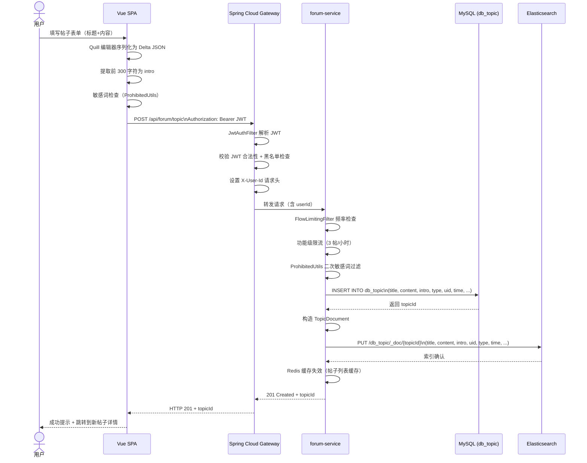
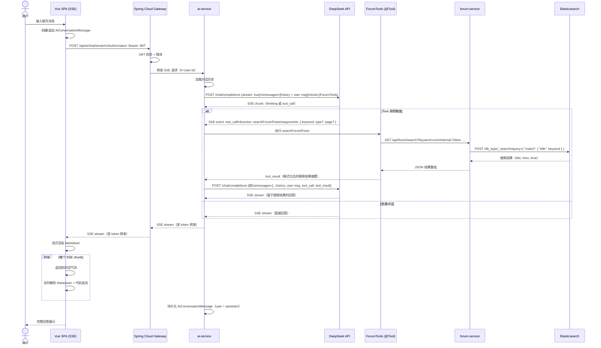
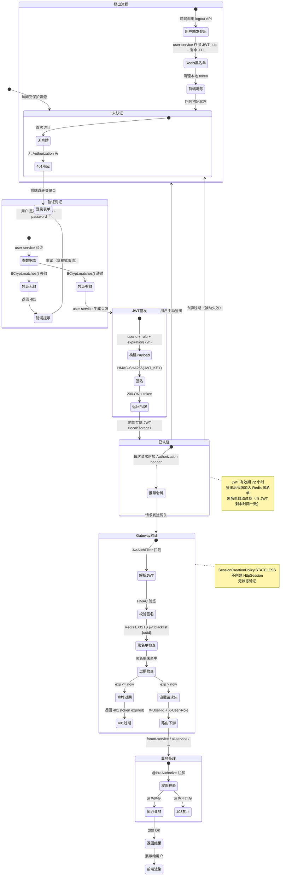

# C 部分：领域模型

## C.1 领域类图

下图展示了"北梨论坛"全部核心领域实体及其静态关系，按微服务边界分组。类图中包含属性（Java 类型）、关联多重性以及组合/聚合语义。

```mermaid
classDiagram
    %% ==================== 用户域 ====================
    namespace UserService {
        class Account {
            +Long id
            +String username
            +String password
            +String email
            +String role
            +String avatar
            +LocalDateTime registerTime
            +Boolean mute
            +Boolean banned
            +register()
            +login()
            +logout()
            +updateProfile()
        }

        class AccountDetails {
            +Long id
            +String gender
            +String phone
            +String qq
            +String wx
            +String desc
        }

        class AccountPrivacy {
            +Long id
            +Boolean phoneHidden
            +Boolean emailHidden
            +Boolean wxHidden
            +Boolean qqHidden
            +Boolean genderHidden
        }

        class EmailRecord {
            +Long id
            +String email
            +String title
            +String content
            +LocalDateTime time
            +Integer status
            +send()
        }
    }

    %% ==================== 论坛域 ====================
    namespace ForumService {
        class Topic {
            +Long id
            +String title
            +String intro
            +String content
            +Long type
            +Long uid
            +LocalDateTime time
            +Boolean top
            +Boolean locked
            +Boolean invisible
            +create()
            +update()
            +delete()
            +syncToES()
        }

        class TopicType {
            +Long id
            +String name
            +String desc
            +String color
        }

        class TopicComment {
            +Long id
            +Long uid
            +Long tid
            +String content
            +LocalDateTime time
            +Long quote
            +create()
            +delete()
        }

        class TopicDraft {
            +Long id
            +Long userId
            +Long type
            +String title
            +String content
            +LocalDateTime createTime
            +LocalDateTime updateTime
            +save()
            +delete()
        }

        class Interact {
            <<ValueObject>>
            +Long tid
            +Long uid
            +LocalDateTime time
            +String type
        }

        class TopicDocument {
            <<ES Index>>
            +String id
            +String title
            +String content
            +String intro
            +Long uid
            +Long type
            +LocalDateTime time
            +Boolean top
            +Boolean locked
            +Boolean invisible
        }
    }

    %% ==================== 公告域 ====================
    namespace AnnouncementService {
        class Announcement {
            +Long id
            +Long uid
            +String title
            +String summary
            +String content
            +Boolean published
            +Boolean top
            +LocalDateTime createTime
            +LocalDateTime updateTime
            +LocalDateTime publishTime
            +publish()
            +unpublish()
        }
    }

    %% ==================== 通知域 ====================
    namespace NotificationService {
        class Notification {
            +Long id
            +Long uid
            +String title
            +String content
            +String type
            +String url
            +LocalDateTime time
            +send()
        }
    }

    %% ==================== AI域 ====================
    namespace AIService {
        class AiConversation {
            +Long id
            +Long userId
            +String title
            +LocalDateTime createdTime
            +LocalDateTime updatedTime
            +create()
            +delete()
        }

        class AiConversationMessage {
            +Long id
            +Long conversationId
            +String role
            +String content
            +String messageType
            +LocalDateTime createdTime
        }
    }

    %% ==================== 存储域 ====================
    namespace OSSService {
        class StoreImage {
            +Long uid
            +String name
            +LocalDateTime time
            +upload()
            +delete()
        }
    }

    %% ==================== 关系 ====================

    %% Account 1→* Topic
    Account "1" --> "*" Topic : 发帖人
    Account "1" --> "*" TopicComment : 评论人
    Account "1" --> "*" Announcement : 发布者
    Account "1" --> "*" Notification : 接收者
    Account "1" --> "*" AiConversation : 对话发起者

    %% Account 1→1 AccountDetails / AccountPrivacy
    Account "1" --> "1" AccountDetails : 扩展信息
    Account "1" --> "1" AccountPrivacy : 隐私设置

    %% Topic 1→* TopicComment
    Topic "1" --> "*" TopicComment : 包含
    TopicComment "*" --> "0..1" TopicComment : 引用(quote)

    %% Topic 1→* Interact (like / collect)
    Topic "1" --> "*" Interact : 互动记录
    Interact "*" --> "1" Account : 互动用户

    %% Topic 1→1 TopicDocument (ES)
    Topic "1" --> "1" TopicDocument : 同步索引

    %% TopicType 1→* Topic
    TopicType "1" --> "*" Topic : 分类

    %% AiConversation 1→* AiConversationMessage
    AiConversation "1" --> "*" AiConversationMessage : 包含消息

    %% Topic 1→* TopicDraft
    Account "1" --> "*" TopicDraft : 草稿
```



### C.1.1 实体说明

| 实体 | 所属服务 | 持久化存储 | 说明 |
|------|---------|-----------|------|
| Account | user-service | MySQL (db_account) | 核心用户账户，BCrypt 加密密码 |
| AccountDetails | user-service | MySQL (db_account_details) | 用户扩展资料，与 Account 一对一 |
| AccountPrivacy | user-service | MySQL (db_account_privacy) | 隐私可见性标记，与 Account 一对一 |
| EmailRecord | user-service | MySQL (db_email_record) | 邮件发送记录，含状态追踪 |
| Topic | forum-service | MySQL (db_topic) | 帖子主体，内容为 Quill Delta JSON |
| TopicType | forum-service | MySQL (db_topic_type) | 帖子分类，带颜色标记 |
| TopicComment | forum-service | MySQL (db_topic_comment) | 评论，支持引用父评论形成树形结构 |
| TopicDraft | forum-service | MySQL (db_topic_draft) | 草稿箱，用户维度的临时存储 |
| Interact | forum-service | MySQL (动态表) | 值对象，存储在点赞/收藏动态表中 |
| TopicDocument | forum-service | Elasticsearch | ES 索引，与 Topic 一对一映射 |
| Announcement | announcement-service | MySQL (db_announcement) | 公告，支持发布/下架状态 |
| Notification | notification-service | MySQL (db_notification) | 用户通知，含类型和跳转链接 |
| AiConversation | ai-service | MySQL (ai_conversation) | AI 对话会话 |
| AiConversationMessage | ai-service | MySQL (ai_conversation_message) | 对话消息，支持多种消息类型 |
| StoreImage | oss-service | MySQL (db_image_store) + MinIO | 图片存储记录，MinIO 管理二进制 |

---

## C.2 包图

下图展示各微服务之间的编译期与运行期依赖关系。

```mermaid
classDiagram
    package gateway-service {
        <<Spring Cloud Gateway>>
    }

    package user-service {
        <<用户认证与管理>>
    }

    package forum-service {
        <<帖子与搜索>>
    }

    package ai-service {
        <<AI 聊天>>
    }

    package oss-service {
        <<对象存储>>
    }

    package notification-service {
        <<通知服务>>
    }

    package announcement-service {
        <<公告服务>>
    }

    package common-core {
        <<共享基础>>
        class JwtUtil
        class ProhibitedUtils
        class FlowLimitingFilter
        class Result
        class BaseEntity
    }

    package common-observability {
        <<共享可观测性>>
        class OTelConfig
        class LogConfig
    }

    %% 依赖关系
    gateway-service --> user-service : Feign 用户校验
    gateway-service --> forum-service
    gateway-service --> ai-service
    gateway-service --> oss-service
    gateway-service --> notification-service
    gateway-service --> announcement-service
    gateway-service --> common-core : JWT 过滤器

    forum-service --> user-service : Feign 获取用户信息
    forum-service --> common-core : 工具类
    forum-service --> common-observability : OTel

    user-service --> common-core : JWT 签发/解析
    user-service --> common-observability

    ai-service --> forum-service : Feign 搜索帖子(Tool)
    ai-service --> common-core
    ai-service --> common-observability

    notification-service --> common-core
    notification-service --> common-observability

    announcement-service --> common-core
    announcement-service --> common-observability

    oss-service --> common-core
    oss-service --> common-observability
```

### C.2.1 包依赖说明

| 源包 | 目标包 | 依赖方式 | 用途 |
|------|--------|---------|------|
| gateway-service | 所有服务 | HTTP 路由 + 负载均衡 | 统一入口，按路径前缀分发请求 |
| gateway-service | common-core | 编译依赖 | JWT 过滤器校验令牌 |
| forum-service | user-service | FeignClient | 获取用户昵称、头像等公开信息 |
| ai-service | forum-service | FeignClient | ForumTools 工具调用，搜索帖子数据实现 RAG |
| 所有服务 | common-core | 编译依赖 | 共享 DTO、Result 封装、工具类 |
| 所有服务 | common-observability | 编译依赖 | Micrometer + OTLP 配置上报 |

**基础设施层**（非 Java 包，但为运行期依赖）：

- **Nacos** — 所有微服务启动时注册，网关通过 Nacos 发现服务实例
- **MySQL** — user/forum/ai/oss/notification/announcement 服务的数据持久化
- **Redis** — 缓存、JWT 黑名单、点赞/收藏缓冲、限流计数器
- **Elasticsearch** — forum-service 的全文搜索索引
- **RabbitMQ** — notification-service 消费邮件发送队列
- **MinIO** — oss-service 管理图片/文件对象存储

---

## C.3 顺序图

### C.3.1 发帖流程

用户通过前端创建帖子，请求经网关路由到 forum-service，完成 MySQL 持久化以及 ES 索引同步后返回。



**关键时序点：**

1. 前端序列化 Quill Delta JSON，提取纯文本 intro（前 300 字符）
2. 网关 JwtAuthFilter 验证 JWT，无状态不查数据库
3. forum-service 双重限流（全局 + 功能级）
4. 先写 MySQL 再同步 ES，写操作以 MySQL 为准
5. ES 同步失败不阻断主流程（仅在日志记录错误）
6. 可选：管理员可通过 `/api/admin/forum/sync-to-es` 触发全量同步

### C.3.2 AI 聊天带 Tool 调用流程

用户发送消息，ai-service 调用 DeepSeek API，模型主动触发 ForumTools 工具搜索论坛数据，实现 RAG 增强回答。



**Tool 调用机制说明：**

| 步骤 | 参与者 | 说明 |
|------|--------|------|
| 1 | 前端 | 通过 POST SSE 端点发送用户消息 |
| 2 | ai-service | 构建包含 `tools` 参数的 DeepSeek API 请求 |
| 3 | DeepSeek | 判断是否需要 Tool 调用，返回 `tool_call` 事件 |
| 4 | ai-service | 反射执行 `@Tool` 注解方法（ForumTools） |
| 5 | ForumTools | 通过 FeignClient 调用 forum-service 搜索接口 |
| 6 | forum-service | 查询 ES 返回匹配帖子 |
| 7 | ai-service | 将 tool_result 追加到对话上下文，继续请求 DeepSeek |
| 8 | DeepSeek | 基于搜索结果生成自然语言回答 |
| 9 | 网关 | `response-timeout: -1` 支持长时间 SSE 流 |

当前 ForumTools 提供以下工具：

- `searchForumPosts(keyword, type?, page?)` — 搜索论坛帖子

---

## C.4 JWT 认证生命周期活动图

下图展示 JWT 从签发到过期（或主动登出）的完整状态流转。



### C.4.1 JWT 认证关键决策点

| 决策点 | 分支条件 | 结果 |
|--------|---------|------|
| 黑名单检查 | UUID 存在于 Redis `jwt:blacklist:*` | 返回 401，令牌已注销 |
| 签名校验 | HMAC 签名不匹配 | 返回 401，令牌被篡改 |
| 过期检查 | `exp` 小于当前时间 | 返回 401，令牌过期 |
| 权限校验 | `ROLE_ADMIN` 访问管理端点 | 通过或返回 403 |
| 阶梯式限流 | 登录失败次数递增 | 逐级增加等待时间 |
| 功能级限流 | 发帖/评论频率超限 | 返回 429 Too Many Requests |

### C.4.2 认证数据流总览

```
                          ┌──────────────────────┐
                          │   前端 (localStorage)  │
                          │   存储 JWT 令牌        │
                          └──────┬───────────────┘
                                 │
                    Authorization: Bearer <JWT>
                                 │
                          ┌──────▼───────────────┐
                          │   Spring Cloud Gateway │
                          │   JwtAuthFilter        │
                          │   ① 解析 JWT           │
                          │   ② 验签 + 黑名单      │
                          │   ③ 设置请求头          │
                          └──────┬───────────────┘
                                 │ X-User-Id, X-User-Role
                          ┌──────▼───────────────┐
                          │   下游微服务            │
                          │   @PreAuthorize        │
                          │   @AuthenticationPrincipal │
                          └──────────────────────┘
```

---

## C.5 实体关系矩阵

下表从数据库表的角度汇总实体间的主外键关系。

| 源表 | 外键字段 | 目标表 | 关系类型 |
|------|---------|--------|---------|
| db_account_details | id | db_account (id) | 1:1（共享主键） |
| db_account_privacy | id | db_account (id) | 1:1（共享主键） |
| db_topic | uid | db_account (id) | N:1 |
| db_topic | type | db_topic_type (id) | N:1 |
| db_topic_comment | uid | db_account (id) | N:1 |
| db_topic_comment | tid | db_topic (id) | N:1 |
| db_topic_comment | quote | db_topic_comment (id) | N:0..1（自引用） |
| db_topic_draft | userId | db_account (id) | N:1 |
| db_announcement | uid | db_account (id) | N:1 |
| db_notification | uid | db_account (id) | N:1 |
| ai_conversation | userId | db_account (id) | N:1 |
| ai_conversation_message | conversationId | ai_conversation (id) | N:1 |
| db_image_store | uid | db_account (id) | N:1 |
