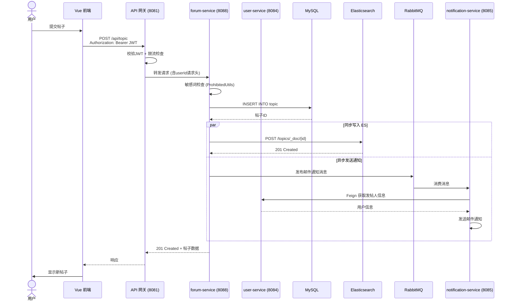
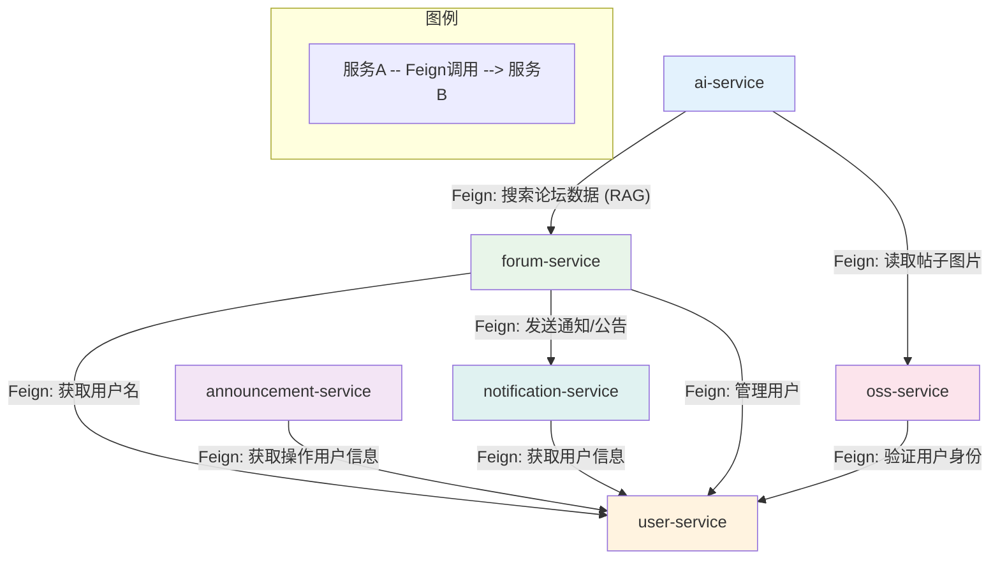
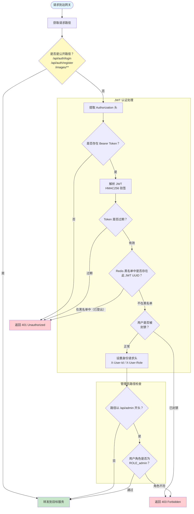
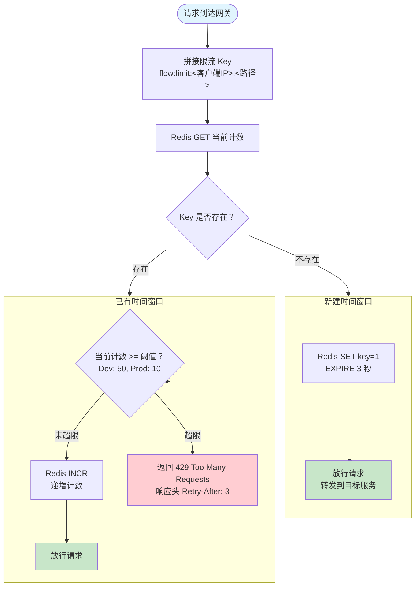
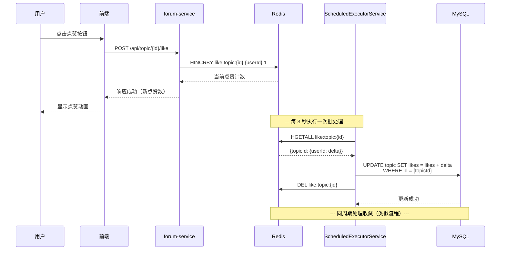
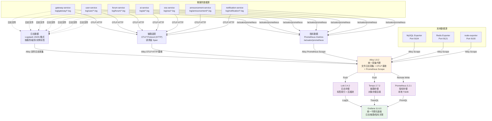
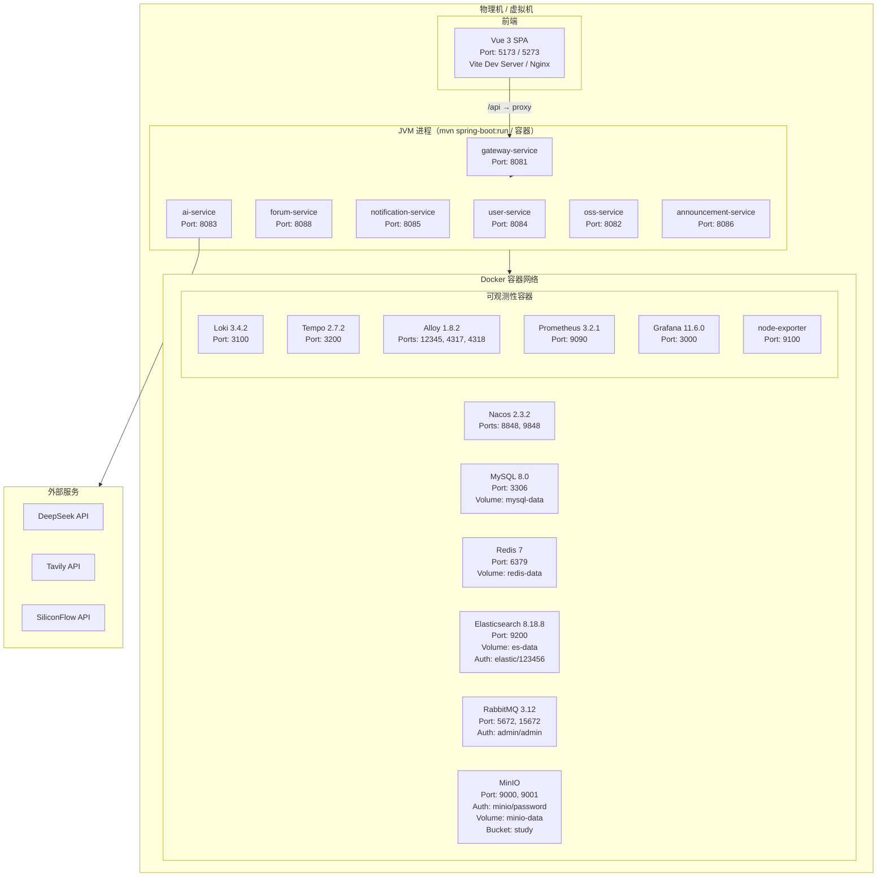

## 一、技术选型

### D.1 后端技术选型

| 技术领域 | 选型方案 | 替代方案 | 选择理由 |
|---------|---------|---------|---------|
| 微服务框架 | Spring Cloud Alibaba 2025.0.0.0 + Nacos 2.3.2 | Spring Cloud Netflix (Eureka + Zuul)；Kubernetes Native (K8s Service + Ingress) | 提供完整的服务注册发现与配置中心一体化方案；Nacos 相比 Eureka 具备配置管理能力，相比 K8s Native 不需要运维 K8s 集群，开发环境部署成本更低 |
| 服务网关 | Spring Cloud Gateway | Zuul 1.x / Zuul 2.x | Gateway 基于 WebFlux 响应式编程，非阻塞 I/O，性能优于 Zuul 1.x；与 Spring Security 6.x 配合更顺畅 |
| 基础框架 | Spring Boot 3.5.8 | — | 最新稳定版，支持 Java 17 虚拟线程（Project Loom）、GraalVM 原生编译 |
| 身份认证 | JWT (java-jwt 4.3) + Spring Security 6.x | Session + Redis 集中式；OAuth2 + Keycloak | JWT 无状态认证，无需服务端会话存储，天然适合网关转发场景；对比 OAuth2 方案免去额外身份服务器运维负担 |
| ORM | MyBatis-Plus 3.5.15 | JPA / Hibernate；MyBatis 原生 | MyBatis-Plus 继承 MyBatis 灵活 SQL 能力，同时提供代码生成器、分页插件、Lambda 查询等增强功能，对比 JPA 在复杂查询场景下更具可控性 |
| 搜索引擎 | Elasticsearch 8.18.8 | OpenSearch；MeiliSearch | ES 生态成熟，中文分词（IK）支持完善，8.x 版本性能大幅提升；对比 MeiliSearch 更适合全文检索 + 复杂聚合场景 |
| 消息队列 | RabbitMQ 3.12 | Apache Kafka；RocketMQ | 业务场景以异步通知、邮件发送为主，吞吐量要求不高；RabbitMQ 部署简单，AMQP 协议成熟，对比 Kafka 学习成本更低 |
| AI 集成 | Spring AI 1.1.2 | LangChain4j；直接 HTTP 调用 | Spring AI 提供统一的 AI 模型接入抽象（ChatClient、Tool Calling），无缝对接 Spring Boot 生态；对比直接 HTTP 调用可获得类型安全、流式 SSE 原生支持 |
| 对象存储 | MinIO | 阿里云 OSS；AWS S3 | 开源 S3 兼容存储，适合私有化部署；开发测试环境零成本 |
| 序列化 | FastJSON2 | Jackson；Gson | 性能优于 Jackson，支持 JSON/JSONB 双格式；阿里系生态兼容性好 |
| 缓存 | Redis 7 | 无 | 通用缓存 + 限流计数器 + 点赞缓冲 + JWT 黑名单，一栈多用 |
| 可观测性 | Micrometer + OpenTelemetry | 原生 Prometheus SDK | 统一指标采集标准，OTLP 协议同时承载 Metrics/Traces/Logs 三种数据，避免多 Agent 部署 |

#### 为什么选择 Spring Cloud Alibaba 而非 Netflix / K8s Native

**对比 Netflix（Eureka + Zuul + Hystrix）：**
- Netflix 组件已进入维护模式（Spring Cloud 2020.0 起标记为 deprecated），不再发布新特性
- Nacos 同时提供服务注册发现与配置中心，减少组件数量
- Sentinel 比 Hystrix 提供更丰富的流量整形与熔断策略（如匀速排队、热点参数限流）

**对比 K8s Native（K8s Service + Ingress + ConfigMap）：**
- 开发环境不需要 K8s 集群，Docker Compose 即可启动全部基础设施，降低入门门槛
- Nacos 提供可视化控制台，方便调试服务注册状态与配置变更
- 微服务代码内直接通过 FeignClient 声明式调用，类 IDE 友好的代码跳转体验优于 Service 间 HTTP 调用
- 后续可逐步迁移至 K8s 部署，Spring Cloud Alibaba 在 K8s 环境下仍可运行

### D.2 前端技术选型

| 技术领域 | 选型方案 | 替代方案 | 选择理由 |
|---------|---------|---------|---------|
| 框架 | Vue 3.3+ (Composition API) | React 18；Angular 15 | Vue 3 组合式 API 逻辑复用更自然，学习曲线平缓；团队 Vue 经验丰富 |
| 构建工具 | Vite 4 | Webpack 5；Turbopack | Vite 基于 ESM 原生模块，开发服务器冷启动 < 1s，HMR 即时生效 |
| 状态管理 | Pinia 2 | Vuex 4；Zustand（React） | Pinia 是 Vue 官方推荐状态管理库，TypeScript 类型推导完整，API 简洁 |
| 桌面端 UI | Element Plus 2.11 | Ant Design Vue；Naive UI | 基于 Vue 3 重写，生态成熟，表单/表格/分页组件丰富；Ant Design Vue 迭代滞后 |
| 移动端 UI | Vant 4 | NutUI | Vant 4 组件丰富、文档完善、按需引入便利；NutUI 社区较小，Issue 响应慢 |
| HTTP 客户端 | Axios 1.4 | Fetch API；Alova | 拦截器机制成熟（注入 JWT Token、统一错误处理），浏览器兼容性好 |
| 富文本编辑器 | Quill Editor | TinyMCE；TipTap | 输出 Delta JSON 格式，便于存储与检索；轻量级，插件生态活跃 |
| 路由 | Vue Router 4 | — | Vue 官方路由库，支持动态路由、导航守卫 |
| PWA | vite-plugin-pwa | — | 零配置 Service Worker 注册，支持离线缓存与安装提示 |
| Markdown | markdown-it | marked；remark | 可扩展性强，安全过滤（xss）支持好 |

#### Vue 3 vs React vs Angular

Vue 3 选择理由：
- **渐进式框架**：可以从一个简单的页面逐步扩展到完整 SPA，而不需要一开始就引入全套技术栈
- **Composition API**：相比 React Hooks 的闭包陷阱（stale closure），Vue 3 的响应式系统天然避免此问题
- **模板语法**：`v-if` / `v-for` / `v-model` 等指令式模板对后端开发者友好
- **包体积**：Vue 3 运行时 ~33KB（gzip），React 18 + ReactDOM ~42KB（gzip），Angular 15 ~100KB+

#### Element Plus vs Ant Design Vue

Element Plus 选择理由：
- Element Plus 是 Element UI 的 Vue 3 重写版，社区活跃度与文档完整度均优于 Ant Design Vue
- 主题定制基于 CSS Variables，无需 Less/Sass 侵入式覆盖
- `ElTable` + `ElPagination` 组合在大数据量场景下表现稳定

#### Vant 4 vs NutUI

Vant 4 选择理由：
- Vant 由有赞团队维护，月下载量远超 NutUI，Issues 响应及时
- Vant 4 全面支持 Vue 3 Composition API，NutUI 部分组件仍依赖 Options API
- 组件丰富度（AddressEdit、Sku、GoodsAction 等电商类组件虽然本系统用不到，但侧面说明生态成熟度）

### D.3 可观测性选型

| 数据维度 | 选型方案 | 替代方案 | 选择理由 |
|---------|---------|---------|---------|
| 日志 | Loki 3.4.2 + Promtail（Alloy 采集） | ELK（Elasticsearch + Logstash + Kibana） | Loki 不建立日志全文索引，仅对标签建立索引，存储成本仅为 ELK 的 1/3~1/2；与 Grafana 原生集成 |
| 链路追踪 | Tempo 2.7.2 | Jaeger；Zipkin | 支持 OTLP 协议直接上报，无需额外 Agent；后端存储与 Loki 共用对象存储（MinIO），减少运维组件 |
| 指标 | Prometheus 3.2.1 | VictoriaMetrics；Thanos | Prometheus 是 CNCF 毕业项目，生态最成熟；Grafana 原生面板支持 |
| 数据采集 | Alloy 1.8.2 | OpenTelemetry Collector；Promtail | 统一采集器同时处理日志/链路/指标三种数据，一套配置管理所有 Pipeline；与 Grafana Labs 工具链原生协同 |
| 可视化 | Grafana 11.6.0 | Kibana | Gink 统一 Dashboard，同面板内混合展示日志（Loki）、链路（Tempo）、指标（Prometheus）数据 |
| 节点监控 | node-exporter | — | 标准主机指标采集，配合 Prometheus 告警 |

#### 为什么选择 Loki 而非 ELK

- **存储成本**：Loki 仅对日志标签建索引，内容以压缩块存储；ES 建立全文倒排索引，存储膨胀率约 3-5x
- **查询模式**：系统运维查询以"按服务/实例/级别筛选"为主，Loki 的 LogQL 标签查询模式天然匹配
- **运维复杂度**：ES 集群的 JVM 调优、分片管理、滚动重启成本较高；Loki 单进程即可运行
- **Grafana 集成**：Loki + Tempo + Prometheus 在 Grafana Explore 中可做"从指标发现异常 → 跳转到关联日志 → 追踪请求链路"的全链路诊断

#### 为什么选择 Tempo 而非 Jaeger

- Jaeger 后端存储依赖于 Elasticsearch 或 Cassandra，Tempo 可复用 MinIO 对象存储
- Tempo 支持 OTLP 协议直接上报（Jaeger 需要 Jaeger Agent 接收 → 转换 → 存储），减少一跳
- Tempo 无需采样策略配置即可工作，Jaeger 生产环境通常需要配置采样率

#### 为什么选择 Prometheus 而非 VictoriaMetrics

- 当前数据规模下 Prometheus 单实例足以应对
- Prometheus 告警规则（Alertmanager）生态成熟
- 未来规模增长时可通过 Thanos 或直接迁移至 VictoriaMetrics，PromQL 兼容

#### 为什么选择 Alloy + Grafana 组合

Alloy 由 Grafana Labs 维护，与 Loki / Tempo / Prometheus 共享配置风格与部署理念，一个 binary 替代 OpenTelemetry Collector + Promtail + node-exporter 等多个组件。配置语言采用 River，支持从 Kubernetes API 或文件系统自动发现目标。

---

## 二、系统架构

### E.1 服务划分

```
┌─────────────────────────────────────────────────────────────────────────────┐
│                          北梨论坛 — 系统架构总览                              │
└─────────────────────────────────────────────────────────────────────────────┘
```

```mermaid
graph TD
    %% 用户层
    User[("用户")]
    Admin[("管理员")]

    %% 前端
    subgraph Frontend ["前端层 Vue 3 SPA"]
        VUE["Vue 3 + Vite<br/>Element Plus / Vant 4<br/>Axios + Pinia"]
    end

    %% 网关层
    subgraph Gateway ["API 网关层"]
        GW["Spring Cloud Gateway<br/>Port 8081"]
        JWT["JWT 认证过滤器"]
        FLOW["限流过滤器"]
        ROUTE["路由分发"]
    end

    %% 服务层
    subgraph Services ["微服务层"]
        US["user-service<br/>Port 8084<br/>认证/用户管理"]
        FS["forum-service<br/>Port 8088<br/>帖子/评论/搜索/互动"]
        NS["notification-service<br/>Port 8085<br/>邮件通知"]
        AIS["ai-service<br/>Port 8083<br/>DeepSeek AI 聊天"]
        OSS["oss-service<br/>Port 8082<br/>文件上传/访问"]
        AS["announcement-service<br/>Port 8086<br/>公告管理"]
    end

    %% 基础设施
    subgraph Infra ["基础设施层"]
        NACOS["Nacos<br/>服务注册发现<br/>配置管理<br/>Port 8848"]
        MYSQL[( "MySQL 8.0<br/>Port 3306<br/>主数据库" )]
        REDIS[( "Redis 7<br/>Port 6379<br/>缓存/限流/点赞缓冲" )]
        ES[( "Elasticsearch 8.18.8<br/>Port 9200<br/>全文搜索" )]
        RABBIT["RabbitMQ 3.12<br/>Port 5672<br/>异步消息"]
        MINIO[( "MinIO<br/>Port 9000<br/>对象存储" )]
    end

    %% 可观测性
    subgraph Observability ["可观测性栈"]
        ALLOY["Alloy 1.8.2<br/>数据采集"]
        LOKI["Loki 3.4.2<br/>日志"]
        TEMPO["Tempo 2.7.2<br/>链路追踪"]
        PROM["Prometheus 3.2.1<br/>指标"]
        GRAFANA["Grafana 11.6.0<br/>可视化面板"]
    end

    %% 外部依赖
    DEEPSEEK["DeepSeek API"]
    TAVILY["Tavily API"]
    SILICON["SiliconFlow API"]

    %% 流
    User --> VUE
    Admin --> VUE
    VUE -->|HTTP / JWT| GW
    GW --> JWT
    GW --> FLOW
    JWT --> ROUTE
    FLOW --> ROUTE

    ROUTE -->|/api/auth/**, /api/user/**| US
    ROUTE -->|/api/** catch-all| FS
    ROUTE -->|/api/notification/**| NS
    ROUTE -->|/api/ai/**| AIS
    ROUTE -->|/api/image/**, /api/file/**| OSS
    ROUTE -->|/api/announcement/**| AS

    US -.->|Feign| NACOS
    FS -.->|Feign| NACOS
    NS -.->|Feign| NACOS
    AIS -.->|Feign| NACOS
    OSS -.->|Feign| NACOS
    AS -.->|Feign| NACOS

    FS -->|读写| MYSQL
    FS -->|写入| ES
    FS -->|读写| REDIS
    FS -->|发送消息| RABBIT

    US -->|读写| MYSQL
    US -->|读写| REDIS
    US -->|发送消息| RABBIT

    NS -->|消费| RABBIT

    OSS -->|存储| MINIO
    OSS -->|读写| MYSQL

    AIS -->|调用| DEEPSEEK
    AIS -->|搜索| TAVILY
    AIS -->|调用| SILICON
    AIS -.->|Feign RAG| FS
    AIS -.->|Feign| OSS

    US -.->|Feign| NACOS

    %% 可观测性
    Services -- 日志/链路/指标 --> ALLOY
    ALLOY --> LOKI
    ALLOY --> TEMPO
    ALLOY --> PROM
    LOKI --> GRAFANA
    TEMPO --> GRAFANA
    PROM --> GRAFANA

    style GW fill:#e1f5fe
    style US fill:#e8f5e9
    style FS fill:#e8f5e9
    style NS fill:#e8f5e9
    style AIS fill:#e8f5e9
    style OSS fill:#e8f5e9
    style AS fill:#e8f5e9
    style NACOS fill:#fff3e0
    style MYSQL fill:#fce4ec
    style REDIS fill:#fce4ec
    style ES fill:#fce4ec
    style RABBIT fill:#fce4ec
    style MINIO fill:#fce4ec
    style ALLOY fill:#f3e5f5
    style LOKI fill:#f3e5f5
    style TEMPO fill:#f3e5f5
    style PROM fill:#f3e5f5
    style GRAFANA fill:#f3e5f5
```

#### 各服务职责

| 服务 | 端口 | 核心职责 | 主要依赖 |
|------|------|---------|---------|
| **gateway-service** | 8081 | 统一入口、JWT 认证、限流、路由分发 | Nacos, Redis |
| **user-service** | 8084 | 用户注册/登录、JWT 签发、角色管理、邮件管理 | MySQL, Redis, Nacos, RabbitMQ |
| **forum-service** | 8088 | 帖子 CRUD、评论、点赞/收藏、ES 搜索、敏感词过滤 | MySQL, Redis, Nacos, ES, RabbitMQ |
| **notification-service** | 8085 | 消费 RabbitMQ 邮件消息，调用邮件服务发送 | Nacos, RabbitMQ |
| **ai-service** | 8083 | DeepSeek AI SSE 流式聊天、ForumTools 工具调用 RAG | Nacos, DeepSeek API, Tavily API, SiliconFlow API |
| **oss-service** | 8082 | 文件（图片/附件）上传、访问鉴权、MinIO 存储管理 | MySQL, MinIO, Nacos |
| **announcement-service** | 8086 | 公告 CRUD、发布/下架管理 | MySQL, Nacos |

### E.2 服务协作

#### 发帖 + 异步通知流程



#### FeignClient 服务调用链



#### 服务间 Feign 调用拓扑

| 调用方 | 被调用方 | 接口用途 |
|--------|---------|---------|
| forum-service | user-service | 根据用户 ID 获取用户名、用户信息 |
| forum-service | notification-service | 发送通知/公告消息 |
| ai-service | forum-service | RAG 搜索论坛数据 |
| ai-service | oss-service | 读取帖子中的图片内容 |
| announcement-service | user-service | 获取操作用户信息 |
| oss-service | user-service | 验证上传用户身份 |
| notification-service | user-service | 获取收件人信息 |

### E.3 认证鉴权

#### JWT 认证流程



#### 认证策略说明

**JWT 规范：**
- 签名算法：HMAC256（对称密钥）
- 有效载荷：`sub`（用户名）、`userId`（用户 ID）、`role`（角色）、`uuid`（JWT 唯一标识，用于黑名单）
- 有效期：72 小时
- 密钥来源：环境变量 `JWT_KEY`，默认 `abcdefghijklmn`

**网关层认证过滤器（JwtAuthenticationGlobalFilter）：**
1. 公开路径白名单（`/api/auth/login`、`/api/auth/register`、`/images/**`）直接放行
2. 非公开路径提取 `Authorization: Bearer <token>`
3. 使用 java-jwt 库验签、检查过期时间
4. 查询 Redis `jwt:blacklist:<uuid>` 判断是否已登出
5. 检查 Redis `ban:user:<userId>` 判断是否被封禁
6. 通过后设置 `X-User-Id`、`X-User-Role` 等请求头，转发给下游服务

**内部服务间认证：**
- 服务间 Feign 调用携带 `X-Internal-Token` 请求头
- 各服务通过 `InternalAuthInterceptor` 校验该令牌
- 令牌值由环境变量 `INTERNAL_SERVICE_TOKEN` 统一配置，默认 `change-me-in-production`
- 避免内部接口暴露到外网后被未授权调用

**登出机制：**
- 用户登出时将 JWT 的 UUID 存入 Redis 黑名单
- 黑名单 TTL 与 JWT 剩余有效期一致，到期自动过期
- 确保登出后同名 Token 立即失效，无需等待 JWT 自然过期

### E.4 数据存储

#### 数据存储映射

```mermaid
graph LR
    %% 定义节点
    subgraph MySQL ["MySQL 8.0 — 主数据库"]
        M_USER["用户表 (user)<br/>用户信息、密码哈希"]
        M_TOPIC["帖子表 (topic)<br/>帖子元数据、内容 Delta JSON"]
        M_COMMENT["评论表 (comment)<br/>评论内容、层级关系"]
        M_CATEGORY["分类表 (category)<br/>帖子分类"]
        M_NOTIFICATION["通知表 (notification)<br/>系统通知"]
        M_AI_DIALOG["AI 对话表 (ai_dialog)<br/>对话历史记录"]
        M_IMAGE_RECORD["图片记录表 (image_record)<br/>上传图片元数据"]
        M_ANNOUNCEMENT["公告表 (announcement)<br/>系统公告"]
        M_TAG["标签表 (tag)<br/>帖子标签"]
    end

    subgraph Redis ["Redis 7 — 缓存与计数器"]
        R_BLACKLIST["JWT 黑名单<br/>jwt:blacklist:<uuid>"]
        R_LIMIT["限流计数器<br/>flow:limit:<ip>:<path>"]
        R_LIKE["点赞缓冲<br/>like:topic:<id> (Hash)"]
        R_FAVORITE["收藏缓冲<br/>favorite:topic:<id> (Hash)"]
        R_BAN["封禁缓存<br/>ban:user:<id>"]
        R_TOPIC_CACHE["帖子缓存<br/>topic:detail:<id>"]
    end

    subgraph ES ["Elasticsearch 8.18.8 — 全文搜索"]
        ES_TOPIC["帖子索引 (topic)<br/>标题+内容全文检索"]
    end

    subgraph MinIO ["MinIO — 对象存储"]
        M_AVATAR["头像文件"]
        M_IMAGE["帖子图片"]
        M_FILE["上传附件"]
    end

    subgraph RabbitMQ ["RabbitMQ 3.12 — 消息队列"]
        Q_EMAIL["邮件队列<br/>email.queue"]
        Q_DEAD["死信队列<br/>email.dlq"]
        Q_NOTIFY["通知队列<br/>notification.queue"]
    end

    %% 服务关联
    US["user-service"] --> M_USER
    US --> R_BLACKLIST
    US --> R_BAN
    US --> Q_EMAIL

    FS["forum-service"] --> M_TOPIC
    FS --> M_COMMENT
    FS --> M_CATEGORY
    FS --> M_TAG
    FS --> M_NOTIFICATION
    FS --> M_AI_DIALOG
    FS --> M_IMAGE_RECORD

    FS --> R_LIMIT
    FS --> R_LIKE
    FS --> R_FAVORITE
    FS --> R_TOPIC_CACHE

    FS --> ES_TOPIC
    FS --> Q_NOTIFY

    OSS["oss-service"] --> M_IMAGE_RECORD
    OSS --> M_AVATAR
    OSS --> M_IMAGE
    OSS --> M_FILE

    NS["notification-service"] --> Q_EMAIL

    AS["announcement-service"] --> M_ANNOUNCEMENT

    style MySQL fill:#fce4ec
    style Redis fill:#fff3e0
    style ES fill:#e8f5e9
    style MinIO fill:#e3f2fd
    style RabbitMQ fill:#f3e5f5
```



#### 数据存储用途与生命周期

| 存储组件 | 数据类型 | 用途 | 生命周期 |
|---------|---------|------|---------|
| **MySQL** | 用户数据 | 用户名、密码（BCrypt 哈希）、邮箱、角色、个人资料 | 永久（用户删除前） |
| **MySQL** | 帖子数据 | 帖子标题、内容（Quill Delta JSON）、分类、标签 | 永久 |
| **MySQL** | 评论数据 | 评论内容、层级关系、所属帖子 | 永久 |
| **MySQL** | 图片记录 | 上传图片的 MinIO 路径、上传者、上传时间 | 永久 |
| **MySQL** | AI 对话 | 用户的 AI 聊天对话历史记录 | 永久 |
| **MySQL** | 公告 | 公告标题、内容、发布状态 | 永久 |
| **MySQL** | 通知 | 系统通知内容、是否已读 | 30 天后归档 |
| **Redis** | JWT 黑名单 | 已登出 JWT 的 UUID 集合 | TTL = JWT 剩余有效期 |
| **Redis** | 限流计数 | IP+路径级别的请求计数器 | TTL = 3s（窗口期） |
| **Redis** | 点赞/收藏缓冲 | Hash 结构缓冲点赞/收藏请求 | 3 秒刷新一次，瞬时内存 |
| **Redis** | 帖子缓存 | 热点帖子详情 | TTL = 30 分钟 |
| **Redis** | 封禁缓存 | 被封禁用户 ID | 封禁时长 |
| **Elasticsearch** | 帖子搜索索引 | 帖子的标题+内容全文索引，支持中文分词 | 与 MySQL 帖子同步 |
| **MinIO** | 头像 | 用户头像图片文件 | 永久 |
| **MinIO** | 图片 | 帖子中上传的图片 | 永久 |
| **MinIO** | 附件 | 用户上传的附件文件 | 永久 |
| **RabbitMQ** | 邮件消息 | 包含收件人、邮件内容的 JSON 消息 | 消费确认后删除 |
| **RabbitMQ** | 死信消息 | 重试 3 次后仍失败的邮件消息 | TTL = 7 天后自动删除 |

### E.5 高并发应对

#### 限流流程



#### Redis 缓冲刷盘（点赞/收藏）



#### 多层次限流策略

| 限流层次 | 实现方式 | 阈值 | 作用范围 |
|---------|---------|------|---------|
| 网关全局 | FlowLimitingFilter + Redis 计数器 | Dev 50 请求/3s，Prod 10 请求/3s | 单 IP 单路径 |
| 发帖频率 | AOP 切面 + Redis | 3 帖子/小时 | 单用户 |
| 评论频率 | AOP 切面 + Redis | 2 评论/60s | 单用户帖子 |
| 图片上传 | AOP 切面 + Redis | 20 图片/小时 | 单用户 |
| 登录频率 | FlowUtils 阶梯式封禁 | 3 次/分钟 → 10 次/30分钟 | 单 IP/用户名 |

#### 缓冲刷盘优势

- **减少 MySQL 写压力**：大量点赞请求只操作 Redis，3 秒汇总一次批量写入 MySQL
- **弱一致性可接受**：点赞/收藏场景延迟 3 秒反映不影响用户体验
- **数据可靠性**：Redis 宕机时最多丢失 3 秒数据，核心数据仍在 MySQL
- **原子操作**：Redis HINCRBY 保证高并发下计数器原子递增，无竞态条件

### E.6 可观测性

#### 可观测性数据流水线



#### 可观测性配置要点

| 维度 | 实现方式 | 关键技术 |
|------|---------|---------|
| **日志** | Logback 输出 Logstash JSON 格式到文件，Alloy 采集日志文件 | 日志格式按服务/级别/实例打标签，支持 Loki 快速过滤 |
| **链路追踪** | Micrometer Tracing + OpenTelemetry SDK 自动埋点，OTLP HTTP 协议上报 | 所有 Feign 调用、数据库操作、消息队列发送自动生成 Span |
| **指标** | Micrometer + Actuator 暴露 `/actuator/prometheus` 端点；Alloy 定时拉取 | JVM 指标（内存/GC/线程）、HikariCP 连接池、Tomcat 请求数 |
| **主机指标** | node-exporter 采集 CPU/内存/磁盘/网络 | Prometheus Target 自动发现 |
| **数据库指标** | MySQL Exporter / Redis Exporter | 慢查询、连接数、QPS |
| **关联诊断** | Grafana Explore 面板一键跳转 | 从 Prometheus 发现 CPU 飙升 → 跳转 Tempo 追踪慢 Span → 跳转 Loki 查看关联日志 |

### E.7 部署

#### 部署拓扑



#### Docker Compose 启动顺序

```mermaid
flowchart LR
    START[("bash setup.sh")]

    STEP1["docker compose up -d nacos"]
    WAIT1["等待 Nacos 就绪<br/>端口 8848 响应"]

    STEP2["docker compose up -d mysql"]
    WAIT2["等待 MySQL 就绪<br/>端口 3306 响应"]

    STEP3["docker compose up -d redis"]
    WAIT3["等待 Redis 就绪<br/>端口 6379 响应"]

    STEP4["docker compose up -d elasticsearch"]
    WAIT4["等待 ES 就绪<br/>端口 9200 返回 green"]

    STEP5["docker compose up -d rabbitmq"]
    WAIT5["等待 RabbitMQ 就绪<br/>端口 5672 响应"]

    STEP6["docker compose up -d minio"]

    STEP7["创建 MinIO bucket: study"]

    STEP8["docker compose up -d 可观测性栈<br/>alloy loki tempo prometheus grafana"]

    DONE["基础服务全部就绪<br/>输出访问地址"]

    START --> STEP1 --> WAIT1 --> STEP2 --> WAIT2
    WAIT2 --> STEP3 --> WAIT3 --> STEP4 --> WAIT4
    WAIT4 --> STEP5 --> WAIT5 --> STEP6 --> STEP7 --> STEP8 --> DONE

    style START fill:#e1f5fe
    style DONE fill:#c8e6c9
```



#### 启动顺序说明

| 序号 | 服务 | 依赖 | 说明 |
|------|------|------|------|
| 1 | Nacos | 无 | 服务注册发现中心，其他服务启动时需注册到 Nacos |
| 2 | MySQL | 无 | 主数据库，服务启动时需通过 Flyway / SQL 脚本建表 |
| 3 | Redis | 无 | 缓存和计数器，网关和多个服务依赖 |
| 4 | Elasticsearch | 无 | 全文搜索引擎，forum-service 启动时使用 |
| 5 | RabbitMQ | 无 | 消息队列，user-service 和 forum-service 发送消息依赖 |
| 6 | MinIO | 无 | 对象存储，oss-service 依赖 |
| 7 | 可观测性栈 | 无 | Alloy / Loki / Tempo / Prometheus / Grafana |
| 8 | 微服务 | 1-6 | 按依赖顺序启动，但 Nacos 注册保障服务发现顺序弹性 |

#### 部署方式对比

| 方式 | 命令 | 适用场景 | 说明 |
|------|------|---------|------|
| Docker Compose | `bash setup.sh` | 开发/测试环境 | 一键启动全部基础设施 |
| mvn spring-boot:run | `mvn spring-boot:run -pl <service>` | 开发调试 | 热重载、断点调试 |
| 独立 JAR | `java -jar target/*.jar` | 生产环境 | 配置 `spring-boot-maven-plugin` 打包 |
| 容器化微服务 | Dockerfile + docker compose | 生产/CI | 统一部署，环境隔离 |

---

