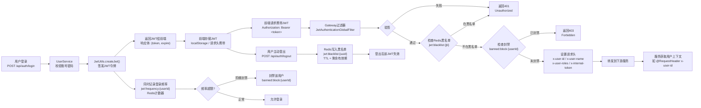
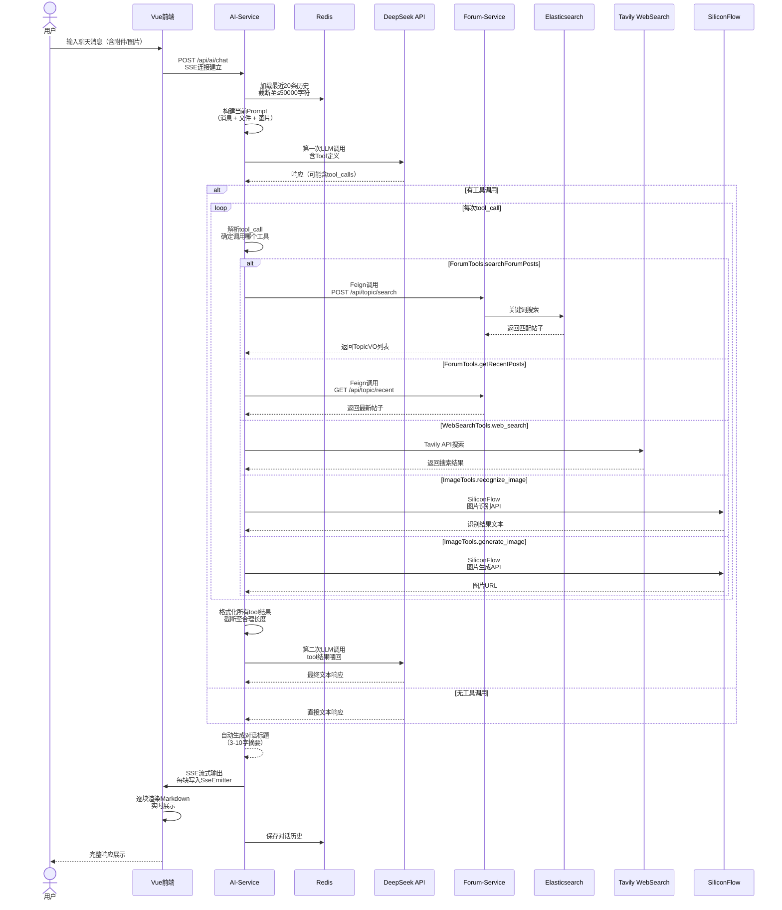
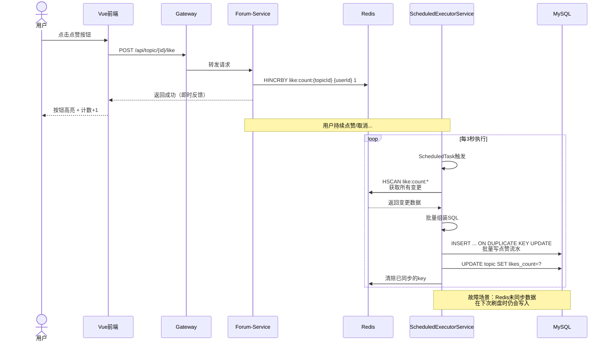

## 三、技术关键点

### 3.1 JWT 无状态认证

#### 设计概述

系统采用 HMAC256 算法（java-jwt 4.3 库）签发 JWT 实现无状态认证。JWT 令牌包含用户身份信息与角色权限，由 Spring Cloud Gateway 统一校验，下游微服务从请求头中直接获取用户上下文，无需重复鉴权。

#### JWT 生命周期



#### 核心代码

**JWT 签发 -- JwtUtils.createJwt()**

```java
public static String createJwt(Account account, long expire, String secret) {
    Algorithm algorithm = Algorithm.HMAC256(secret);
    Date expireDate = new Date(System.currentTimeMillis() + expire * 1000);
    return JWT.create()
        .withJWTId(UUID.randomUUID().toString())
        .withClaim("id", account.getId())
        .withClaim("name", account.getUsername())
        .withClaim("authorities",
            account.getAuthorities().stream()
                .map(GrantedAuthority::getAuthority)
                .toList())
        .withExpiresAt(expireDate)
        .withIssuedAt(new Date())
        .sign(algorithm);
}
```

**Gateway 验证 -- JwtAuthenticationGlobalFilter**

```java
@Component
public class JwtAuthenticationGlobalFilter implements GlobalFilter, Ordered {

    @Override
    public Mono<Void> filter(ServerWebExchange exchange, GatewayFilterChain chain) {
        String path = exchange.getRequest().getURI().getPath();

        // 跳过白名单路径（登录、注册等）
        if (isWhitelisted(path)) {
            return chain.filter(exchange);
        }

        String authHeader = exchange.getRequest().getHeaders()
            .getFirst(HttpHeaders.AUTHORIZATION);
        if (authHeader == null || !authHeader.startsWith("Bearer ")) {
            return unauthorized(exchange, "Missing or invalid Authorization header");
        }

        String token = authHeader.substring(7);
        try {
            DecodedJWT decoded = JWT.require(Algorithm.HMAC256(secret))
                .build().verify(token);
            String jti = decoded.getId();
            Integer userId = decoded.getClaim("id").asInt();
            String username = decoded.getClaim("name").asString();

            // 检查 Redis 黑名单
            if (redisTemplate.hasKey("jwt:blacklist:" + jti)) {
                return unauthorized(exchange, "Token has been revoked");
            }

            // 检查用户是否被封禁
            if (redisTemplate.hasKey("banned:block:" + userId)) {
                return forbidden(exchange, "User is blocked");
            }

            // 设置转发请求头，下游服务直接读取
            ServerWebExchange mutated = exchange.mutate()
                .request(r -> r
                    .header("x-user-id", String.valueOf(userId))
                    .header("x-user-name", username)
                    .header("x-user-roles", decoded.getClaim("authorities").asString())
                    .header("x-internal-token", internalServiceToken))
                .build();

            return chain.filter(mutated);
        } catch (JWTVerificationException e) {
            return unauthorized(exchange, "Invalid or expired token");
        }
    }
}
```

#### 设计决策

| 决策 | 选择 | 理由 |
|------|------|------|
| 签名算法 | HMAC256 | 对称算法，单服务端密钥管理简单，性能优于 RSA/ECDSA，适合单体式微服务架构 |
| 令牌有效期 | 72 小时 | 平衡用户体验与安全：校园论坛活跃周期通常为 1-3 天，过短需频繁登录，过长增加泄露风险 |
| 登出方案 | Redis 黑名单 | 不依赖短 TTL（否则用户无法主动登出）；黑名单仅存 jti，体积小；TTL 自动过期清理 |
| Claims 内容 | id + name + authorities | 下游服务无需再次查库即可完成权限判断，减少服务间调用延迟 |
| 登录频率限制 | Redis 阶梯封禁 | 单用户维度计数，防止暴力破解；阶梯策略（如 5 次/分钟警告、10 次/小时临时封禁）相比固定阈值更灵活 |

---

### 3.2 Elasticsearch 全文搜索

#### 设计概述

帖子数据同步至 Elasticsearch 8.18.8，提供高性能的标题与简介全文检索。搜索时对 `title` 和 `intro` 字段做 `match_phrase` 短语匹配，并返回高亮片段供前端渲染。

#### 搜索流程

```mermaid
flowchart LR
    A["用户输入关键词"] --> B["Vue前端<br/>TopicSearch.vue"]
    B --> C["GET /api/topic/search<br/>?keyword=xxx&page=1"]
    C --> D["Spring Cloud Gateway<br/>端口8081"]
    D --> E["Forum-Service<br/>TopicSearchController"]
    E --> F["TopicService<br/>searchTopics(keyword, page)"]
    F --> G["TopicRepository<br/>Spring Data ES"]
    G --> H["Elasticsearch<br/>索引: db_topic"]
    H --> I{"查询策略<br/>bool.should"}
    I --> J["match_phrase<br/>title: keyword"]
    I --> K["match_phrase<br/>intro: keyword"]
    J --> L["ES返回匹配结果<br/>+ 高亮片段"]
    K --> L
    L --> M["解析SearchHit&lt;TopicDocument&gt;<br/>提取@Highlight字段"]
    M --> N["组装PageResult&lt;TopicVO&gt;<br/>含高亮title/intro"]
    N --> O["返回JSON给前端"]
    O --> P["前端渲染高亮片段<br/>v-html 显示&lt;em&gt;标签"]
```



#### 索引映射与数据模型

```java
@Document(indexName = "db_topic")
@Setting(settingPath = "/es/topic-settings.json")
public class TopicDocument {

    @Id
    private Integer id;

    @Field(type = FieldType.Text, analyzer = "ik_max_word", searchAnalyzer = "ik_smart")
    private String title;

    @Field(type = FieldType.Text, analyzer = "ik_max_word", searchAnalyzer = "ik_smart")
    private String intro;

    @Field(type = FieldType.Text, index = false)
    private String content;    // 完整内容（不参与搜索，仅存储）

    @Field(type = FieldType.Integer)
    private Integer uid;

    @Field(type = FieldType.Integer)
    private Integer type;

    @Field(type = FieldType.Date, format = DateFormat.date_time)
    private LocalDateTime time;
}
```

#### 搜索查询

```java
public interface TopicRepository extends ElasticsearchRepository<TopicDocument, Integer> {

    @Query("""
        {"bool": {"should": [
            {"match_phrase": {"title": "?0"}},
            {"match_phrase": {"intro": "?0"}}
        ]}}
    """)
    @Highlight(fields = {
        @HighlightField(name = "title", numberOfFragments = 1),
        @HighlightField(name = "intro", numberOfFragments = 1)
    })
    List<SearchHit<TopicDocument>> findByTitleOrIntro(String keyword);
}
```

#### 数据同步

帖子创建、更新、删除时通过 `ForumEventPublisher` 触发 ES 同步，保证增量数据一致性。

```java
@Service
@Slf4j
public class TopicIndexService {

    private final TopicRepository topicRepository;

    /**
     * 增量同步：单条帖子同步到 ES
     */
    public void syncTopicToEs(Topic topic) {
        TopicDocument doc = new TopicDocument();
        BeanUtils.copyProperties(topic, doc);
        // 截取前300字符作为简介
        if (topic.getContent() != null && topic.getContent().length() > 300) {
            doc.setIntro(topic.getContent().substring(0, 300));
        } else {
            doc.setIntro(topic.getContent());
        }
        topicRepository.save(doc);
        log.debug("ES索引同步完成, topicId={}", topic.getId());
    }

    /**
     * 全量重索引：管理员调用
     */
    @Transactional
    public void rebuildAllIndex() {
        topicRepository.deleteAll();
        List<Topic> allTopics = topicMapper.selectList(null);
        List<TopicDocument> docs = allTopics.stream().map(topic -> {
            TopicDocument doc = new TopicDocument();
            BeanUtils.copyProperties(topic, doc);
            return doc;
        }).toList();
        topicRepository.saveAll(docs);
        log.info("ES全量重建完成，共索引 {} 条帖子", docs.size());
    }
}
```

#### 索引策略说明

- **索引名** `db_topic`：单索引存储所有帖子，避免分索引的跨索引查询开销
- **分词器** `ik_max_word`（索引时）与 `ik_smart`（搜索时）：索引时最大化分词召回率，搜索时精准匹配减少噪声
- **`match_phrase`**：要求关键词连续出现且顺序一致，提升搜索精准度，避免单字拆分的无关结果
- **高亮**：服务端 `@Highlight` 注解自动生成 `<em>` 标签，前端直接 `v-html` 渲染，减少前端计算
- **`content` 不索引**：帖子正文仅存储不索引，避免大文本拉低查询性能，通过 `intro` 前 300 字提供预览

---

### 3.3 AI RAG 实现

#### 设计概述

AI 聊天助手集成 DeepSeek 大模型，采用 RAG（检索增强生成）架构，通过工具调用（Tool Calling）机制自动检索论坛数据并返回给 LLM 二次推理，最终以 SSE 流式输出到前端。

#### 完整聊天流程



#### 核心代码

**ChatClient 配置**

```java
@Configuration
public class ChatClientConfig {

    @Bean
    public ChatClient chatClient(DeepSeekChatModel chatModel) {
        return ChatClient.builder(chatModel)
            .defaultSystem("""
                你是北梨论坛的智能AI助手。
                你使用中文回答，回答简洁有条理。
                你可以搜索论坛内容、查询最新帖子、联网搜索信息。
                当用户询问论坛相关问题时，优先使用论坛搜索工具。
                """)
            .defaultRequestSpec(spec -> spec.connectTimeout(Duration.ofSeconds(5)))
            .build();
    }

    @Bean
    public DeepSeekChatModel deepSeekChatModel(DeepSeekProperties props) {
        return DeepSeekChatModel.builder()
            .apiKey(props.getApiKey())
            .baseUrl(props.getBaseUrl())
            .defaultRequestConfig(RequestConfig.builder()
                .readTimeout(Duration.ofSeconds(60))
                .build())
            .build();
    }
}
```

**ForumTools -- 论坛搜索工具**

```java
@Component
@Slf4j
public class ForumTools {

    private final ForumClient forumClient;  // Feign客户端

    @Tool(name = "search_forum_posts", description = "搜索论坛帖子，当用户询问特定话题时使用")
    public String searchForumPosts(@P("keyword") String keyword,
                                   @P(value = "page", required = false) Integer page) {
        if (page == null) page = 1;
        try {
            Result<List<TopicVO>> result = forumClient.searchTopics(keyword, page);
            if (result.getCode() != 200 || result.getData() == null || result.getData().isEmpty()) {
                return "没有找到相关帖子。";
            }
            // 格式化返回结果，截断避免超出token限制
            StringBuilder sb = new StringBuilder();
            for (TopicVO topic : result.getData()) {
                sb.append("标题: ").append(topic.getTitle()).append("\n");
                sb.append("摘要: ").append(topic.getIntro()).append("\n");
                sb.append("---\n");
            }
            return sb.toString();
        } catch (Exception e) {
            log.error("搜索论坛帖子失败", e);
            return "搜索论坛帖子时出现错误，请稍后重试。";
        }
    }

    @Tool(name = "get_recent_posts", description = "获取论坛最新帖子，当用户询问最新动态时使用")
    public String getRecentPosts() {
        try {
            Result<List<TopicVO>> result = forumClient.getRecentPosts();
            if (result.getCode() != 200 || result.getData() == null) {
                return "获取最新帖子失败。";
            }
            StringBuilder sb = new StringBuilder("最新帖子：\n");
            for (TopicVO topic : result.getData()) {
                sb.append("- ").append(topic.getTitle())
                  .append(" (").append(topic.getUsername()).append(")\n");
            }
            return sb.toString();
        } catch (Exception e) {
            log.error("获取最新帖子失败", e);
            return "获取最新帖子时出现错误。";
        }
    }
}
```

**工具调用执行循环**

```java
@Service
@Slf4j
public class ConversationService {

    private final ChatClient chatClient;
    private final Map<Long, SseEmitter> activeStreams = new ConcurrentHashMap<>();
    private final ThreadPoolTaskExecutor executor;

    public void executeConversation(Long userId, ChatRequest request, SseEmitter emitter) {
        // 并发控制：每个用户同时只能有一个活跃流
        SseEmitter previous = activeStreams.put(userId, emitter);
        if (previous != null) {
            previous.completeWithError(new RuntimeException("新对话开始，旧连接关闭"));
        }

        executor.submit(() -> {
            try {
                // 1. 加载对话历史
                List<Message> history = loadHistory(request.getConversationId(), 20, 50000);

                // 2. 构建用户消息（含文件和图片）
                UserMessage userMessage = buildUserMessage(request);
                List<Message> messages = new ArrayList<>(history);
                messages.add(userMessage);

                // 3. 第一次LLM调用（带工具定义）
                ChatClient.ChatClientRequestSpec spec = chatClient.prompt()
                    .messages(messages)
                    .tools(searchForumPosts, getRecentPosts, webSearch, recognizeImage, generateImage);

                // 4. 流式调用并处理工具调用
                StringBuilder fullResponse = new StringBuilder();
                AtomicBoolean toolCalled = new AtomicBoolean(false);

                spec.stream().chatResponse()
                    .doOnNext(response -> {
                        if (response.getResult() != null
                            && response.getResult().getOutput() != null
                            && response.getResult().getOutput().getToolCalls() != null) {
                            toolCalled.set(true);
                        }
                    })
                    .doOnComplete(() -> {
                        if (!toolCalled.get()) {
                            // 无工具调用，直接完成
                            saveHistory(userId, request, fullResponse.toString());
                            autoGenerateTitle(request.getConversationId());
                            emitter.complete();
                        }
                    })
                    .subscribe(chatResponse -> {
                        // SSE推送文本块
                        String delta = chatResponse.getResult().getOutput().getContent();
                        if (delta != null) {
                            fullResponse.append(delta);
                            sendSseEvent(emitter, delta);
                        }
                    }, emitter::completeWithError);

                // 5. 工具调用结果回喂（简化示意）
                if (toolCalled.get()) {
                    String toolResult = executeToolCalls(response);
                    String finalResponse = chatClient.prompt()
                        .messages(messages)
                        .messages(new SystemMessage(toolResult))
                        .call()
                        .content();

                    // 流式输出最终结果
                    sendSseEvent(emitter, finalResponse);
                    saveHistory(userId, request, finalResponse);
                    autoGenerateTitle(request.getConversationId());
                    emitter.complete();
                }

            } catch (Exception e) {
                log.error("对话执行异常", e);
                emitter.completeWithError(e);
            } finally {
                activeStreams.remove(userId, emitter);
            }
        });
    }
}
```

#### RAG 架构说明

| 环节 | 实现 | 说明 |
|------|------|------|
| 检索源 | 论坛帖子（ES）、最新动态（MySQL）、网络（Tavily） | 多数据源覆盖论坛上下文与实时信息 |
| 检索触发 | Tool Calling | LLM 自主判断何时需要检索，不需硬编码关键词 |
| 检索接口 | Feign 调用 Forum-Service | AI-Service 不直接访问 ES，通过 Forum-Service 封装，职责清晰 |
| 结果截断 | 格式化文本 + 字符数限制 | 避免工具返回结果超出 LLM 上下文窗口 |
| 二次推理 | 第一次含工具定义，第二次喂回结果 | 标准的 ReAct 模式，保证 LLM 基于检索结果生成回答 |
| SSE 输出 | SseEmitter 5 分钟超时 + 15 秒心跳 | 支持长时间推理场景，心跳维持连接不中断 |
| 并发控制 | ConcurrentHashMap 单活跃流 | 同一用户新对话自动关闭旧连接，防止资源泄露 |
| 标题生成 | 自动摘要 3-10 字 | 对话列表友好展示，无需用户手动命名 |

---

### 3.4 Redis 点赞/收藏缓冲机制

#### 设计概述

点赞和收藏是高频率操作，直接写入 MySQL 会造成较大数据库压力。系统采用 Redis hash 缓存计数，通过 `ScheduledExecutorService` 每 3 秒批量刷入 MySQL，实现异步写、高性能读。

#### 缓冲刷盘流程



#### 核心实现

```java
@Component
@Slf4j
public class LikeFlushScheduler {

    private final StringRedisTemplate redisTemplate;
    private final JdbcTemplate jdbcTemplate;

    @PostConstruct
    public void init() {
        ScheduledExecutorService scheduler = Executors.newScheduledThreadPool(1);
        scheduler.scheduleAtFixedRate(this::flushLikesToDb, 3, 3, TimeUnit.SECONDS);
    }

    /**
     * 每3秒将Redis中的点赞变更批量刷入MySQL
     */
    public void flushLikesToDb() {
        // 使用SCAN而非KEYS，避免阻塞Redis
        Set<String> keys = redisTemplate.execute(
            (RedisCallback<Set<String>>) connection -> {
                Set<String> matched = new HashSet<>();
                ScanOptions options = ScanOptions.scanOptions()
                    .match("like:count:*").count(100).build();
                Cursor<byte[]> cursor = connection.scan(options);
                while (cursor.hasNext()) {
                    matched.add(new String(cursor.next()));
                }
                return matched;
            });

        if (keys == null || keys.isEmpty()) return;

        List<Object[]> batchArgs = new ArrayList<>();
        List<Integer> topicIds = new ArrayList<>();

        for (String key : keys) {
            // key格式: like:count:{topicId}
            Integer topicId = Integer.parseInt(key.split(":")[2]);
            Map<Object, Object> entries = redisTemplate.opsForHash().entries(key);
            // entries: {userId -> 1(点赞)/-1(取消)/0(无变化)}

            int netChange = entries.values().stream()
                .mapToInt(v -> Integer.parseInt(v.toString()))
                .sum();

            if (netChange != 0) {
                batchArgs.add(new Object[]{netChange, topicId});
                topicIds.add(topicId);
                // 更新topic表的likes_count
                jdbcTemplate.update(
                    "UPDATE topic SET likes_count = likes_count + ? WHERE id = ?",
                    netChange, topicId);
            }
        }

        // 写入点赞流水表
        if (!batchArgs.isEmpty()) {
            jdbcTemplate.batchUpdate(
                "INSERT INTO topic_like_log (topic_id, user_id, action, create_time) " +
                "VALUES (?, ?, ?, NOW())",
                batchArgs);
        }

        // 清除已同步的Redis缓存
        keys.forEach(key -> redisTemplate.delete(key));
        log.debug("点赞刷盘完成，同步 {} 个帖子", topicIds.size());
    }
}
```

#### 设计优势

- **即时反馈**：用户操作后前端立即得到响应，不等待数据库写入
- **批量写入**：3 秒窗口聚合多次操作，减少数据库事务开销
- **数据安全**：Redis 宕机仅丢失 3 秒窗口内的变更，点赞计数值通过 Redis AOF 持久化进一步保障
- **幂等性**：`INSERT ... ON DUPLICATE KEY UPDATE` 保证重复写入不产生重复数据

---

## 四、附加说明

### 4.1 运行环境

#### 硬件与软件要求

| 类别 | 要求 | 说明 |
|------|------|------|
| JDK | 17+ | 微服务后端运行环境，推荐 Eclipse Temurin 或 Oracle OpenJDK |
| Node.js | 18+（推荐 20+） | 前端构建与运行，20+ 启用 PWA Workbox 支持 |
| Maven | 3.8+ | 项目构建工具 |
| Docker | 24+ (Docker Compose V2) | 基础设施容器化部署 |
| 内存 | 最低 8 GB，推荐 16 GB | 同时运行全部微服务 + Docker 容器 + 前端开发服务器 |
| 磁盘 | 10 GB 可用空间 | Docker 镜像、Maven 依赖、日志文件 |

#### 各服务端口与环境变量

| 服务 | 端口 | 必需环境变量 | 可选环境变量 |
|------|------|-------------|-------------|
| gateway-service | 8081 | — | `GATEWAY_SERVER_PORT` |
| user-service | 8082 | — | `MYSQL_URL`, `REDIS_HOST` |
| forum-service | 8088 | — | `ES_URIS`, `ES_USERNAME`, `ES_PASSWORD` |
| notification-service | 8085 | — | `RABBITMQ_HOST` |
| ai-service | 8083 | `DEEPSEEK_KEY` | `TAVILY_API_KEY`, `DEEPSEEK_BASE_URL` |
| oss-service | 8084 | — | `MINIO_ENDPOINT`, `MINIO_ACCESS_KEY` |
| announcement-service | 8086 | — | — |

#### 通用环境变量

| 变量 | 默认值 | 说明 |
|------|--------|------|
| `NACOS_SERVER_ADDR` | `localhost:8848` | Nacos 注册中心地址 |
| `NACOS_DISCOVERY_ENABLED` | `true` | 是否启用 Nacos 服务发现 |
| `JWT_KEY` | `abcdefghijklmn` | JWT 签名密钥（生产环境必须修改） |
| `INTERNAL_SERVICE_TOKEN` | `change-me-in-production` | 服务间调用鉴权 Token |
| `OTEL_EXPORTER_OTLP_ENDPOINT` | `http://localhost:4318/v1/traces` | OpenTelemetry OTLP 端点 |
| `LOG_DIR` | `log` | 日志输出目录 |

---

### 4.2 安装部署

#### 部署步骤

```bash
# 第一步：克隆项目
git clone <repository-url> && cd chat-forum

# 第二步：启动基础设施（Docker）
cd docker
bash setup.sh
# 该脚本自动完成：清理旧容器 → 拉取镜像 → 启动 Nacos / MySQL / Redis /
# ES / RabbitMQ / MinIO / Loki / Tempo / Alloy / Prometheus / Grafana
# 并等待 Elasticsearch 就绪
cd ..

# 第三步：编译 common 模块
mvn clean install -pl common-core,common-observability -DskipTests

# 第四步：编译安装全部模块
mvn clean install -DskipTests

# 第五步：按顺序启动微服务
# 终端 1 — 网关
cd gateway-service && mvn spring-boot:run

# 终端 2 — 用户服务
cd user-service && mvn spring-boot:run

# 终端 3 — 论坛服务
cd forum-service && mvn spring-boot:run

# 终端 4 — 通知服务
cd notification-service && mvn spring-boot:run

# 终端 5 — AI 服务
cd ai-service && mvn spring-boot:run

# 终端 6 — OSS 服务
cd oss-service && mvn spring-boot:run

# 终端 7 — 公告服务
cd announcement-service && mvn spring-boot:run

# 第六步：启动前端
cd my-project-frontend
npm install && npm run dev
# 访问 http://localhost:5173（或 5273）
```

#### Docker Compose 服务列表

| 服务 | 镜像 | 端口 | 用途 |
|------|------|------|------|
| Nacos | nacos/nacos-server:v2.3.2 | 8848, 9848 | 服务注册与配置中心 |
| MySQL | mysql:8.0 | 3306 | 主数据库 |
| Redis | redis:7 | 6379 | 缓存、黑名单、频率限制 |
| Elasticsearch | elasticsearch:8.18.8 | 9200 | 帖子全文搜索 |
| RabbitMQ | rabbitmq:3.12-management | 5672, 15672 | 异步消息队列 |
| MinIO | minio/minio | 9000, 9001 | 对象存储 |
| Loki | grafana/loki:3.4.2 | 3100 | 日志聚合 |
| Tempo | grafana/tempo:2.7.2 | 3200 | 链路追踪 |
| Alloy | grafana/alloy:v1.8.2 | 12345, 4317, 4318 | 可观测性数据采集 |
| Prometheus | prom/prometheus:v3.2.1 | 9090 | 指标监控 |
| Grafana | grafana/grafana:11.6.0 | 3000 | 可视化面板 |

#### 启动顺序说明

1. **基础设施先行**：Docker Compose 确保 Nacos、MySQL、Redis 先就绪
2. **common 模块优先编译**：提供各服务共享的 DTO、工具类、JWT 工具
3. **无严格顺序要求**（均注册到 Nacos 自动发现），推荐顺序：
   - gateway-service（统一入口）
   - user-service（认证依赖）
   - forum-service / notification-service / oss-service / announcement-service（业务服务）
   - ai-service（依赖 forum-service Feign 接口，可最后启动）
4. **前端独立启动**：开发模式下 Vite proxy 转发 `/api` 到网关，前后端完全解耦

---

### 4.3 代码量统计

#### 按模块统计

| 模块 | Java文件 | 代码行 | XML/YAML | 配置文件行 | 说明 |
|------|----------|--------|----------|-----------|------|
| common-core | 28 | 1,024 | 1 | 83 | 共享 DTO、JWT 工具、异常、常量 |
| common-observability | 3 | 46 | 2 | 58 | 可观测性自动配置 |
| gateway-service | 5 | 353 | 3 | 141 | 路由、认证过滤器、限流 |
| user-service | 32 | 1,092 | 3 | 439 | 认证、用户 CRUD、权限管理 |
| forum-service | 54 | 2,348 | 5 | 412 | 帖子、评论、搜索、点赞/收藏 |
| notification-service | 12 | 371 | 1 | 53 | 邮件发送、RabbitMQ 消费 |
| ai-service | 28 | 1,162 | 3 | 129 | DeepSeek 集成、RAG、Tool Calling |
| oss-service | 15 | 578 | 2 | 69 | MinIO 文件上传/访问 |
| announcement-service | 10 | 362 | 1 | 62 | 公告管理 |
| **Java 合计** | **187** | **7,336** | — | — | — |

#### 按语言分类

| 语言 | 文件数 | 代码行 | 注释行 | 空行 | 说明 |
|------|--------|--------|--------|------|------|
| Java | 187 | 7,336 | 约 2,100 | 约 1,500 | Spring Boot 微服务 |
| Vue (SFC) | 41 | 6,545 | 约 800 | 约 700 | Vue 3 + Element Plus + Vant 4 |
| JavaScript / TypeScript | 12 | 675 | 约 120 | 约 80 | 工具函数、Vite 配置 |
| YAML | 17 | 1,476 | 约 120 | 约 200 | Docker Compose、应用配置 |
| XML | 13 | 758 | 约 60 | 约 80 | POM、MyBatis 映射 |
| SQL | 1 | 305 | 约 80 | 约 60 | 数据库 Schema + 种子数据 |
| Shell / Batch | 4 | 196 | 约 40 | 约 30 | Docker setup 脚本 |
| JSON / 其他 | 23 | 约 900 | — | — | ESLint、i18n、ES 配置 |
| **总计** | **298** | **约 18,200** | — | — | **约 27,000 行（含配置文件）** |

#### 关键模块代码分布

```text
forum-service  (2,348 行)  ────────── 核心业务逻辑
├── controller/      368 行    帖子/评论/搜索/互动控制器
├── service/         852 行    业务逻辑、ES同步、点赞刷盘
├── repository/      126 行    MyBatis-Plus + ES Repository
├── entity/dto/      412 行    实体类与数据传输对象
├── config/          186 行    线程池、RabbitMQ、ES配置
├── utils/           256 行    敏感词过滤、Quill Delta处理
└── event/           148 行    论坛事件、ES同步事件

my-project-frontend  (6,545 行) ──────── 前端 SPA
├── views/           2,860 行  页面组件
├── components/      1,720 行  可复用组件
├── layouts/          580 行   MobileLayout / AdminLayout
├── store/            340 行   Pinia 状态管理
├── router/           225 行   路由配置
├── utils/            420 行   工具函数、设备检测
└── styles/           400 行   全局样式
```

---

*本文档基于北梨论坛 v1.0 版本编写，代码统计截至项目当前提交。*
